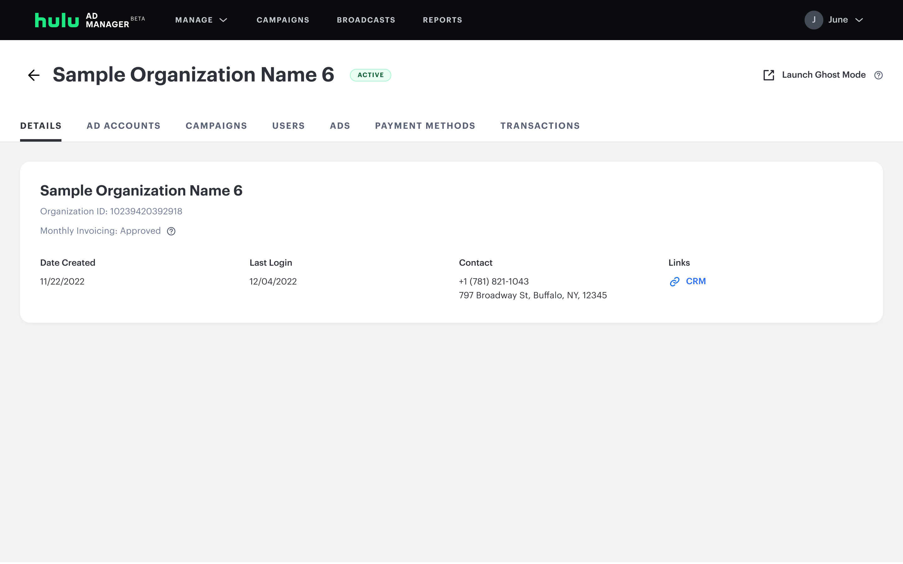

<AmbientVeil class="title-veil" />

  

<HeroTitle compact>
  Designing for Advertisers

  <template #subtitle>
    
Saneeya Khan

    
Senior Product Designer

  </template>
  <template #pill>
    PORTFOLIO
  </template>
</HeroTitle>
  

::right::

<!--
hello my name is Saneeya and I'm here to go over some of the work I've done in ad tech
-->

---
transition: fade-out
layout: default
hide: true
---

## My process

<InvitePushRow />

<!--
Invite -> wayfinding sign -> bathroom sign -> wifi -> QR Code -> google from

- went all out but out of scope: games, recipes
-no one took candy
- user feedback was great
-->

---
layout: default
transition: slide-left
---

<h2 class="user-groups-slide-heading m-0 mt-6 mb-5">Agenda</h2>

  

    01
    About
  

  

    02
    Mini Case Study: Making Filters Functional
  

  

    03
    Case Study: Campaign Creation Flow
  

  

    04
    Case Study: Behind the Platform
  

  

    05
    Q & A
  

<!--
Here is the agenda for today, feel free to interrupt if you have questions during this presentation or you can wait until the end where I have some time scheduled for Q and A
-->

---
transition: slide-left
layout: two-cols
layoutClass: h-full layout-wide-right
---

## Designing

::right::

<PinterestMasonry placement="title" :hide-left-mid="true" :hide-left-bottom="true" left-extra-top-src="./slides/assets/About4.jpg" left-extra-top-position="30% center" :left-extra-top-grow="1.4" :title-top-grow="2.2" :title-bottom-grow="1.0" left-top-small-src="./slides/assets/About2.jpg" left-top-small-position="center 40%" :left-top-small-scale="1.3" right-tall-src="./slides/assets/About1.jpg" right-bottom-src="./slides/assets/About3.jpg" right-bottom-position="20% center" />

<!--
Before I dive into the work, I'd like to go over what I call my "creative background" One thing about me is I like creating things. Things in all sorts of formats. Here is a bedroom wall which I painted myself and while I didn't make the art, I did curate it and arrange it in a specific way 

and I dont just decorate physicially , here is  my virtual home in Final Fantasy 14, an online multiplayer game which was my pandemic game. One of the most fun things for me was to was decorate these homes, this screenshot here shows a room I did where I placed every single object like the food on top of this table

And I also like creating real life things. I dont crochet as much as I used to but I have made alot small toys such as this baby groot. And the things I like creating the most, are of course the ones I can eat such as this tart
-->

---
transition: slide-left
layout: two-cols
layoutClass: h-full layout-wide-right
---

## Professional Background

::right::

<PinterestMasonry placement="title" :hide-left-mid="true" left-top-small-src="./slides/assets/About6.jpg" left-top-src="./slides/assets/About7.png" left-top-bg="transparent" right-tall-src="./slides/assets/About5.jpg" right-bottom-src="./slides/assets/About8.png" />

<!--
and here is my professional background. Back in the day, I spent years doing graphic design in a variety of industries.

One example was this billboard I did for the local county fair.

Eventually I did a career pivot to UX, my first tech role was at McGraw Hill Education, which is a textbook company but also has a suite of ed tech products. One of those products was ALEKS which I did most of my work on. I  designed teacher and student facing user interfaces and even some other things like this logo I made for the 20th anniversary. 

After McGraw Hill, I spent some time at a mortgage company doing more enterprise platforms , this time for loan officers and real estate agents. While there,  I learned a lot about how regulated and complicated work flows behave. 

All of this together really helped when I joined Disney. I was on the ads design team but initially I knew nothing about ad tech,But since then I have worked on several platforms for advertisers, internal users and even some customer-facing products for almost 5 years now
-->

---
layout: default
transition: slide-left
hide: true
---

<CaseStudyPillTabs :key="s11_copy_agenda" class="-mt-10 mb-10 mx-auto" :initial-index="1" />

<h2 class="user-groups-slide-heading m-0 mt-6 mb-5">Old Process (sort of)</h2>

  

    
Discovery

    <i class="fa-solid fa-arrow-right text-[#0D9488] text-[1.5rem] shrink-0 anim-fade-up anim-d2"></i>
    
Problem Statement

    <i class="fa-solid fa-arrow-right text-[#0D9488] text-[1.5rem] shrink-0 anim-fade-up anim-d3"></i>
    
Wireframes

    <i class="fa-solid fa-arrow-right text-[#0D9488] text-[1.5rem] shrink-0 anim-fade-up anim-d4"></i>
    
High Fidelity

  

  

    
<i class="fa-solid fa-arrow-up-long text-[#0D9488] text-[1.5rem]"></i>

    

    
<i class="fa-solid fa-arrow-down-long text-[#0D9488] text-[1.5rem]"></i>

  

  

    
Hand off

    <i class="fa-solid fa-arrow-left text-[#0D9488] text-[1.5rem] shrink-0 anim-fade-up anim-d4"></i>
    
Final Designs

    <i class="fa-solid fa-arrow-left text-[#0D9488] text-[1.5rem] shrink-0 anim-fade-up anim-d4"></i>
    
Revisions

    <i class="fa-solid fa-arrow-left text-[#0D9488] text-[1.5rem] shrink-0 anim-fade-up anim-d4"></i>
    
User Testing

  

<!--
I want to go over my process. As most of you know, this is the ideal flow that design has been told to do, the double diamond approach,

 and I wish I could work like this but...
-->

---
layout: default
transition: slide-left
hide: true
---

<CaseStudyPillTabs :key="s11_copy_agenda_dup" class="-mt-10 mb-10 mx-auto" :initial-index="1" />

<h2 class="user-groups-slide-heading m-0 mt-6 mb-5">Now (sort of)</h2>

  

    
PRD

    <i class="fa-solid fa-arrow-right text-[#0D9488] text-[1.5rem] shrink-0 anim-fade-up anim-d2"></i>
    
AI Prototype

    <i class="fa-solid fa-arrow-right text-[#0D9488] text-[1.5rem] shrink-0 anim-fade-up anim-d3"></i>
    
User Feedback

    <i class="fa-solid fa-arrow-right text-[#0D9488] text-[1.5rem] shrink-0 anim-fade-up anim-d4"></i>
    
AI Prototype (revisions)

    

    

    

    

    

    

    

      <i class="fa-solid fa-arrow-down-long text-[#0D9488] text-[1.5rem]"></i>
    

    

    

    

    

    
Dev back-and-forth

    <i class="fa-solid fa-arrow-left text-[#0D9488] text-[1.5rem] shrink-0 anim-fade-up anim-d4"></i>
    
Stakeholder back-and-forth

  

<!--
As always the reality of work is different than you expect. For me personally the process never been super linear 

Time is always a factor for me. I'm usually working in teams that move pretty fast so I don't always have the opportunity for discovery or talking to users so sometimes I use the best what I have available which tends to be the PRD

These days, instead of doing a bunch of figma mocks, I try to use AI to create quick concepts, it's especially easy when you have a design system linked

And from there and I just shared the prototype with everyone developers, PMs, stakeholders etc. And we do back and forth to continuously improve the design
-->

---
layout: default
transition: slide-left
---

<CaseStudyPillTabs :key="s11_copy_agenda_dup2" class="-mt-10 mb-10 mx-auto" :initial-index="1" />

<h2 class="user-groups-slide-heading m-0 mt-6 mb-5">How I work</h2>

  

    

      <svg xmlns="http://www.w3.org/2000/svg" viewBox="0 0 640 640" class="h-7 w-7 fill-[#0D9488]" aria-hidden="true"><path d="M568.4 196.5C563.9 207 550 206.3 543.5 196.9C515.7 156.9 477.4 124.7 432.5 104.3C422.1 99.6 418.8 86 428.4 79.7C443.4 69.8 461.4 64 480.7 64C533.3 64 575.9 106.6 575.9 159.2C575.9 172.4 573.2 185 568.3 196.5zM96.5 196.9C90 206.3 76 207 71.6 196.5C66.7 185 64 172.4 64 159.2C64 106.6 106.6 64 159.2 64C178.5 64 196.5 69.8 211.5 79.7C221.1 86 217.8 99.6 207.4 104.3C162.6 124.7 124.3 156.9 96.4 196.9zM454.2 531.4C416.8 559.4 370.3 576 320 576C269.7 576 223.2 559.4 185.9 531.4L150.6 566.6C138.1 579.1 117.8 579.1 105.3 566.6C92.8 554.1 92.8 533.8 105.3 521.3L140.5 486.1C112.6 448.8 96 402.3 96 352C96 228.3 196.3 128 320 128C443.7 128 544 228.3 544 352C544 402.3 527.4 448.8 499.4 486.2L534.6 521.4C547.1 533.9 547.1 554.2 534.6 566.7C522.1 579.2 501.8 579.2 489.3 566.7L454.1 531.5zM344 248C344 234.7 333.3 224 320 224C306.7 224 296 234.7 296 248L296 352C296 358.4 298.5 364.5 303 369L359 425C368.4 434.4 383.6 434.4 392.9 425C402.2 415.6 402.3 400.4 392.9 391.1L343.9 342.1L343.9 248z"/></svg>
    

    

    Usually the only designer
  

  

    

      <svg xmlns="http://www.w3.org/2000/svg" viewBox="0 0 640 640" class="h-7 w-7 fill-[#0D9488]" aria-hidden="true"><path d="M320 80C377.4 80 424 126.6 424 184C424 241.4 377.4 288 320 288C262.6 288 216 241.4 216 184C216 126.6 262.6 80 320 80zM96 152C135.8 152 168 184.2 168 224C168 263.8 135.8 296 96 296C56.2 296 24 263.8 24 224C24 184.2 56.2 152 96 152zM0 480C0 409.3 57.3 352 128 352C140.8 352 153.2 353.9 164.9 357.4C132 394.2 112 442.8 112 496L112 512C112 523.4 114.4 534.2 118.7 544L32 544C14.3 544 0 529.7 0 512L0 480zM521.3 544C525.6 534.2 528 523.4 528 512L528 496C528 442.8 508 394.2 475.1 357.4C486.8 353.9 499.2 352 512 352C582.7 352 640 409.3 640 480L640 512C640 529.7 625.7 544 608 544L521.3 544zM472 224C472 184.2 504.2 152 544 152C583.8 152 616 184.2 616 224C616 263.8 583.8 296 544 296C504.2 296 472 263.8 472 224zM160 496C160 407.6 231.6 336 320 336C408.4 336 480 407.6 480 496L480 512C480 529.7 465.7 544 448 544L192 544C174.3 544 160 529.7 160 512L160 496z"/></svg>
    

    

    Technical/time limitations
  

  

    

      <svg xmlns="http://www.w3.org/2000/svg" viewBox="0 0 640 640" class="h-7 w-7 fill-[#0D9488]" aria-hidden="true"><path d="M64 183.4C44.9 172.4 32 151.7 32 128C32 92.7 60.7 64 96 64C119.7 64 140.4 76.9 151.4 96L488.5 96C499.6 76.9 520.2 64 543.9 64C579.2 64 607.9 92.7 607.9 128C607.9 151.7 595 172.4 575.9 183.4L575.9 456.5C595 467.6 607.9 488.2 607.9 511.9C607.9 547.2 579.2 575.9 543.9 575.9C520.2 575.9 499.5 563 488.5 543.9L151.4 543.9C140.3 563 119.7 575.9 96 575.9C60.7 575.9 32 547.2 32 511.9C32 488.2 44.9 467.5 64 456.5L64 183.4zM512 183.4C502.3 177.8 494.2 169.7 488.6 160L151.4 160C145.8 169.7 137.7 177.8 128 183.4L128 456.5C137.7 462.1 145.8 470.2 151.4 479.9L488.5 479.9C494.1 470.2 502.2 462.1 511.9 456.5L511.9 183.4zM176 240C176 222.3 190.3 208 208 208L320 208C337.7 208 352 222.3 352 240L352 304C352 321.7 337.7 336 320 336L208 336C190.3 336 176 321.7 176 304L176 240zM288 384L320 384C364.2 384 400 348.2 400 304L432 304C449.7 304 464 318.3 464 336L464 400C464 417.7 449.7 432 432 432L320 432C302.3 432 288 417.7 288 400L288 384z"/></svg>
    

    

    Vague or incomplete requirements
  

<!--
With that non-linear approach there are other key factors in how I work

As I mentioned before time is always a concern and now because of AI I'm trying to get better at token management and prompting which is still at work in progress

I've also been the sole designer on most projects and because of that I've gotten pretty good at working with a bunch of different teams so I understand that with limited resources there is always so much you can do and what you can achieve. 

I myself like setting up a weekly design office hour whee anyone can drop in and discuss designs. this has proven to be really useful and helpful when collaborating with so many people

And one thing I tend to keep bringing up is what exactly design can bring. Everyone is using AI to prototype now, I've had many PMs  put a PRD into a prompt and see what pops out and they think the design is done. However these designs don't really follow a design system and don't understand the problem. Even in this AI forward world, I do my best to show people I work with that having a designer still makes a difference
-->

---
layout: default
transition: slide-left
---

<CaseStudyPillTabs :key="s11_copy_agenda_dup3" class="-mt-10 mb-10 mx-auto" :initial-index="1" />

<h2 class="user-groups-slide-heading m-0 mt-6 mb-5">How I work</h2>

  

    

      <svg xmlns="http://www.w3.org/2000/svg" viewBox="0 0 640 640" class="h-7 w-7 fill-[#0D9488]" aria-hidden="true"><path d="M568.4 196.5C563.9 207 550 206.3 543.5 196.9C515.7 156.9 477.4 124.7 432.5 104.3C422.1 99.6 418.8 86 428.4 79.7C443.4 69.8 461.4 64 480.7 64C533.3 64 575.9 106.6 575.9 159.2C575.9 172.4 573.2 185 568.3 196.5zM96.5 196.9C90 206.3 76 207 71.6 196.5C66.7 185 64 172.4 64 159.2C64 106.6 106.6 64 159.2 64C178.5 64 196.5 69.8 211.5 79.7C221.1 86 217.8 99.6 207.4 104.3C162.6 124.7 124.3 156.9 96.4 196.9zM454.2 531.4C416.8 559.4 370.3 576 320 576C269.7 576 223.2 559.4 185.9 531.4L150.6 566.6C138.1 579.1 117.8 579.1 105.3 566.6C92.8 554.1 92.8 533.8 105.3 521.3L140.5 486.1C112.6 448.8 96 402.3 96 352C96 228.3 196.3 128 320 128C443.7 128 544 228.3 544 352C544 402.3 527.4 448.8 499.4 486.2L534.6 521.4C547.1 533.9 547.1 554.2 534.6 566.7C522.1 579.2 501.8 579.2 489.3 566.7L454.1 531.5zM344 248C344 234.7 333.3 224 320 224C306.7 224 296 234.7 296 248L296 352C296 358.4 298.5 364.5 303 369L359 425C368.4 434.4 383.6 434.4 392.9 425C402.2 415.6 402.3 400.4 392.9 391.1L343.9 342.1L343.9 248z"/></svg>
    

    

    Do my own discovery; find out core problem
  

  

    

      <svg xmlns="http://www.w3.org/2000/svg" viewBox="0 0 640 640" class="h-7 w-7 fill-[#0D9488]" aria-hidden="true"><path d="M320 80C377.4 80 424 126.6 424 184C424 241.4 377.4 288 320 288C262.6 288 216 241.4 216 184C216 126.6 262.6 80 320 80zM96 152C135.8 152 168 184.2 168 224C168 263.8 135.8 296 96 296C56.2 296 24 263.8 24 224C24 184.2 56.2 152 96 152zM0 480C0 409.3 57.3 352 128 352C140.8 352 153.2 353.9 164.9 357.4C132 394.2 112 442.8 112 496L112 512C112 523.4 114.4 534.2 118.7 544L32 544C14.3 544 0 529.7 0 512L0 480zM521.3 544C525.6 534.2 528 523.4 528 512L528 496C528 442.8 508 394.2 475.1 357.4C486.8 353.9 499.2 352 512 352C582.7 352 640 409.3 640 480L640 512C640 529.7 625.7 544 608 544L521.3 544zM472 224C472 184.2 504.2 152 544 152C583.8 152 616 184.2 616 224C616 263.8 583.8 296 544 296C504.2 296 472 263.8 472 224zM160 496C160 407.6 231.6 336 320 336C408.4 336 480 407.6 480 496L480 512C480 529.7 465.7 544 448 544L192 544C174.3 544 160 529.7 160 512L160 496z"/></svg>
    

    

    Negotiate scope/deadlines
  

  

    

      <svg xmlns="http://www.w3.org/2000/svg" viewBox="0 0 640 640" class="h-7 w-7 fill-[#0D9488]" aria-hidden="true"><path d="M64 183.4C44.9 172.4 32 151.7 32 128C32 92.7 60.7 64 96 64C119.7 64 140.4 76.9 151.4 96L488.5 96C499.6 76.9 520.2 64 543.9 64C579.2 64 607.9 92.7 607.9 128C607.9 151.7 595 172.4 575.9 183.4L575.9 456.5C595 467.6 607.9 488.2 607.9 511.9C607.9 547.2 579.2 575.9 543.9 575.9C520.2 575.9 499.5 563 488.5 543.9L151.4 543.9C140.3 563 119.7 575.9 96 575.9C60.7 575.9 32 547.2 32 511.9C32 488.2 44.9 467.5 64 456.5L64 183.4zM512 183.4C502.3 177.8 494.2 169.7 488.6 160L151.4 160C145.8 169.7 137.7 177.8 128 183.4L128 456.5C137.7 462.1 145.8 470.2 151.4 479.9L488.5 479.9C494.1 470.2 502.2 462.1 511.9 456.5L511.9 183.4zM176 240C176 222.3 190.3 208 208 208L320 208C337.7 208 352 222.3 352 240L352 304C352 321.7 337.7 336 320 336L208 336C190.3 336 176 321.7 176 304L176 240zM288 384L320 384C364.2 384 400 348.2 400 304L432 304C449.7 304 464 318.3 464 336L464 400C464 417.7 449.7 432 432 432L320 432C302.3 432 288 417.7 288 400L288 384z"/></svg>
    

    

    Delegate time to the &quot;major&quot; issues
  

---
layout: default
transition: slide-left
---

<CaseStudyPillTabs :key="s11_copy_agenda_dup4" class="-mt-10 mb-10 mx-auto" :initial-index="1" />

<h2 class="user-groups-slide-heading m-0 mt-6 mb-5">Ad Trafficking tool</h2>

  <video
    class="mx-auto block h-auto max-h-[min(400px,50vh)] w-auto max-w-full rounded-xl object-contain shadow-[0_4px_24px_rgb(0_0_0_/_12%)] md:max-w-5xl"
    autoplay
    loop
    muted
    playsinline
    preload="metadata"
    @loadedmetadata="(e) => { const v = e.target; if (v instanceof HTMLVideoElement) v.playbackRate = 0.2 }"
    @play="(e) => { const v = e.target; if (v instanceof HTMLVideoElement) v.playbackRate = 0.2 }"
  >
    <source src="./slides/assets/MCWalkthrough.mp4" type="video/mp4" />
  </video>

---
layout: default
transition: slide-left
---

<CaseStudyPillTabs :key="s11_copy_agenda_dup4_ad_dup" class="-mt-10 mb-10 mx-auto" :initial-index="1" />

<h2 class="user-groups-slide-heading m-0 mt-6 mb-5">Campaigns > Line Items > Ads</h2>

  

---
layout: default
transition: slide-left
---

<CaseStudyPillTabs :key="s11_copy_agenda_dup4_dup" class="-mt-10 mb-10 mx-auto" :initial-index="1" />

<h2 class="user-groups-slide-heading m-0 mt-6 mb-5">Campaigns > Line Items > Ads</h2>

  <video
    class="mx-auto block h-auto max-h-[min(400px,50vh)] w-auto max-w-full rounded-xl object-contain shadow-[0_4px_24px_rgb(0_0_0_/_12%)] md:max-w-5xl"
    autoplay
    loop
    muted
    playsinline
    preload="metadata"
    @loadedmetadata="(e) => { const v = e.target; if (v instanceof HTMLVideoElement) v.playbackRate = 0.2 }"
    @play="(e) => { const v = e.target; if (v instanceof HTMLVideoElement) v.playbackRate = 0.2 }"
  >
    <source src="./slides/assets/MCTableCampaigns.mp4" type="video/mp4" />
  </video>

---
layout: default
transition: slide-left
---

<CaseStudyPillTabs :key="s11_copy_agenda_dup4_dup_dup" class="-mt-10 mb-10 mx-auto" :initial-index="1" />

<h2 class="user-groups-slide-heading m-0 mt-6 mb-5">Campaigns > Line Items > Ads</h2>

  <video
    class="mx-auto block h-auto max-h-[min(400px,50vh)] w-auto max-w-full rounded-xl object-contain shadow-[0_4px_24px_rgb(0_0_0_/_12%)] md:max-w-5xl"
    autoplay
    loop
    muted
    playsinline
    preload="metadata"
    @loadedmetadata="(e) => { const v = e.target; if (v instanceof HTMLVideoElement) v.playbackRate = 0.2 }"
    @play="(e) => { const v = e.target; if (v instanceof HTMLVideoElement) v.playbackRate = 0.2 }"
  >
    <source src="./slides/assets/MCTableLineItems.mp4" type="video/mp4" />
  </video>

---
layout: default
transition: slide-left
---

<CaseStudyPillTabs :key="s11_copy_agenda_dup4_dup_dup_dup" class="-mt-10 mb-10 mx-auto" :initial-index="1" />

<h2 class="user-groups-slide-heading m-0 mt-6 mb-5">Campaigns > Line Items > Ads</h2>

  <video
    class="mx-auto block h-auto max-h-[min(400px,50vh)] w-auto max-w-full rounded-xl object-contain shadow-[0_4px_24px_rgb(0_0_0_/_12%)] md:max-w-5xl"
    autoplay
    loop
    muted
    playsinline
    preload="metadata"
    @loadedmetadata="(e) => { const v = e.target; if (v instanceof HTMLVideoElement) v.playbackRate = 0.2 }"
    @play="(e) => { const v = e.target; if (v instanceof HTMLVideoElement) v.playbackRate = 0.2 }"
  >
    <source src="./slides/assets/MCTableAds.mp4" type="video/mp4" />
  </video>

---
layout: default
transition: slide-left
---

<CaseStudyPillTabs :key="s11_copy_agenda_dup5" class="-mt-10 mb-10 mx-auto" :initial-index="1" />

<h2 class="user-groups-slide-heading m-0 mt-6 mb-5">Issues</h2>

  

    

      <svg xmlns="http://www.w3.org/2000/svg" viewBox="0 0 640 640" class="h-7 w-7 fill-[#0D9488]" aria-hidden="true"><path d="M568.4 196.5C563.9 207 550 206.3 543.5 196.9C515.7 156.9 477.4 124.7 432.5 104.3C422.1 99.6 418.8 86 428.4 79.7C443.4 69.8 461.4 64 480.7 64C533.3 64 575.9 106.6 575.9 159.2C575.9 172.4 573.2 185 568.3 196.5zM96.5 196.9C90 206.3 76 207 71.6 196.5C66.7 185 64 172.4 64 159.2C64 106.6 106.6 64 159.2 64C178.5 64 196.5 69.8 211.5 79.7C221.1 86 217.8 99.6 207.4 104.3C162.6 124.7 124.3 156.9 96.4 196.9zM454.2 531.4C416.8 559.4 370.3 576 320 576C269.7 576 223.2 559.4 185.9 531.4L150.6 566.6C138.1 579.1 117.8 579.1 105.3 566.6C92.8 554.1 92.8 533.8 105.3 521.3L140.5 486.1C112.6 448.8 96 402.3 96 352C96 228.3 196.3 128 320 128C443.7 128 544 228.3 544 352C544 402.3 527.4 448.8 499.4 486.2L534.6 521.4C547.1 533.9 547.1 554.2 534.6 566.7C522.1 579.2 501.8 579.2 489.3 566.7L454.1 531.5zM344 248C344 234.7 333.3 224 320 224C306.7 224 296 234.7 296 248L296 352C296 358.4 298.5 364.5 303 369L359 425C368.4 434.4 383.6 434.4 392.9 425C402.2 415.6 402.3 400.4 392.9 391.1L343.9 342.1L343.9 248z"/></svg>
    

    

    Could drill down, but not up
  

  

    

      <svg xmlns="http://www.w3.org/2000/svg" viewBox="0 0 640 640" class="h-7 w-7 fill-[#0D9488]" aria-hidden="true"><path d="M320 80C377.4 80 424 126.6 424 184C424 241.4 377.4 288 320 288C262.6 288 216 241.4 216 184C216 126.6 262.6 80 320 80zM96 152C135.8 152 168 184.2 168 224C168 263.8 135.8 296 96 296C56.2 296 24 263.8 24 224C24 184.2 56.2 152 96 152zM0 480C0 409.3 57.3 352 128 352C140.8 352 153.2 353.9 164.9 357.4C132 394.2 112 442.8 112 496L112 512C112 523.4 114.4 534.2 118.7 544L32 544C14.3 544 0 529.7 0 512L0 480zM521.3 544C525.6 534.2 528 523.4 528 512L528 496C528 442.8 508 394.2 475.1 357.4C486.8 353.9 499.2 352 512 352C582.7 352 640 409.3 640 480L640 512C640 529.7 625.7 544 608 544L521.3 544zM472 224C472 184.2 504.2 152 544 152C583.8 152 616 184.2 616 224C616 263.8 583.8 296 544 296C504.2 296 472 263.8 472 224zM160 496C160 407.6 231.6 336 320 336C408.4 336 480 407.6 480 496L480 512C480 529.7 465.7 544 448 544L192 544C174.3 544 160 529.7 160 512L160 496z"/></svg>
    

    

    Users want to see relevant campaigns/line items/ads regardless of what tab
  

---
layout: default
transition: slide-left
---

<CaseStudyPillTabs :key="s11_copy_agenda_dup5_feedback" class="-mt-10 mb-10 mx-auto" :initial-index="1" />

<h2 class="user-groups-slide-heading m-0 mt-6 mb-5">User feedback</h2>

  

    <i class="fa-solid fa-circle text-[#0D9488] text-[0.5rem] shrink-0"></i>
    Wanted to select rows as needed
  

  

    <i class="fa-solid fa-circle text-[#0D9488] text-[0.5rem] shrink-0"></i>
    But wanted ability to turn off unselected rows as well
  

---
layout: two-cols
layoutClass: h-full
transition: slide-left
---

  

    

      
MakingFilters Functional

      
Redoing filters for a data-dense tool

      

        MINI CASE STUDY
      

    

  

::right::

<PinterestMasonry :show-images="false" span-src="./slides/assets/FI.png" span-position="center 28%" :span-flex="0.8" :merge-right-stack="true" right-src="./slides/assets/MCFilters.gif" right-position="left center" left-top-src="/filter88.png" left-bottom-src="/datepicker.png" left-bottom-position="center 18%" />

<!--
So I just explained in terms of how I work I have a mini case study to kind of show you the process as it is now

I'm going to start off showing how I designed a new filter flow
-->

---
layout: default
transition: slide-left
---

  

    

      

        

          
Timeline

          
6 Months

        

        

          
Type

          
Internal Tool

        

        

          
Status

          
In Development

        

      

    

  

<!--
This project is still in development right now I don't know if it took exactly 6 months I started it last year but then it was kind of a shelved for a while and recently picked up again 

I think there is some ways to go because there are some edge cases that keep popping up
-->

---
layout: default
transition: fade
---

<CaseStudyPillTabs :key="s_filters_open" class="-mt-10 mb-10 mx-auto" :initial-index="1" />

<h2 class="user-groups-slide-heading m-0 mt-6 mb-5">Mission Control filters</h2>

  <video
    class="mx-auto block h-auto max-h-[min(400px,46vh)] w-auto max-w-full rounded-xl object-contain shadow-[0_4px_24px_rgb(0_0_0_/_12%)] md:max-w-4xl"
    autoplay
    loop
    muted
    playsinline
    preload="metadata"
    @loadedmetadata="(e) => { const v = e.target; if (v instanceof HTMLVideoElement) v.playbackRate = 0.5 }"
    @play="(e) => { const v = e.target; if (v instanceof HTMLVideoElement) v.playbackRate = 0.5 }"
  >
    <source src="./slides/assets/MCfilterexample.mp4" type="video/mp4" />
  </video>

<!--
now for some context we have an internal ad trafficking tool called mission control, mission control which is used by account managers account executives, sales planners, customer support operations and basically a ton of people who all different needs in this platform

As a result there is a lot of data available and users rely on fitlers to sift through what they need 

This is what the filters looks like in the current platform it's a long drop down you have to scroll through and then apply the filters from there
-->

---
layout: default
transition: slide-left
---

<CaseStudyPillTabs :key="s_filters_map" class="-mt-10 mb-10 mx-auto" :initial-index="1" />

<h2 class="user-groups-slide-heading m-0 mt-6 mb-5">User feedback</h2>

  

    

      <i class="fa-brands fa-google text-[#0D9488] text-[1.6rem]"></i>
    

    

    Users were used to having custom filters in GAM (which we were trying to replace)
  

  

    

      <i class="fa-solid fa-tags text-[#0D9488] text-[1.6rem]"></i>
    

    

    They wanted to filter by asset tags &amp; targeting values
  

  

    

      <i class="fa-regular fa-square-caret-down text-[#0D9488] text-[1.6rem]"></i>
    

    

    Filter list is one long dropdown, a lot of scrolling
  

  

    

      <i class="fa-solid fa-filter text-[#0D9488] text-[1.6rem]"></i>
    

    

    They wanted more granular filtering (AND/OR, IS, IS NOT, etc.)
  

<!--
mission control is a legacy tool so it's been around for a while and because of that there's been a lot of complaints or as I like to call it feedback, especially for filters

I did have some time for discovery here where I learned that users want a better way to navigate filters, they want to have custom filters, more filter options and most of all they want boolean targeting like and/or targeting since every user is looking for something different
-->

---
layout: default
transition: slide-left
---

<CaseStudyPillTabs :key="s_filters_uf" class="-mt-10 mb-10 mx-auto" :initial-index="1" />

<h2 class="user-groups-slide-heading m-0 mt-6 mb-5">Technical issues</h2>

  

    

      <i class="fa-solid fa-filter-circle-xmark text-[#0D9488] text-[1.6rem]"></i>
    

    

    Current filter behaviors were implemented inconsistently
  

  

    

      <i class="fa-solid fa-layer-group text-[#0D9488] text-[1.6rem]"></i>
    

    

    Filters were added on ad hoc on a case by case, field by field basis
  

  

    

      <i class="fa-solid fa-expand text-[#0D9488] text-[1.6rem]"></i>
    

    

    Filters were difficult to scale especially when new fields or data types were introduced
  

<!--
There were also some technical issues with the filters

They they were not consistent because they were added ad hoc on a case by case basis 

and because of this they weren't very easy to scale especially when we were introducing new data into the platform
-->

---
layout: default
transition: slide-left
---

<CaseStudyPillTabs :key="s_filters_tech" class="-mt-10 mb-10 mx-auto" :initial-index="1" />

  

    Filters were inconsistent, difficult to use, and did not have boolean (AND/OR) logic.
  

<!--
so the main problem was that the filters were not very consistent difficult to use, difficult navigate, and do not have boolean logic
-->

---
layout: default
transition: slide-left
---

<CaseStudyPillTabs :key="s_filters_quote" class="-mt-10 mb-10 mx-auto" :initial-index="2" process-label="Designs" />

<h2 class="user-groups-slide-heading m-0 mt-6 mb-5">My goals</h2>

  

    <i class="fa-regular fa-square text-slate-300 text-[1.5rem] shrink-0"></i>
    Introduce a filter panel or some other new selection area
  

  

    <i class="fa-regular fa-square text-slate-300 text-[1.5rem] shrink-0"></i>
    Have consistent style for each type of filter (radio, multi-select, etc)
  

  

    <i class="fa-regular fa-square text-slate-300 text-[1.5rem] shrink-0"></i>
    Introduce boolean options (AND/OR)
  

  

    <i class="fa-regular fa-square text-slate-300 text-[1.5rem] shrink-0"></i>
    Enable users to save their filters and share them
  

<!--
when I had the basic requirements down I kind of made a mental list of all the things I had to make such as the boolean logic and the consistent style for each type of filter.

Plus I needed to add way where users could save their filters and an additional ask was that they be able to share them with their team
-->

---
layout: default
transition: slide-left
---

<CaseStudyPillTabs :key="s_filters_vid" class="-mt-10 mb-10 mx-auto" :initial-index="1" />

<h2 class="user-groups-slide-heading m-0 mt-6 mb-5">Filter map</h2>

  

<!--
I started off making what I call a filter map. I took screenshots of all the content in the trafficking table and just stitched them together in figma and from there I mapped each filter to the data it represented

This helped me see what types of filters there were, how many there were, and how to categorize them
-->

---
layout: default
transition: slide-left
---

<CaseStudyPillTabs :key="s_filters_goals1" class="-mt-10 mb-10 mx-auto" :initial-index="2" process-label="Designs" />

<h2 class="user-groups-slide-heading m-0 mb-2">Existing patterns</h2>

<AdManagerStack :images="['./slides/assets/MCfilter1.png', './slides/assets/MCfilter2.png', './slides/assets/MCfilter3.png']" :compact="true" :viewport-height="500" layer-max-width="82rem" layer-width-pct="92%" pull-down="-1.5rem" />

<!--
I took a look at other legacy tools we had in mission control and how they displayed filters 

here is one with the filters on the left side

Here is another one in our programmatic platform where the filters are on the right side

And the filter is here are in the creative review tool and they are also on the left side 

and since this tool is relatively new, it uses our current design system
 
as you may have noticed all these platforms look inconsistent because they were designed at different times, but going forward I knew I'd be using this design system here for anything net new
-->

---
layout: default
transition: slide-left
---

<CaseStudyPillTabs :key="s_filters_patterns_dup" class="-mt-10 mb-10 mx-auto" :initial-index="2" process-label="Designs" />

  

    <h2 class="user-groups-slide-heading m-0">Layout options</h2>
    

      <i class="fa-solid fa-circle text-[#0D9488] text-[0.5rem] shrink-0"></i>
      Filters in side panel
    

    <CarouselSyncBullet :show-at-click="1">Filters in modal</CarouselSyncBullet>
  

  

    <AdManagerStack :images="['./slides/assets/Filters1.png', './slides/assets/Filters2.png']" :compact="true" :viewport-height="480" layer-max-width="72rem" layer-width-pct="95%" pull-down="-1rem" />
  

<!--
I experimented in figma with some layouts 

Here is one where they are on the left side

and Here is an example of it as a modal
-->

---
layout: default
transition: slide-left
---

<CaseStudyPillTabs :key="s_filters_patterns" class="-mt-10 mb-10 mx-auto" :initial-index="2" process-label="Designs" />

  

    <h2 class="user-groups-slide-heading m-0">Initial design</h2>
    

      <i class="fa-solid fa-circle text-[#0D9488] text-[0.5rem] shrink-0"></i>
      Full &quot;Advanced Filters&quot; page
    

    

      <i class="fa-solid fa-circle text-[#0D9488] text-[0.5rem] shrink-0"></i>
      Too many booleans
    

    

      <i class="fa-solid fa-circle text-[#0D9488] text-[0.5rem] shrink-0"></i>
      Left panel is not necessary
    

  

  

    
  

<!--
the previous designs were fine but they were but they did not account for all the content these filters were going to have

I came up with this idea of making a full page called Advanced Filters where you can build your filters with boolean logic 

My first design had this idea where you selected filters on the left side and it would populate them in the middle where you could have your and/or targeting. 

but I just had too many boolean options all of which were not necessary

Plus with the left panel you could only select one filter at a time and our users wanted to be able to select the same filer again and again

for example they wanted to select publisher Disney+ and date range OR publisher Hulu and date range
-->

---
layout: default
transition: slide-left
---

<CaseStudyPillTabs :key="s_filters_fi" class="-mt-10 mb-10 mx-auto" :initial-index="2" process-label="Designs" />

  

    <h2 class="user-groups-slide-heading m-0">Option 1</h2>
    

      <i class="fa-solid fa-circle text-[#0D9488] text-[0.5rem] shrink-0"></i>
      Easier to scan
    

    

      <i class="fa-solid fa-circle text-[#0D9488] text-[0.5rem] shrink-0"></i>
      First ever AI prototype
    

  

  

    
  

<!--
my next design a simplified the approach.

I removed the left panel and has this filter drop down at the bottom 

I wanted to test this design out with users and at the time we had just gotten licenses to use cursor so this is my first ever AI prototype. I made this back in December and I was just mind blown and how complex I could make the interactions with just prompts

I don't do many formal User Tests, mostly ad hoc ones  as needed. I really wanted to test this out but I wanted to make another option
-->

---
layout: default
transition: slide-left
---

<CaseStudyPillTabs :key="s_filters_adv1" class="-mt-10 mb-10 mx-auto" :initial-index="2" process-label="Designs" />

  

    <h2 class="user-groups-slide-heading m-0">Option 2</h2>
    

      <i class="fa-solid fa-circle text-[#0D9488] text-[0.5rem] shrink-0"></i>
      Better use of space
    

    

      <i class="fa-solid fa-circle text-[#0D9488] text-[0.5rem] shrink-0"></i>
      Grouped filters
    

    

      <i class="fa-solid fa-circle text-[#0D9488] text-[0.5rem] shrink-0"></i>
      Users liked this version more
    

  

  

    
  

<!--
And so this was the second design

Instead of having an full page for filters, I thought it might make more sense having a slide out where you could select your filters on the left side, be able to select them multiple times and use the space to build out your filters

This layout received better feedback than the other one so I decided to go forward with it and now let me show you the prototype I built so you can see this in action

[SHOW PROTOTYPE]
-->

---
layout: default
transition: slide-left
---

<CaseStudyPillTabs :key="s_filters_goals2" class="-mt-10 mb-10 mx-auto" :initial-index="3" />

<h2 class="user-groups-slide-heading m-0 mt-6 mb-5">My goals</h2>

  

    
      <i class="fa-regular fa-square text-slate-300 text-[1.5rem] absolute inset-0 goals-uncheck" style="animation-delay:0.4s"></i>
      <i class="fa-solid fa-square-check text-[#0D9488] text-[1.5rem] absolute inset-0 goals-check" style="animation-delay:0.4s"></i>
    
    Introduce a filter panel or some other new selection area
  

  

    
      <i class="fa-regular fa-square text-slate-300 text-[1.5rem] absolute inset-0 goals-uncheck" style="animation-delay:0.9s"></i>
      <i class="fa-solid fa-square-check text-[#0D9488] text-[1.5rem] absolute inset-0 goals-check" style="animation-delay:0.9s"></i>
    
    Have consistent style for each type of filter (radio, multi-select, etc)
  

  

    
      <i class="fa-regular fa-square text-slate-300 text-[1.5rem] absolute inset-0 goals-uncheck" style="animation-delay:1.4s"></i>
      <i class="fa-solid fa-square-check text-[#0D9488] text-[1.5rem] absolute inset-0 goals-check" style="animation-delay:1.4s"></i>
    
    Introduce boolean options (AND/OR)
  

  

    <i class="fa-regular fa-square text-slate-300 text-[1.5rem] shrink-0"></i>
    Enable users to save their filters and share them
    
      <i class="fa-solid fa-triangle-exclamation text-amber-400"></i>
      Partially implemented
    
  

<!--
I was able to achieve most of the goals I had set out to do 

however because of some technical limitations we didn't have the ability to share custom filters, so that is something will probably come later down the year as a p1
-->

---
layout: default
transition: slide-left
---

<CaseStudyPillTabs :key="s_filters_takeaways" class="-mt-10 mb-10 mx-auto" :initial-index="3" />

<h2 class="user-groups-slide-heading m-0 mt-6 mb-5">Takeaways</h2>

  

    

      <i class="fa-solid fa-arrow-pointer text-[1.6rem] text-[#0D9488] "></i>
    

    

    Prototyping advanced logic harder than intended; did not need pixel-perfect output
  

  

    

      <i class="fa-solid fa-hourglass text-[1.6rem] text-[#0D9488] "></i>
    

    

    Should have considered more scope creep into my own workflows &amp; asked for help sooner
  

  

    

      <i class="fa-solid fa-hands-clapping text-[1.6rem] text-[#0D9488] "></i>
    

    

    Biggest win was learning how to prototype such intricate designs
  

<!--
this is still a work in progress and even though it's not done yet I still had a lot of takeaways

first of all AI prototyping is a game changer. I don't think I would been able to get such specific feedback had I not built such an interactive design with would not have been possible in figma

However because the prototype was so technical, the development team took it very literally and so they kept asking for updates to match the PRD and so I'd keep going back-and-forth and updating the prototype. 

This took up a lot of time and ultimately I learned that it wasn't important to have a pixel perfect prototype, but use it more as general direction and testing edge cases

Overall I was pretty proud with how the AI prototype turned out especially since I don't have a development background

So that is my mini case studying showing how I work. And now I'm gonna go on to the one of the main case studies
-->

---
layout: two-cols
layoutClass: h-full
transition: slide-left
---

  

    

      
Redesigning for AgencyScale

      
Updating the Campaign Creation flow

      

        CASE STUDY
      

    

  

::right::

<PinterestMasonry :show-images="false" span-src="./slides/assets/Campaigngrid4.png" span-position="center 28%" :span-flex="0.8" :merge-right-stack="true" right-src="./slides/assets/Campaigngrid1.png" right-position="left center" left-top-src="./slides/assets/Campaigngrid2.png" left-bottom-src="./slides/assets/Campaigngrid3.png" left-bottom-position="center 18%" />

<!--
here is the redesign of the campaign creation flow I worked on for Disney Campaign Manager
-->

---
layout: default
transition: slide-left
---

  

    

      

        

          
Timeline

          
2 Years

        

        

          
Role

          
Lead Designer

        

        

          
Team

          

            
1 Designer

            
5-7 PMs

            
30-40 Internal &amp; External Devs

            
QA

            
Ad Sales

            
Customer Support

            
Ad Ops

          

        

      

    

  

<!--
It was a huge project and before I get into the specifics, I bet you're all asking what is disney campaign manager?
-->

---
src: ./slides/more.md
---

---
layout: default
transition: slide-left
---

<CaseStudyPillTabs :key="s7" class="-mt-10 mb-10 mx-auto" variant="campaign" :initial-index="0" />

<h2 class="user-groups-slide-heading m-0 mt-6 mb-5">Background</h2>

  

    

      <svg xmlns="http://www.w3.org/2000/svg" viewBox="0 0 640 640" class="self-center w-8 h-8 fill-[#0D9488] flex-shrink-0" aria-hidden="true"><path d="M96 160L96 400L544 400L544 160L96 160zM32 160C32 124.7 60.7 96 96 96L544 96C579.3 96 608 124.7 608 160L608 400C608 435.3 579.3 464 544 464L96 464C60.7 464 32 435.3 32 400L32 160zM192 512L448 512C465.7 512 480 526.3 480 544C480 561.7 465.7 576 448 576L192 576C174.3 576 160 561.7 160 544C160 526.3 174.3 512 192 512z"/></svg>
    

    

    Launched in March 2020 as Hulu Ad Manager
  

  

    

      <svg xmlns="http://www.w3.org/2000/svg" viewBox="0 0 640 640" class="self-center w-8 h-8 fill-[#0D9488] flex-shrink-0" aria-hidden="true"><path d="M96 192C96 130.1 146.1 80 208 80C269.9 80 320 130.1 320 192C320 253.9 269.9 304 208 304C146.1 304 96 253.9 96 192zM32 528C32 430.8 110.8 352 208 352C305.2 352 384 430.8 384 528L384 534C384 557.2 365.2 576 342 576L74 576C50.8 576 32 557.2 32 534L32 528zM464 128C517 128 560 171 560 224C560 277 517 320 464 320C411 320 368 277 368 224C368 171 411 128 464 128zM464 368C543.5 368 608 432.5 608 512L608 534.4C608 557.4 589.4 576 566.4 576L421.6 576C428.2 563.5 432 549.2 432 534L432 528C432 476.5 414.6 429.1 385.5 391.3C408.1 376.6 435.1 368 464 368z"/></svg>
    

    

    Intended for SMBs to be able to advertise on Hulu
  

  

    

      <svg xmlns="http://www.w3.org/2000/svg" viewBox="0 0 640 640" class="self-center w-8 h-8 fill-[#0D9488] flex-shrink-0" aria-hidden="true"><path d="M296 88C296 74.7 306.7 64 320 64C333.3 64 344 74.7 344 88L344 128L400 128C417.7 128 432 142.3 432 160C432 177.7 417.7 192 400 192L285.1 192C260.2 192 240 212.2 240 237.1C240 259.6 256.5 278.6 278.7 281.8L370.3 294.9C424.1 302.6 464 348.6 464 402.9C464 463.2 415.1 512 354.9 512L344 512L344 552C344 565.3 333.3 576 320 576C306.7 576 296 565.3 296 552L296 512L224 512C206.3 512 192 497.7 192 480C192 462.3 206.3 448 224 448L354.9 448C379.8 448 400 427.8 400 402.9C400 380.4 383.5 361.4 361.3 358.2L269.7 345.1C215.9 337.5 176 291.4 176 237.1C176 176.9 224.9 128 285.1 128L296 128L296 88z"/></svg>
    

    

    Managed by an external agency
  

<!--
Hulu ad manager was launched in early 2020 and was maintained by a 3rd party agency.

The product was initially created to let SMBs advertise on Hulu because there was a much lower minimum spend than the traditional route, $500 in campaign manager vs $50,000 through the sales team

Even thought it was still a young platform, it was profitable, making about $10mil a year

It was making money, but the company really wanted to scale the platform
-->

---
layout: default
transition: fade
---

<CaseStudyPillTabs :key="s6" class="-mt-10 mb-10 mx-auto" variant="campaign" :initial-index="0" />

<AdManagerStack :images="['./slides/assets/OLDham1.png', './slides/assets/OLDham2.png', './slides/assets/OLDham3.png', './slides/assets/OLDham4.png']" :compact="true" :viewport-height="500" layer-max-width="72rem" pull-down="-2rem" />

<!--
So as Jimmy explained, Disney Campaign Manager is Disney's self serve ad platform that you can access whenever and wherever and is the product I spent most of my time at Disney working on

Before the rebrand, it was known as Hulu Ad Manager, and when I started in 2021 this was campaign creation flow looked like

It was was a page by page flow where you can set up Campaign name, dates, budget, and targeting options such as demographics and interests, and hobbies
-->

---
layout: default
transition: slide-left
---

<CaseStudyPillTabs :key="s23_copy_dup" class="-mt-10 mb-10 mx-auto" variant="campaign" :initial-index="0" />

<h2 class="user-groups-slide-heading m-0 mt-6 mb-5">Growing pains</h2>

  

    <i class="fa-solid fa-circle text-[#0D9488] text-[0.5rem] shrink-0"></i>
    $10m ARR within 1 year of launch
  

  

    <i class="fa-solid fa-circle text-[#0D9488] text-[0.5rem] shrink-0"></i>
    Had to use 3rd party agency for every update to the platform
  

  

    <i class="fa-solid fa-circle text-[#0D9488] text-[0.5rem] shrink-0"></i>
    New initiative to transfer/rebuild the platform on Disney
  

---
layout: default
transition: slide-left
---

<CaseStudyPillTabs :key="s8" class="-mt-10 mb-10 mx-auto" variant="campaign" :initial-index="1" />

<h2 class="user-groups-slide-heading m-0 mt-6 mb-5">Plans to scale</h2>

  

    <i class="fa-solid fa-circle text-[#0D9488] text-[0.5rem] shrink-0"></i>
    Business wanted to increase growth
  

  

    <i class="fa-solid fa-circle text-[#0D9488] text-[0.5rem] shrink-0"></i>
    Larger campaign budgets + more big-spend accounts
  

<!--
When I started, there was a big push to get more agency users and enterprise advertisers on campaign manager, because those groups  have larger campaign spends than SMBs and most media buys on streaming are done through agencies

Unfortunately we did not offer all the features that agencies wanted
-->

---
layout: default
transition: slide-left
---

<CaseStudyPillTabs :key="s8_dup" class="-mt-10 mb-10 mx-auto" variant="campaign" :initial-index="1" />

<h2 class="user-groups-slide-heading m-0 mt-6 mb-5">Agency pivot</h2>

  

    

      <svg xmlns="http://www.w3.org/2000/svg" viewBox="0 0 640 640" class="self-center w-8 h-8 fill-[#0D9488] flex-shrink-0" aria-hidden="true"><path d="M64 128C64 92.7 92.7 64 128 64L384 64C419.3 64 448 92.7 448 128L448 249.3C401.1 268.3 368 314.3 368 368C368 395.7 376.8 421.4 391.8 442.4C340.3 463.4 304 514 304 573.1C304 574.1 304 575 304 576L128 576C92.7 576 64 547.3 64 512L64 128zM208 464L208 528L261.4 528C268.6 498.6 282.7 471.9 301.8 449.7C295.7 430.2 277.5 416 256 416C229.5 416 208 437.5 208 464zM339 288.3C338 288.1 337 288 336 288L304 288C295.2 288 288 295.2 288 304L288 336C288 344.8 295.2 352 304 352L320.7 352C322.8 329.2 329.1 307.7 339 288.3zM176 160C167.2 160 160 167.2 160 176L160 208C160 216.8 167.2 224 176 224L208 224C216.8 224 224 216.8 224 208L224 176C224 167.2 216.8 160 208 160L176 160zM288 176L288 208C288 216.8 295.2 224 304 224L336 224C344.8 224 352 216.8 352 208L352 176C352 167.2 344.8 160 336 160L304 160C295.2 160 288 167.2 288 176zM176 288C167.2 288 160 295.2 160 304L160 336C160 344.8 167.2 352 176 352L208 352C216.8 352 224 344.8 224 336L224 304C224 295.2 216.8 288 208 288L176 288zM416 368C416 323.8 451.8 288 496 288C540.2 288 576 323.8 576 368C576 412.2 540.2 448 496 448C451.8 448 416 412.2 416 368zM352 576C352 523 395 480 448 480L544 480C597 480 640 523 640 576C640 593.7 625.7 608 608 608L384 608C366.3 608 352 593.7 352 576z"/></svg>
    

    

    Target users changed from SMBs to agencies &amp; larger advertisers
  

  

    

      <svg xmlns="http://www.w3.org/2000/svg" viewBox="0 0 640 640" class="self-center w-8 h-8 fill-[#0D9488] flex-shrink-0" aria-hidden="true"><path d="M286.1 368C384.6 368 464.4 447.8 464.4 546.3C464.4 562.7 451.1 576 434.7 576L78.1 576C61.7 576 48.4 562.7 48.4 546.3C48.4 447.8 128.2 368 226.7 368L286.1 368zM562.3 172.1C571.7 162.7 586.9 162.7 596.2 172.1C605.5 181.5 605.6 196.7 596.2 206L562.3 239.9L596.2 273.8C605.6 283.2 605.6 298.4 596.2 307.7C586.8 317 571.6 317.1 562.3 307.7L528.4 273.8L494.5 307.7C485.1 317.1 469.9 317.1 460.6 307.7C451.3 298.3 451.2 283.1 460.6 273.8L494.5 239.9L460.6 206C451.2 196.6 451.2 181.4 460.6 172.1C470 162.8 485.2 162.7 494.5 172.1L528.4 206L562.3 172.1zM256.4 312C190.1 312 136.4 258.3 136.4 192C136.4 125.7 190.1 72 256.4 72C322.7 72 376.4 125.7 376.4 192C376.4 258.3 322.7 312 256.4 312z"/></svg>
    

    

    70% of ad buys on streaming are done via agencies
  

---
layout: default
transition: slide-left
---

<CaseStudyPillTabs :key="s8_dup2" class="-mt-10 mb-10 mx-auto" variant="campaign" :initial-index="1" />

<h2 class="user-groups-slide-heading m-0 mt-6 mb-5">Agency pivot</h2>

  

    

      <svg xmlns="http://www.w3.org/2000/svg" viewBox="0 0 640 640" class="self-center w-8 h-8 fill-[#0D9488]" aria-hidden="true"><path d="M64 128C64 92.7 92.7 64 128 64L384 64C419.3 64 448 92.7 448 128L448 249.3C401.1 268.3 368 314.3 368 368C368 395.7 376.8 421.4 391.8 442.4C340.3 463.4 304 514 304 573.1C304 574.1 304 575 304 576L128 576C92.7 576 64 547.3 64 512L64 128zM208 464L208 528L261.4 528C268.6 498.6 282.7 471.9 301.8 449.7C295.7 430.2 277.5 416 256 416C229.5 416 208 437.5 208 464zM339 288.3C338 288.1 337 288 336 288L304 288C295.2 288 288 295.2 288 304L288 336C288 344.8 295.2 352 304 352L320.7 352C322.8 329.2 329.1 307.7 339 288.3zM176 160C167.2 160 160 167.2 160 176L160 208C160 216.8 167.2 224 176 224L208 224C216.8 224 224 216.8 224 208L224 176C224 167.2 216.8 160 208 160L176 160zM288 176L288 208C288 216.8 295.2 224 304 224L336 224C344.8 224 352 216.8 352 208L352 176C352 167.2 344.8 160 336 160L304 160C295.2 160 288 167.2 288 176zM176 288C167.2 288 160 295.2 160 304L160 336C160 344.8 167.2 352 176 352L208 352C216.8 352 224 344.8 224 336L224 304C224 295.2 216.8 288 208 288L176 288zM416 368C416 323.8 451.8 288 496 288C540.2 288 576 323.8 576 368C576 412.2 540.2 448 496 448C451.8 448 416 412.2 416 368zM352 576C352 523 395 480 448 480L544 480C597 480 640 523 640 576C640 593.7 625.7 608 608 608L384 608C366.3 608 352 593.7 352 576z"/></svg>
      Initiative to move platform
    

    <i class="fa-solid fa-plus text-[#5EEAD4] text-[2.5rem] mx-1 anim-fade-up justify-self-center self-center" style="animation-delay:0.4s"></i>
    

      <svg xmlns="http://www.w3.org/2000/svg" viewBox="0 0 640 640" class="self-center w-8 h-8 fill-[#0D9488]" aria-hidden="true"><path d="M286.1 368C384.6 368 464.4 447.8 464.4 546.3C464.4 562.7 451.1 576 434.7 576L78.1 576C61.7 576 48.4 562.7 48.4 546.3C48.4 447.8 128.2 368 226.7 368L286.1 368zM562.3 172.1C571.7 162.7 586.9 162.7 596.2 172.1C605.5 181.5 605.6 196.7 596.2 206L562.3 239.9L596.2 273.8C605.6 283.2 605.6 298.4 596.2 307.7C586.8 317 571.6 317.1 562.3 307.7L528.4 273.8L494.5 307.7C485.1 317.1 469.9 317.1 460.6 307.7C451.3 298.3 451.2 283.1 460.6 273.8L494.5 239.9L460.6 206C451.2 196.6 451.2 181.4 460.6 172.1C470 162.8 485.2 162.7 494.5 172.1L528.4 206L562.3 172.1zM256.4 312C190.1 312 136.4 258.3 136.4 192C136.4 125.7 190.1 72 256.4 72C322.7 72 376.4 125.7 376.4 192C376.4 258.3 322.7 312 256.4 312z"/></svg>
      Plans to scale
    

  

  

    

      <i class="fa-solid fa-equals text-[#5EEAD4] text-[2.5rem] shrink-0"></i>
      Entire Platform Rebuild
    

    New reporting, creative gallery, campaign management, account management, admin experience, etc
  

---
layout: default
transition: slide-left
---

<CaseStudyPillTabs :key="s10" class="-mt-10 mb-10 mx-auto" variant="campaign" :initial-index="1" />

<h2 class="user-groups-slide-heading m-0 mt-6 mb-5">What Agencies wanted</h2>

  

    

      <i class="fa-solid fa-circle text-[#0D9488] text-[0.5rem] shrink-0"></i>
      Ability to run multiple line items
    

    

      <i class="fa-solid fa-circle text-[#0D9488] text-[0.5rem] shrink-0"></i>
      Extra targeting options (dayparting, pacing, etc)
    

  

  

    
  

<!--
For this presentation, Im specifically going to focus what agencies wanted in campaign creation since it's the core experience of the platform

These advertisers wanted extra targeting options such as day parting, frequency, pacing but the main thing they wanted was line items.

I think you guys probably know what line items are but they are essentially sub campaigns  each with their own targeting within a larger campaign.

In other ad platforms, they are called ad sets or ad groups
-->

---
layout: default
transition: slide-left
---

<CaseStudyPillTabs :key="s9" class="-mt-10 mb-10 mx-auto" variant="campaign" :initial-index="1" />

  

    Agencies (and larger advertisers) did not see value in the self-serve ad platform
  

<!--
The core problem then became how could we get these large-spend advertisers to use our platform
-->

---
layout: default
transition: slide-left
hide: true
---

<CaseStudyPillTabs :key="s23_copy" class="-mt-10 mb-10 mx-auto" variant="campaign" :initial-index="1" />

<h2 class="user-groups-slide-heading m-0 mt-6 mb-5">Opportunity for a new design</h2>

  
Budget to move 3rd-party platform to be moved in-house

  <i class="fa-solid fa-arrow-right text-[#0D9488] text-[1.5rem] mx-1 anim-fade-up justify-self-center self-center" style="animation-delay:0.4s"></i>
  
Chance to redesign entire ad manager (reporting, creative library, etc)

  <i class="fa-solid fa-arrow-right text-[#0D9488] text-[1.5rem] mx-1 anim-fade-up justify-self-center self-center" style="animation-delay:1.1s"></i>
  
I could create a new campaign flow to meet agency needs

<!--
Part of the initiative to scale the platform was this huge 2-year project to move ad manager from the 3rd party agency that managed to have it be in house because it would save money and give us full ownership of the platform

For me, I was given the rare opportunity to redesign an entire platform which included redoing campaign creation
-->

---
layout: default
transition: slide-left
---

<CaseStudyPillTabs :key="s10_copy" class="-mt-10 mb-10 mx-auto" variant="campaign" :initial-index="1" />

<h2 class="user-groups-slide-heading m-0 mt-6 mb-5">My goals</h2>

  

    <i class="fa-regular fa-square text-slate-300 text-[1.5rem] shrink-0"></i>
    Add line items to campaign creation flow
  

  

    <i class="fa-regular fa-square text-slate-300 text-[1.5rem] shrink-0"></i>
    Add extra targeting options (dayparting, pacing, etc)
  

  

    <i class="fa-regular fa-square text-slate-300 text-[1.5rem] shrink-0"></i>
    Have campaign flow (and entire platform) redesigns done by Oct 2024 launch
  

<!--
Before I started, I had 2 core goals, add line items and add more targeting options

And the most import thing: the hard deadline which was oct 1 2024
-->

---
layout: default
transition: slide-left
---

<CaseStudyPillTabs :key="s11" class="-mt-10 mb-10 mx-auto" variant="campaign" :initial-index="1" />

<h2 class="user-groups-slide-heading m-0 mt-6 mb-5">My strategy</h2>

  

    

      <svg xmlns="http://www.w3.org/2000/svg" viewBox="0 0 640 640" class="self-center w-8 h-8 fill-[#0D9488] flex-shrink-0" aria-hidden="true"><path d="M96 160L96 400L544 400L544 160L96 160zM32 160C32 124.7 60.7 96 96 96L544 96C579.3 96 608 124.7 608 160L608 400C608 435.3 579.3 464 544 464L96 464C60.7 464 32 435.3 32 400L32 160zM192 512L448 512C465.7 512 480 526.3 480 544C480 561.7 465.7 576 448 576L192 576C174.3 576 160 561.7 160 544C160 526.3 174.3 512 192 512z"/></svg>
    

    

    Prioritize work (Campaign redesign) since I was the only designer
  

  

    

      <svg xmlns="http://www.w3.org/2000/svg" viewBox="0 0 640 640" class="self-center w-8 h-8 fill-[#0D9488] flex-shrink-0" aria-hidden="true"><path d="M96 192C96 130.1 146.1 80 208 80C269.9 80 320 130.1 320 192C320 253.9 269.9 304 208 304C146.1 304 96 253.9 96 192zM32 528C32 430.8 110.8 352 208 352C305.2 352 384 430.8 384 528L384 534C384 557.2 365.2 576 342 576L74 576C50.8 576 32 557.2 32 534L32 528zM464 128C517 128 560 171 560 224C560 277 517 320 464 320C411 320 368 277 368 224C368 171 411 128 464 128zM464 368C543.5 368 608 432.5 608 512L608 534.4C608 557.4 589.4 576 566.4 576L421.6 576C428.2 563.5 432 549.2 432 534L432 528C432 476.5 414.6 429.1 385.5 391.3C408.1 376.6 435.1 368 464 368z"/></svg>
    

    

    Look at what existed and competitors
  

  

    

      <svg xmlns="http://www.w3.org/2000/svg" viewBox="0 0 640 640" class="self-center w-8 h-8 fill-[#0D9488] flex-shrink-0" aria-hidden="true"><path d="M296 88C296 74.7 306.7 64 320 64C333.3 64 344 74.7 344 88L344 128L400 128C417.7 128 432 142.3 432 160C432 177.7 417.7 192 400 192L285.1 192C260.2 192 240 212.2 240 237.1C240 259.6 256.5 278.6 278.7 281.8L370.3 294.9C424.1 302.6 464 348.6 464 402.9C464 463.2 415.1 512 354.9 512L344 512L344 552C344 565.3 333.3 576 320 576C306.7 576 296 565.3 296 552L296 512L224 512C206.3 512 192 497.7 192 480C192 462.3 206.3 448 224 448L354.9 448C379.8 448 400 427.8 400 402.9C400 380.4 383.5 361.4 361.3 358.2L269.7 345.1C215.9 337.5 176 291.4 176 237.1C176 176.9 224.9 128 285.1 128L296 128L296 88z"/></svg>
    

    

    Get additional resourcing
  

<!--
Now, I know 2 years sounds like a lot of time to work on a new design, but in reality it was just one of many thing I was working on. 

I was also working on updating the rest of the platform, as well updating the existing product because it was still making revenue 

One top of that, I was the only designer for the majority of this project.

So, by myself, I had to work with a ton of developers (both internal and overseas), several PMs, the sales teams, the QA team, the marketing and many more people because this was a huge initiative and they were all involved in it
-->

---
layout: default
transition: slide-left
---

<CaseStudyPillTabs :key="s11_dup" class="-mt-10 mb-10 mx-auto" variant="campaign" :initial-index="1" />

<h2 class="user-groups-slide-heading m-0 mt-6 mb-5">Working across teams</h2>

  

    Internal Teams
    

      <i class="fa-solid fa-circle text-[#0D9488] text-[0.5rem] shrink-0"></i>
      Daily slacks/emails to PMs & eng
    

    

      <i class="fa-solid fa-circle text-[#0D9488] text-[0.5rem] shrink-0"></i>
      Weekly 'UX office hour'
    

    

      <i class="fa-solid fa-circle text-[#0D9488] text-[0.5rem] shrink-0"></i>
      Set up feedback sessions with sales & ops teams
    

    

      <i class="fa-solid fa-circle text-[#0D9488] text-[0.5rem] shrink-0"></i>
      Attend on-sites with product/eng
    

  

  

    External teams
    

      <i class="fa-solid fa-circle text-[#0D9488] text-[0.5rem] shrink-0"></i>
      Daily 8am calls
    

    

      <i class="fa-solid fa-circle text-[#0D9488] text-[0.5rem] shrink-0"></i>
      Asynchronous Q&A via spreadsheets
    

    

      <i class="fa-solid fa-circle text-[#0D9488] text-[0.5rem] shrink-0"></i>
      Very literal on designs
    

  

<!--
Since  I was the only designer for the majority of the time, and I was dealing with a LOT of partners by myself

To keep up with everyone, I would message the PMs and lead engineers pretty frequently

I held weekly UX office hours where anyone could sign up in the agenda and go over anything design related

I myself shared designs and did discovery in ad hoc sessions with our sales and operations people

And I would even try to go out to the Hulu office, this was before RTO and it wasn't even my assigned office. But I tried to go a few times a month because the PMs were there and it usually was the easiest way for me to get updates and ask questions

Working with the external teams was a whole other story, we were using 3rd party developers in Ukraine because this was such a huge project  and we needed additional help

this 3rd party implemented a lot of the front end and it was difficult to communicate with them, because there was a 10 hour time difference as well as a culture and language barrier

I would go to the 8am calls because it the was the only time everyone was online at once, we used this spreadsheet to ask questions and answers. Right before those 8am calls, I would scan the spreadsheet to see if there was anything design related that I could answer

But the biggest challenge, especially for me, was how literal those teams took designs. I was used to sharing designs with devs that had general direction, and they could fill in the blanks themselves but for these teams, they wanted every single flow spelled out
-->

---
layout: default
transition: slide-left
hide: true
---

<CaseStudyPillTabs :key="s_internal_teams" class="-mt-10 mb-10 mx-auto" variant="campaign" :initial-index="1" />

<h2 class="user-groups-slide-heading m-0 mt-6 mb-5">With internal teams</h2>

  

    <i class="fa-solid fa-circle text-[#0D9488] text-[0.5rem] shrink-0"></i>
    Daily slacks/emails to PMs & eng
  

  

    <i class="fa-solid fa-circle text-[#0D9488] text-[0.5rem] shrink-0"></i>
    Weekly 'UX office hour'
  

  

    <i class="fa-solid fa-circle text-[#0D9488] text-[0.5rem] shrink-0"></i>
    Set up feedback sessions with sales & ops teams
  

  

    <i class="fa-solid fa-circle text-[#0D9488] text-[0.5rem] shrink-0"></i>
    Attend on-sites with product/eng
  

---
layout: default
transition: slide-left
hide: true
---

<CaseStudyPillTabs :key="s_external_teams" class="-mt-10 mb-10 mx-auto" variant="campaign" :initial-index="1" />

<h2 class="user-groups-slide-heading m-0 mt-6 mb-5">With external teams</h2>

  

    <i class="fa-solid fa-circle text-[#0D9488] text-[0.5rem] shrink-0"></i>
    Daily 8am calls
  

  

    <i class="fa-solid fa-circle text-[#0D9488] text-[0.5rem] shrink-0"></i>
    Asynchronous Q&A via spreadsheets
  

  

    <i class="fa-solid fa-circle text-[#0D9488] text-[0.5rem] shrink-0"></i>
    Very literal on designs
  

---
layout: default
transition: slide-left
---

<CaseStudyPillTabs :key="s9_copy" class="relative z-10 -mt-10 mb-10 mx-auto" variant="campaign" :initial-index="1" />

  

    How can I show line items in the campaign creation flow?
  

<!--
With all that in consideration, I had to figure out the part that kept stumping me: how to add in line items?

In the page by page flow, There were several pages you had to navigate through to create just one campaign, so how could I implement even more sub-campaigns?
-->

---
layout: default
transition: slide-left
---

<CaseStudyPillTabs :key="s_prev_design" class="-mt-10 mb-10 mx-auto" variant="campaign" :initial-index="2" />

  

    <h2 class="user-groups-slide-heading m-0">Previous design</h2>
    

      <i class="fa-solid fa-circle text-[#0D9488] text-[0.5rem] shrink-0"></i>
      Tested well in UXR
    

    

      <i class="fa-solid fa-circle text-[#0D9488] text-[0.5rem] shrink-0"></i>
      Easy to scale
    

  

  

    
  

<!--
Because of the limited resources, I decided to see what designs or patterns were there that I could upcycle. 

There was this single page flow that was done by a previous designer and was tested with SMBs. It tested well, most users really liked the layout.

I hypothesized that it would be easier to add more sections (such as the new targeting options) in a single page flow than adding several more pages in a page-by-page flow
-->

---
layout: default
transition: slide-left
---

<CaseStudyPillTabs :key="s13" class="-mt-10 mb-4 mx-auto" variant="campaign" :initial-index="2" />

<h2 class="user-groups-slide-heading m-0 mt-6 mb-5 max-w-[9rem]">Competitive analysis</h2>

  

    

      <i class="fa-solid fa-circle text-[#0D9488] text-[0.5rem] shrink-0"></i>
      Ad Groups/Sets
    

    

      <i class="fa-solid fa-circle text-[#0D9488] text-[0.5rem] shrink-0"></i>
      Left or Right rail
    

  

  

    <AdManagerStack :images="['./slides/assets/CA1.png', './slides/assets/CA2.png', './slides/assets/CA3.png']" :compact="true" :viewport-height="820" layer-max-width="110rem" layer-width-pct="100%" pull-down="-16rem" />
  

<!--
Unfortunately for me the past designer didn't really have anything that I could use for line items. So I looked at other ad platforms to see how they handled this.

Facebook has this folder structure on the left rail and called them "ad sets"

Snapchat also calls them "ad sets" and has them here in the right rail

TikTok has "ad groups" and displayed them in the left rail  in a folder structure similar to facebook
-->

---
layout: default
transition: slide-left
---

<CaseStudyPillTabs :key="s_core_layout" class="-mt-10 mb-10 mx-auto" variant="campaign" :initial-index="2" />

<h2 class="user-groups-slide-heading m-0 mt-6 mb-5">Core layout</h2>

  <ImageFadeSwap
    :images="['./slides/assets/layoutidea1.png', './slides/assets/layoutidea1a.png']"
    alt="Layout Idea 1"
    img-class="block h-[380px] w-auto max-w-full rounded-xl object-contain shadow-[0_2px_16px_rgb(0_0_0_/_6%)]"
  />

<!--
After looking at all the examples, I decided the core layout would look something like this

On the left would either be the navigation or line item menu, then you have the core campaign creation content in the middle, and here on the right rail would be where the inventory availability meter goes

I still hadn't decided exactly where Line items would go but I figured if I started designing, I could come up with some ideas
-->

---
layout: default
transition: slide-left
---

<CaseStudyPillTabs :key="s15" class="-mt-10 mb-4 mx-auto" variant="campaign" :initial-index="2" />

<h2 class="user-groups-slide-heading m-0 mt-6 mb-5">Top rail</h2>

  

    

      <i class="fa-solid fa-circle text-[#0D9488] text-[0.5rem] shrink-0"></i>
      Line items as top tabs
    

    <CarouselSyncBullet :show-at-click="3">Not scalable</CarouselSyncBullet>
  

  

    <AdManagerStack
      :images="['./slides/assets/Concept1.png', './slides/assets/Concept2.png', './slides/assets/Concept3.png', './slides/assets/Concept4.png']"
      :compact="true"
      :viewport-height="780"
      layer-max-width="110rem"
      layer-width-pct="98%"
      pull-down="-14.5rem"
      pile-shift="1.5rem"
    />
  

<!--
I did a ton of mocks, and of my initial ideas was to have line items live in the top as tabs because it would be easier to switch back and forth

I experimented with more high fidelity versions 

but since line item names could be customized, these tabs could get pretty long 

and you end up with this weird horizontal scroll which did not look good or scale well

I ditched this idea and went on to try other options
-->

---
layout: default
transition: slide-left
---

<CaseStudyPillTabs :key="s16" class="-mt-10 mb-4 mx-auto" variant="campaign" :initial-index="2" />

<h2 class="user-groups-slide-heading m-0 mt-6 mb-5">More concepts</h2>

  

    

      <i class="fa-solid fa-circle text-[#0D9488] text-[0.5rem] shrink-0"></i>
      Early concepts for bulk editing line items
    

    <CarouselSyncBullet :show-at-click="1">Cut for scope</CarouselSyncBullet>
  

  

    <AdManagerStack :images="['./slides/assets/Concept2a.png', './slides/assets/Concept2b.png']" :compact="true" :viewport-height="820" layer-max-width="130rem" layer-width-pct="98%" pull-down="-16rem" />
  

<!--
One requirement early on was the ability to do bulk editing, as in be able to edit multiple line items at the same time

because of that concept I came up with these options, like having line items in a dropdown

and this option where line items lived in the left rail. We ended up removing bulk editing for scope but this specific layout stuck with me and I decided to keep experimenting with it
-->

---
layout: default
transition: slide-left
---

<CaseStudyPillTabs :key="s17" class="-mt-10 mb-4 mx-auto" variant="campaign" :initial-index="2" />

<h2 class="user-groups-slide-heading m-0 mt-6 mb-5">Left rail</h2>

  

    

      <i class="fa-solid fa-circle text-[#0D9488] text-[0.5rem] shrink-0"></i>
      Can scale
    

    <CarouselSyncBullet :show-at-click="2">Easier to switch between line items</CarouselSyncBullet>
    <CarouselSyncBullet :show-at-click="2">Tested well internally</CarouselSyncBullet>
  

  

    <AdManagerStack :images="['./slides/assets/Concept3a.png', './slides/assets/Concept3b.png', './slides/assets/Concept3c.png']" :compact="true" :viewport-height="760" layer-max-width="100rem" layer-width-pct="95%" pull-down="-12rem" />
  

<!--
Another idea was having tabs that could toggle back and forth with the campaign navigation and line item menu

it was still sort of awkward, so another idea was having this line item accordion that would open up the navigation when selected

this was fine but navigation doesn't change, its the same regardless of whatever line item is selected. what does change is the line item

so I reversed it and came up with this design where the line item menu was an accordion  

I shared this layout with various internal teams specifically the client facing people such as customer support and sales people and they really liked this approach
-->

---
layout: default
transition: slide-left
---

<CaseStudyPillTabs :key="s18" class="-mt-10 mb-4 mx-auto" variant="campaign" :initial-index="2" process-label="Final" />

<h2 class="user-groups-slide-heading m-0 mt-2 mb-2">Final Line Item menu</h2>

  <AdManagerStack
    :images="['./slides/assets/Finala.png']"
    :compact="true"
    :viewport-height="500"
    layer-max-width="88rem"
    layer-width-pct="89%"
    pull-down="-3rem"
    pile-shift="2rem"
  />

<!--
I took that idea and revised it a little and this was the final flow that launched, the only change was the name change
-->

---
layout: default
transition: slide-left
---

<CaseStudyPillTabs :key="s18b" class="-mt-10 mb-4 mx-auto" variant="campaign" :initial-index="2" process-label="Final" />

<h2 class="user-groups-slide-heading m-0 mt-6 mb-5">New targeting section</h2>

<AdManagerStack :images="['./slides/assets/Daypart.png']" :compact="true" :viewport-height="510" layer-max-width="86rem" layer-width-pct="89%" pull-down="-2rem" />

<!--
And because we had the single page flow now, it was easy for me to a new card with the new targeting like dayparting
-->

---
layout: default
transition: slide-left
---

<CaseStudyPillTabs :key="s18b_copy" class="-mt-10 mb-4 mx-auto" variant="campaign" :initial-index="2" process-label="Final" />

<h2 class="user-groups-slide-heading m-0 mt-6 mb-3">Full flow</h2>

  <FastVideo
    src="./slides/assets/New Campaign Flow Walkthrough.mp4"
    :playback-rate="3"
    video-class="mx-auto block h-auto max-h-[min(520px,58vh)] w-auto max-w-full rounded-xl object-contain shadow-[0_2px_16px_rgb(0_0_0_/_8%)] md:max-w-3xl"
  />

<!--
Here is the final flow sped up 

you can see the new logo here.
-->

---
layout: default
transition: slide-left
---

<CaseStudyPillTabs :key="s_need_help" class="-mt-10 mb-10 mx-auto" variant="campaign" :initial-index="3" />

<h2 class="user-groups-slide-heading m-0 mt-6 mb-5">Still left to do</h2>

  

    <i class="fa-solid fa-circle text-[#0D9488] text-[0.5rem] shrink-0"></i>
    Test designs externally
  

  

    <i class="fa-solid fa-circle text-[#0D9488] text-[0.5rem] shrink-0"></i>
    Work with overseas engineering team on handoff
  

  

    <i class="fa-solid fa-circle text-[#0D9488] text-[0.5rem] shrink-0"></i>
    QA design in testing environment & revise designs as needed
  

<!--
The hardest part was how much work it was for one person.  I really needed help. The rest of the design team was stretched thin, so I had to get someone new

Hiring a full-time person at Disney is quite difficult and takes a long time which I was not gonna wait around for so 

I played slack tag where I would ask one person who I can talk to about budget and they would refer me to someone else. Ultimately I ended up finding the with the project manager who controlled funding for this initiative and was able to secure budget for a contractor and then was able to hire a contractor a couple months before launch for the final stretch
-->

---
layout: default
transition: slide-left
---

<CaseStudyPillTabs :key="s_need_help_dup" class="-mt-10 mb-10 mx-auto" variant="campaign" :initial-index="3" />

<h2 class="user-groups-slide-heading m-0 mt-6 mb-5">Getting additional resources</h2>

  

    <i class="fa-solid fa-circle text-[#0D9488] text-[0.5rem] shrink-0"></i>
    Getting a contractor would be easier and faster
  

  

    <i class="fa-solid fa-circle text-[#0D9488] text-[0.5rem] shrink-0"></i>
    Asked around until I got to the people who controlled budget
  

  

    <i class="fa-solid fa-circle text-[#0D9488] text-[0.5rem] shrink-0"></i>
    Hired contractor in summer 2024
  

---
layout: default
transition: slide-left
---

<CaseStudyPillTabs :key="s_ut1" class="-mt-10 mb-10 mx-auto" variant="campaign" :initial-index="3" />

<h2 class="user-groups-slide-heading m-0 mt-6 mb-5">User Testing</h2>

  

    <i class="fa-solid fa-circle text-[#0D9488] text-[0.5rem] shrink-0"></i>
    UT in Summer 2024; changes would not happen until after launch
  

  

    <i class="fa-solid fa-circle text-[#0D9488] text-[0.5rem] shrink-0"></i>
    "Gut check" to make sure campaign flow made sense
  

  

    <i class="fa-solid fa-circle text-[#0D9488] text-[0.5rem] shrink-0"></i>
    No dedicated UXR team to help with UT
  

  

    <i class="fa-solid fa-circle text-[#0D9488] text-[0.5rem] shrink-0"></i>
    Test with existing customers
  

<!--
another part of my non liner journey was User testing. I shared designs often with internal teams but I really wanted to test the campaign flow with customers who already used our platform

Because of time and resources, I wasn't able to user test until after the final designs were being implemented. 

I know you're not supposed to user test while the design is in production, because it would be too late to affect the launch, but I was able to convince product to let me put any potential changes from the user test as fast follow ups after launch

this was really for my benefit, I wanted to make sure the new design worked and since there was no UXR team I knew I would have to do a lot of the work on my own

One thing I thought would be easy was getting users to test with. I had spoken to sales about testing with existing customers and they seemed receptive at first but...
-->

---
layout: default
transition: slide-left
---

<CaseStudyPillTabs :key="s11_after_methodology" class="-mt-10 mb-10 mx-auto" variant="campaign" :initial-index="3" />

<h2 class="user-groups-slide-heading m-0 mt-6 mb-5">Challenges that arose</h2>

  

    

      <svg xmlns="http://www.w3.org/2000/svg" viewBox="0 0 640 640" class="self-center w-8 h-8 fill-[#0D9488] flex-shrink-0" aria-hidden="true"><path d="M96 160L96 400L544 400L544 160L96 160zM32 160C32 124.7 60.7 96 96 96L544 96C579.3 96 608 124.7 608 160L608 400C608 435.3 579.3 464 544 464L96 464C60.7 464 32 435.3 32 400L32 160zM192 512L448 512C465.7 512 480 526.3 480 544C480 561.7 465.7 576 448 576L192 576C174.3 576 160 561.7 160 544C160 526.3 174.3 512 192 512z"/></svg>
    

    

    No UXR team
  

  

    

      <svg xmlns="http://www.w3.org/2000/svg" viewBox="0 0 640 640" class="self-center w-8 h-8 fill-[#0D9488] flex-shrink-0" aria-hidden="true"><path d="M96 192C96 130.1 146.1 80 208 80C269.9 80 320 130.1 320 192C320 253.9 269.9 304 208 304C146.1 304 96 253.9 96 192zM32 528C32 430.8 110.8 352 208 352C305.2 352 384 430.8 384 528L384 534C384 557.2 365.2 576 342 576L74 576C50.8 576 32 557.2 32 534L32 528zM464 128C517 128 560 171 560 224C560 277 517 320 464 320C411 320 368 277 368 224C368 171 411 128 464 128zM464 368C543.5 368 608 432.5 608 512L608 534.4C608 557.4 589.4 576 566.4 576L421.6 576C428.2 563.5 432 549.2 432 534L432 528C432 476.5 414.6 429.1 385.5 391.3C408.1 376.6 435.1 368 464 368z"/></svg>
    

    

    Sales team would not give access to their clients
  

---
layout: default
transition: slide-left
---

<CaseStudyPillTabs :key="s25" class="-mt-10 mb-10 mx-auto" variant="campaign" :initial-index="3" />

<h2 class="user-groups-slide-heading m-0 mt-6 mb-5">Methodology</h2>

  

    

      <svg xmlns="http://www.w3.org/2000/svg" viewBox="0 0 640 640" class="h-7 w-7 fill-[#0D9488]" aria-hidden="true"><path d="M128 128C128 92.7 156.7 64 192 64L341.5 64C358.5 64 374.8 70.7 386.8 82.7L493.3 189.3C505.3 201.3 512 217.6 512 234.6L512 512C512 547.3 483.3 576 448 576L192 576C156.7 576 128 547.3 128 512L128 128zM336 122.5L336 216C336 229.3 346.7 240 360 240L453.5 240L336 122.5zM248 320C234.7 320 224 330.7 224 344C224 357.3 234.7 368 248 368L392 368C405.3 368 416 357.3 416 344C416 330.7 405.3 320 392 320L248 320zM248 416C234.7 416 224 426.7 224 440C224 453.3 234.7 464 248 464L392 464C405.3 464 416 453.3 416 440C416 426.7 405.3 416 392 416L248 416z"/></svg>
    

    

    Built test plan and screener criteria, then recruited and moderated all sessions
  

  

    

      <svg xmlns="http://www.w3.org/2000/svg" viewBox="0 0 640 640" class="h-7 w-7 fill-[#0D9488]" aria-hidden="true"><path d="M173.3 66.5C181.4 62.4 191.2 63.3 198.4 68.8L518.4 308.7C526.7 314.9 530 325.7 526.8 335.5C523.6 345.3 514.4 351.9 504 351.9L351.7 351.9L440.6 529.6C448.5 545.4 442.1 564.6 426.3 572.5C410.5 580.4 391.3 574 383.4 558.2L294.5 380.5L203.2 502.3C197 510.6 186.2 513.9 176.4 510.7C166.6 507.5 160 498.3 160 488L160 88C160 78.9 165.1 70.6 173.3 66.5z"/></svg>
    

    

    Partnered with UX engineering to build a high-fidelity interactive prototype
  

  

    

      <svg xmlns="http://www.w3.org/2000/svg" viewBox="0 0 640 640" class="h-7 w-7 fill-[#0D9488]" aria-hidden="true"><path d="M320 64C355.3 64 384 92.7 384 128C384 163.3 355.3 192 320 192C284.7 192 256 163.3 256 128C256 92.7 284.7 64 320 64zM416 376C416 401 403.3 423 384 435.9L384 528C384 554.5 362.5 576 336 576L304 576C277.5 576 256 554.5 256 528L256 435.9C236.7 423 224 401 224 376L224 336C224 283 267 240 320 240C373 240 416 283 416 336L416 376zM160 96C190.9 96 216 121.1 216 152C216 182.9 190.9 208 160 208C129.1 208 104 182.9 104 152C104 121.1 129.1 96 160 96zM176 336L176 368C176 400.5 188.1 430.1 208 452.7L208 528C208 529.2 208 530.5 208.1 531.7C199.6 539.3 188.4 544 176 544L144 544C117.5 544 96 522.5 96 496L96 439.4C76.9 428.4 64 407.7 64 384L64 352C64 299 107 256 160 256C172.7 256 184.8 258.5 195.9 262.9C183.3 284.3 176 309.3 176 336zM432 528L432 452.7C451.9 430.2 464 400.5 464 368L464 336C464 309.3 456.7 284.4 444.1 262.9C455.2 258.4 467.3 256 480 256C533 256 576 299 576 352L576 384C576 407.7 563.1 428.4 544 439.4L544 496C544 522.5 522.5 544 496 544L464 544C451.7 544 440.4 539.4 431.9 531.7C431.9 530.5 432 529.2 432 528zM480 96C510.9 96 536 121.1 536 152C536 182.9 510.9 208 480 208C449.1 208 424 182.9 424 152C424 121.1 449.1 96 480 96z"/></svg>
    

    

    10 participants across beginner to advanced skill levels, each in a 1-hour moderated session
  

  

    

      <svg xmlns="http://www.w3.org/2000/svg" viewBox="0 0 640 640" class="h-7 w-7 fill-[#0D9488]" aria-hidden="true"><path d="M576 160C576 210.2 516.9 285.1 491.4 315C487.6 319.4 482 321.1 476.9 320L384 320C366.3 320 352 334.3 352 352C352 369.7 366.3 384 384 384L480 384C533 384 576 427 576 480C576 533 533 576 480 576L203.6 576C212.3 566.1 222.9 553.4 233.6 539.2C239.9 530.8 246.4 521.6 252.6 512L480 512C497.7 512 512 497.7 512 480C512 462.3 497.7 448 480 448L384 448C331 448 288 405 288 352C288 299 331 256 384 256L423.8 256C402.8 224.5 384 188.3 384 160C384 107 427 64 480 64C533 64 576 107 576 160zM181.1 553.1C177.3 557.4 173.9 561.2 171 564.4L169.2 566.4L169 566.2C163 570.8 154.4 570.2 149 564.4C123.8 537 64 466.5 64 416C64 363 107 320 160 320C213 320 256 363 256 416C256 446 234.9 483 212.5 513.9C201.8 528.6 190.8 541.9 181.7 552.4L181.1 553.1zM192 416C192 398.3 177.7 384 160 384C142.3 384 128 398.3 128 416C128 433.7 142.3 448 160 448C177.7 448 192 433.7 192 416zM480 192C497.7 192 512 177.7 512 160C512 142.3 497.7 128 480 128C462.3 128 448 142.3 448 160C448 177.7 462.3 192 480 192z"/></svg>
    

    

    Evaluated whether users could complete end-to-end: create a campaign, add line items, and set targeting
  

<!--
What I ended up doing was creating  a screener and recruited users on Dscout (its a usertesting.com type of product we had a license to). From there I found 10 people who said they had used self serve ad platforms before

I conducted 1 hr usability tests where I asked them to do certain tasks and see how they went about them,

Even though none of them had used our platform before, I got some pretty useful feedback
-->

---
layout: default
transition: slide-left
hide: true
---

<CaseStudyPillTabs :key="s11_copy" class="-mt-10 mb-10 mx-auto" variant="campaign" :initial-index="3" />

<h2 class="user-groups-slide-heading m-0 mt-6 mb-5">Non-linear journey</h2>

  

    
Wireframes

    <i class="fa-solid fa-arrow-right text-[#0D9488] text-[1.5rem] shrink-0 anim-fade-up anim-d2"></i>
    
Finalized designs

    <i class="fa-solid fa-arrow-right text-[#0D9488] text-[1.5rem] shrink-0 anim-fade-up anim-d3"></i>
    
Stakeholder feedback

    <i class="fa-solid fa-arrow-right text-[#0D9488] text-[1.5rem] shrink-0 anim-fade-up anim-d4"></i>
    
User testing

    

      <i class="fa-solid fa-arrow-down-long text-[#0D9488] text-[1.5rem]"></i>
    

    

    

      <i class="fa-solid fa-arrow-down-long text-[#0D9488] text-[1.5rem]"></i>
    

    

    

      <i class="fa-solid fa-arrow-down-long text-[#0D9488] text-[1.5rem]"></i>
    

    

    

      <i class="fa-solid fa-arrow-down-long text-[#0D9488] text-[1.5rem]"></i>
    

  

  

    
PRD changes

    <i class="fa-solid fa-arrow-left text-[#0D9488] text-[1.5rem] shrink-0 anim-fade-up anim-d4"></i>
    
Revisions

    <i class="fa-solid fa-arrow-left text-[#0D9488] text-[1.5rem] shrink-0 anim-fade-up anim-d4"></i>
    
Design handoff

    <i class="fa-solid fa-arrow-left text-[#0D9488] text-[1.5rem] shrink-0 anim-fade-up anim-d4"></i>
    
Completed flow

  

<!--
coming up with design concepts was probably the easier part of this project

what was not as easy this was the 2-year journey to get there, it had many challenges along the way

as you can see here,  I never have linear workflows
-->

---
layout: default
transition: slide-left
hide: true
---

<CaseStudyPillTabs :key="s23" class="-mt-10 mb-10 mx-auto" variant="campaign" :initial-index="3" />

<h2 class="user-groups-slide-heading m-0 mt-6 mb-5">A wrench in the plan</h2>

  
Shared test plan

  <i class="fa-solid fa-arrow-right text-[#0D9488] text-[1.5rem] mx-1 anim-fade-up justify-self-center self-center" style="animation-delay:0.4s"></i>
  
Sales wants incentives for clients

  <i class="fa-solid fa-arrow-right text-[#0D9488] text-[1.5rem] mx-1 anim-fade-up justify-self-center self-center" style="animation-delay:1.1s"></i>
  
Went to Marketing to get incentive

  
Met with Sales again

  <i class="fa-solid fa-arrow-right text-[#0D9488] text-[1.5rem] mx-1 anim-fade-up justify-self-center self-center" style="animation-delay:2.2s"></i>
  
"No"

  

  

<!--
Nothing is straight forward. I shared my test plan with sales, they asked me to get some type of incentive for their clients, I went to marketing and got the incentive, then I went back to sales and sales said No, they weren't comfortable sharing their clients with me and so ...
-->

---
layout: default
transition: slide-left
hide: true
---

<CaseStudyPillTabs :key="s_ut2" class="-mt-10 mb-10 mx-auto" variant="campaign" :initial-index="3" />

<h2 class="user-groups-slide-heading m-0 mt-6 mb-5">User Testing</h2>

  

    <i class="fa-solid fa-circle text-[#0D9488] text-[0.5rem] shrink-0"></i>
    UT in Summer 2024; changes would not happen until after launch
  

  

    <i class="fa-solid fa-circle text-[#0D9488] text-[0.5rem] shrink-0"></i>
    "Gut check" to make sure campaign flow made sense
  

  

    <i class="fa-solid fa-circle text-[#0D9488] text-[0.5rem] shrink-0"></i>
    No dedicated UXR team to help with UT
  

  

    <i class="fa-solid fa-circle text-[#0D9488] text-[0.5rem] shrink-0"></i>
    Test with <s class="text-[#0D9488]">existing customers</s> &nbsp;users who have done digital advertising
  

<!--
I had to move on and make the best of what I had, and find other users by myself
-->

---
layout: default
transition: slide-left
---

<CaseStudyPillTabs :key="s_line_item" class="-mt-10 mb-10 mx-auto" variant="campaign" :initial-index="3" />

<h2 class="user-groups-slide-heading m-0 mt-6 mb-3">"Line Item"</h2>

  

    

      <i class="fa-solid fa-circle text-[#0D9488] text-[0.5rem] shrink-0"></i>
      Term confused some users
    

    

      <i class="fa-solid fa-circle text-[#0D9488] text-[0.5rem] shrink-0"></i>
      Used to "ad groups/sets" or "flights"
    

  

  

    
  

<!--
Here are some of the high level ones

First off, the term "line items" was confusing, even to the users who did a lot of advertising were thrown off by the term but understood the concept

I think the term "line item" was one of the things I pushed back against the most with product, I wanted to call it ad set or ad groups. even before this user test, based on my meetings with internal teams, a lot of them didn't get the term either

However product insisted on calling it line items because thats what it was called in our internal ad trafficking tool And like with sales, I had to accept I wasn't going to change their minds and had to move on to other important things in this tight deadline
-->

---
layout: default
transition: slide-left
---

<CaseStudyPillTabs :key="s_discoverability" class="-mt-10 mb-10 mx-auto" variant="campaign" :initial-index="3" />

<h2 class="user-groups-slide-heading m-0 mt-6 mb-3">Discoverability</h2>

  

    

      <i class="fa-solid fa-circle text-[#0D9488] text-[0.5rem] shrink-0"></i>
      66% of users struggled to locate "New Line Item" button
    

  

  

    
  

<!--
Another big issue was that people could not find the "create new line item button", it was too small and not noticeable so that was something I prioritized as a post-launch fix
-->

---
layout: default
transition: slide-left
---

<CaseStudyPillTabs :key="s_layout_ut" class="-mt-10 mb-10 mx-auto" variant="campaign" :initial-index="3" />

<h2 class="user-groups-slide-heading m-0 mt-6 mb-3">Layout</h2>

  

    

      <i class="fa-solid fa-circle text-[#0D9488] text-[0.5rem] shrink-0"></i>
      Users appreciated single-page layout
    

    

      <i class="fa-solid fa-circle text-[#0D9488] text-[0.5rem] shrink-0"></i>
      Most of them could navigate to different targeting sections easily
    

  

  

    
  

<!--
On the positive note, the single page flow tested well, people new to the platform quickly figured out how to navigate

and that was a huge goal of mine, was to make sure this new singe page layout was usable
-->

---
layout: default
transition: slide-left
---

<CaseStudyPillTabs :key="s13_copy2" class="-mt-10 mb-4 mx-auto" variant="campaign" :initial-index="3" />

<h2 class="user-groups-slide-heading m-0 mt-6 mb-5 max-w-[18rem]">Handoffs</h2>

  

    

      <i class="fa-solid fa-circle text-[#0D9488] text-[0.5rem] shrink-0"></i>
      Mapped out every flow
    

    <CarouselSyncBullet :show-at-click="1">And every state</CarouselSyncBullet>
  

  

    <AdManagerStack :images="['./slides/assets/literal1.png', './slides/assets/literal2.png']" :compact="true" :viewport-height="780" layer-max-width="120rem" layer-width-pct="98%" pull-down="-12rem" />
  

<!--
What I ended up doing was mapping out everything, every flow, every error, modal, 

every state, whatever

This led to some massive figma files and I really wish I had the AI tooling we have now because it could have sped up a lot of this 

Ultimately this did help the external devs and more importantly didn't hold them up when we had this tight deadline we had to hit
-->

---
layout: default
transition: slide-left
---

<CaseStudyPillTabs :key="s_design_uat" class="-mt-10 mb-10 mx-auto" variant="campaign" :initial-index="3" />

<h2 class="user-groups-slide-heading m-0 mt-6 mb-5">Design UAT</h2>

  

    

      <i class="fa-solid fa-circle text-[#0D9488] text-[0.5rem] shrink-0"></i>
      Created Epic with all requested changes
    

    

      <i class="fa-solid fa-circle text-[#0D9488] text-[0.5rem] shrink-0"></i>
      Prioritized based on LOE + urgency
    

    

      <i class="fa-solid fa-circle text-[#0D9488] text-[0.5rem] shrink-0"></i>
      Quick and important changes such as a more prominent "Add New Line Item"
    

  

  

    
  

<!--
After all the user feedback as well as my own QA of the testing environment, I made this huge Epic on JIRA with almost 100 tickets from everything to minor UI issues to major issues like the new line item button

I prioritized these tickets based on severity and level of effort and was able to get the engineering teams to work on them in the weeks following launch
-->

---
layout: default
transition: slide-left
---

<CaseStudyPillTabs :key="s_new" class="-mt-10 mb-10 mx-auto" variant="campaign" :initial-index="3" />

<h2 class="user-groups-slide-heading m-0 mt-6 mb-5">After the launch</h2>

  

    

      <i class="fa-solid fa-arrow-up text-[2.5rem]"></i>
      <CountUp :to="39" suffix="%" :duration="1200" />
    

    Increase in agency users the following year
  

  

    

      <CountUp :to="76" prefix="$" suffix="M" :duration="1400" />
    

    ARR the following year (from $26M previous year)
  

<!--
once we released the new campaign flow and new platform, there was pretty quick growth the following year, both revenue and number of agency users signficantly increased

we accomplished the businesses goal of scaling the product and getting more agencies onboard
-->

---
layout: default
transition: slide-left
---

<CaseStudyPillTabs :key="s_goals" class="-mt-10 mb-10 mx-auto" variant="campaign" :initial-index="3" />

<h2 class="user-groups-slide-heading m-0 mt-6 mb-5">My goals</h2>

  

    <i class="fa-regular fa-square text-[#0D9488] text-[1.5rem] check-empty"></i><i class="fa-solid fa-square-check text-[#0D9488] text-[1.5rem] check-filled"></i>
    Add line items to campaign creation flow
  

  

    <i class="fa-regular fa-square text-[#0D9488] text-[1.5rem] check-empty"></i><i class="fa-solid fa-square-check text-[#0D9488] text-[1.5rem] check-filled"></i>
    Add extra targeting options (dayparting, pacing, etc)
  

  

    <i class="fa-regular fa-square text-[#0D9488] text-[1.5rem] check-empty"></i><i class="fa-solid fa-square-check text-[#0D9488] text-[1.5rem] check-filled"></i>
    Have campaign flow (and entire platform) redesigns done by Oct 2024 launch
  

<!--
and i was able to complete all the goals i had set out to do
-->

---
layout: default
transition: slide-left
---

<CaseStudyPillTabs :key="s_wiwdd" class="-mt-10 mb-10 mx-auto" variant="campaign" :initial-index="3" />

<h2 class="user-groups-slide-heading m-0 mt-6 mb-5">What I would do differently</h2>

  

    

      <i class="fa-solid fa-clock text-[#0D9488] text-[1.6rem]"></i>
    

    

    Bring in contractor support earlier. Was hard training new hire while also in the midst of a ton of work.
  

  

    

      <i class="fa-solid fa-route text-[#0D9488] text-[1.6rem]"></i>
    

    

    Establish a clear deliverables timeline upfront and revisit scope regularly as the project evolves
  

  

    If I could design this again...
  

<!--
This was a huge project and probably one of the hardest ones I've ever worked on. I learned a lot from this especially things I would do differently such as getting support earlier and setting up realistic timelines for my work sooner

but one thing i would definitely do differently now is use AI especially for quick concepts. 

Knowing what I know now about ads and wanting to test out AI tooling, I created the campaign flow as i would do it now just as a personal project

[SHOW PROTOTYPE]
-->

---
layout: two-cols
layoutClass: h-full
transition: slide-left
---

  

    

      
Behind the Platform

      
Admin portal for internal users

      

        CASE STUDY
      

    

  

::right::

<PinterestMasonry :show-images="false" span-src="./slides/assets/GhostMode3.png" span-position="center 28%" :span-flex="0.8" :merge-right-stack="true" right-src="./slides/assets/NewAdmin.png" right-position="left center" left-top-src="./slides/assets/AdminLayout1.png" left-top-position="55% center" left-bottom-src="./slides/assets/adminportal.gif" left-bottom-position="center 18%" />

<!--
Before I move on, are there any questions or should I go on to the next case study?

This is like the previous project, but its the flip side

You saw the advertiser facing view of Disney campaign manager and now I'm gonna show you the the internal side we call Admin portal
-->

---
layout: default
transition: slide-left
---

<CaseStudyPillTabs :key="s_admin_meta" class="-mt-10 mb-6 mx-auto" variant="campaign" :initial-index="0" />

  

    

      

        

          
Timeline

          
6 Months

        

        

          
Role

          
Sole Designer

        

        

          
Tool Type

          
Internal Tool

        

      

    

  

<!--
This was a pretty quick project that was I was doing in tandem with the whole platform redesign
-->

---
layout: default
transition: slide-left
---

<CaseStudyPillTabs :key="s_ut2_before_account_mgmt" class="-mt-10 mb-10 mx-auto" variant="campaign" :initial-index="3" />

<h2 class="user-groups-slide-heading m-0 mt-6 mb-5">New changes</h2>

  

    <i class="fa-solid fa-circle text-[#0D9488] text-[0.5rem] shrink-0"></i>
    Changes for agencies/larger advertisers
  

  

    <i class="fa-solid fa-circle text-[#0D9488] text-[0.5rem] shrink-0"></i>
    Introduced ad accounts, brands, permissioned roles
  

  

    <i class="fa-solid fa-circle text-[#0D9488] text-[0.5rem] shrink-0"></i>
    Allowed multiple users, ad accounts, payment options
  

<!--
In the last case study, I showed the new campaign flow, where we added a bunch of new features to get agencies 

Before that launched we redid the account management. Initially you only had one user and one payment method 

Now we introduced ad accounts, brands, and the ability to have multiple payment methods and multiple users with different roles
-->

---
layout: default
transition: slide-left
---

<CaseStudyPillTabs :key="s18b_account_mgmt" class="-mt-10 mb-4 mx-auto" variant="campaign" :initial-index="2" process-label="Final" />

<h2 class="user-groups-slide-heading m-0 mt-6 mb-5">Account Management</h2>

  

    

      <i class="fa-solid fa-circle text-[#0D9488] text-[0.5rem] shrink-0"></i>
      Old Account Management
    

    

      <i class="fa-solid fa-circle text-[#0D9488] text-[0.5rem] shrink-0"></i>
      New Account Management
    

  

  

    <AdManagerStack :images="['./slides/assets/OldAccountSettings.png', './slides/assets/NewAccountSettings.png']" :compact="true" :viewport-height="530" layer-max-width="60rem" layer-width-pct="100%" pull-down="-5rem" />
  

<!--
This was the old account management page on the advertiser side you had two tabs basically one that showed your transactions and one that showed your settings such as your payment option and your company's information

When I started at the company this was the redesign that prior designers had worked on. There is this new menu here where you could navigate your different settings and edit them as needed

I was still new to the platform so I didn't know it as well as I know it now but this design seemed fine with me so I modified it a little and approved it for production
-->

---
layout: default
transition: slide-left
---

<CaseStudyPillTabs :key="s7_before_61" class="-mt-10 mb-10 mx-auto" variant="campaign" :initial-index="0" />

<h2 class="user-groups-slide-heading m-0 mt-6 mb-5">Admin Portal</h2>

  

    

      <svg xmlns="http://www.w3.org/2000/svg" viewBox="0 0 640 640" class="self-center w-8 h-8 fill-[#0D9488] flex-shrink-0" aria-hidden="true"><path d="M320 80C377.4 80 424 126.6 424 184C424 241.4 377.4 288 320 288C262.6 288 216 241.4 216 184C216 126.6 262.6 80 320 80zM96 152C135.8 152 168 184.2 168 224C168 263.8 135.8 296 96 296C56.2 296 24 263.8 24 224C24 184.2 56.2 152 96 152zM0 480C0 409.3 57.3 352 128 352C140.8 352 153.2 353.9 164.9 357.4C132 394.2 112 442.8 112 496L112 512C112 523.4 114.4 534.2 118.7 544L32 544C14.3 544 0 529.7 0 512L0 480zM521.3 544C525.6 534.2 528 523.4 528 512L528 496C528 442.8 508 394.2 475.1 357.4C486.8 353.9 499.2 352 512 352C582.7 352 640 409.3 640 480L640 512C640 529.7 625.7 544 608 544L521.3 544zM472 224C472 184.2 504.2 152 544 152C583.8 152 616 184.2 616 224C616 263.8 583.8 296 544 296C504.2 296 472 263.8 472 224zM160 496C160 407.6 231.6 336 320 336C408.4 336 480 407.6 480 496L480 512C480 529.7 465.7 544 448 544L192 544C174.3 544 160 529.7 160 512L160 496z"/></svg>
    

    

    Used by account managers, account executive, add-ops, customer support, etc
  

  

    

      <svg xmlns="http://www.w3.org/2000/svg" viewBox="0 0 640 640" class="self-center w-8 h-8 fill-[#0D9488] flex-shrink-0" aria-hidden="true"><path d="M528 320C528 205.1 434.9 112 320 112C205.1 112 112 205.1 112 320C112 434.9 205.1 528 320 528C434.9 528 528 434.9 528 320zM64 320C64 178.6 178.6 64 320 64C461.4 64 576 178.6 576 320C576 461.4 461.4 576 320 576C178.6 576 64 461.4 64 320zM320 240C302.3 240 288 254.3 288 272C288 285.3 277.3 296 264 296C250.7 296 240 285.3 240 272C240 227.8 275.8 192 320 192C364.2 192 400 227.8 400 272C400 319.2 364 339.2 344 346.5L344 350.3C344 363.6 333.3 374.3 320 374.3C306.7 374.3 296 363.6 296 350.3L296 342.2C296 321.7 310.8 307 326.1 302C332.5 299.9 339.3 296.5 344.3 291.7C348.6 287.5 352 281.7 352 272.1C352 254.4 337.7 240.1 320 240.1zM288 432C288 414.3 302.3 400 320 400C337.7 400 352 414.3 352 432C352 449.7 337.7 464 320 464C302.3 464 288 449.7 288 432z"/></svg>
    

    

    Commonly used for troubleshooting ie why is campaign not delivering, why creative is rejected
  

  

    

      <svg xmlns="http://www.w3.org/2000/svg" viewBox="0 0 640 640" class="self-center w-8 h-8 fill-[#0D9488] flex-shrink-0" aria-hidden="true"><path d="M352 528L128 528C119.2 528 112 520.8 112 512L112 288C112 279.2 119.2 272 128 272L176 272L176 224L128 224C92.7 224 64 252.7 64 288L64 512C64 547.3 92.7 576 128 576L352 576C387.3 576 416 547.3 416 512L416 464L368 464L368 512C368 520.8 360.8 528 352 528zM288 368C279.2 368 272 360.8 272 352L272 128C272 119.2 279.2 112 288 112L512 112C520.8 112 528 119.2 528 128L528 352C528 360.8 520.8 368 512 368L288 368zM224 352C224 387.3 252.7 416 288 416L512 416C547.3 416 576 387.3 576 352L576 128C576 92.7 547.3 64 512 64L288 64C252.7 64 224 92.7 224 128L224 352z"/></svg>
    

    

    Designed to match the advertiser-facing UI
  

<!--
So what is admin portal? Admin portal is the internal side of campaign manager used by account managers, account executives, planners, operations and customer support

It's commonly used for troubleshooting and it specifically designed to mimic the advertiser facing view so internal users don't get confused with different UI when addressing support tickets

Admin portal needed a facelift also because we were adding a lot of new features as I showed earlier
-->

---
layout: default
transition: slide-left
---

<CaseStudyPillTabs :key="s18b_admin_portal_dup" class="-mt-10 mb-4 mx-auto" variant="campaign" :initial-index="2" process-label="Final" />

<h2 class="user-groups-slide-heading m-0 mt-6 mb-5">Admin Portal</h2>

  

    

      <i class="fa-solid fa-circle text-[#0D9488] text-[0.4rem] shrink-0"></i>
      Old Admin Portal
    

    <CarouselSyncBullet :show-at-click="1" class="!text-[0.85rem]">
      New Admin Portal
    </CarouselSyncBullet>
  

  

    <AdManagerStack :images="['./slides/assets/oldadmin.png', './slides/assets/NewAdmin.png']" :compact="true" :viewport-height="590" layer-max-width="78rem" layer-width-pct="100%" pull-down="-9rem" />
  

<!--
this was the prior design for the admin portal similar to the old account management for advertisers I just showed

You have a table with all advertisers and when you select an advertiser, this is what their detail page looks like. You have here a list of all their campaigns, ads and transactions

And the new layout was designed to be the same as the customer facing view and here you can also view all organizations as as well as ad accounts campaigns and users
-->

---
layout: default
transition: slide-left
---

<CaseStudyPillTabs :key="s18b_admin_portal_dup2" class="-mt-10 mb-4 mx-auto" variant="campaign" :initial-index="2" process-label="Final" />

<h2 class="user-groups-slide-heading m-0 mt-6 mb-5">Admin Navigation</h2>

  

    

      <i class="fa-solid fa-circle text-[#0D9488] text-[0.45rem] shrink-0"></i>
      Old Admin
    

    <CarouselSyncBullet :show-at-click="1" class="!text-[0.95rem]">
      New Admin
    </CarouselSyncBullet>
  

  

    <AdManagerStack :images="['./slides/assets/AdminFlow1.png', './slides/assets/AdminFlow2.png']" :compact="true" :viewport-height="520" layer-max-width="64rem" layer-width-pct="92%" pull-down="-5.5rem" pile-shift="1rem" flat />
  

<!--
Much like with the account management I didn't spend a lot of time going over the admin portal designs and so I thought it'd be fine for production

However one thing became very obvious after release that the navigation was pretty different

Here in the old layout, an internal user can go to a list of all orgs and search for a specific advertiser, when they click on their name they go to a new page with that advertisers information and associated campaigns and ads

In the new layout, you do not go to a new page for that advertiser. If you want to see a campaign you go to list of All campaigns and filter by advertiser to find associated campaigns
-->

---
layout: default
transition: slide-left
---

<CaseStudyPillTabs :key="s18b_admin_nav_dup" class="-mt-10 mb-4 mx-auto" variant="campaign" :initial-index="2" process-label="Final" />

<h2 class="user-groups-slide-heading m-0 mt-6 mb-5">Navigation Issues</h2>

  

    

      <i class="fa-solid fa-circle text-[#0D9488] text-[0.45rem] shrink-0"></i>
      Awkward jumps when switching sections
    

  

  

    <AdManagerStack :images="['./slides/assets/AdminFlow3.png']" :compact="true" :viewport-height="520" layer-max-width="64rem" layer-width-pct="92%" pull-down="-6.5rem" pile-shift="0.5rem" flat />
  

<!--
Or you could go to the list of all orgs and search by advertiser, and when you click on the name you get this side panel with all the details, and if I click a campaign here, it redirects me to the campaign section with the information side panel pulled up

it's awkward and doesn't follow user expectations
-->

---
layout: default
transition: slide-left
---

<CaseStudyPillTabs :key="s7_before_61_copy" class="-mt-10 mb-10 mx-auto" variant="campaign" :initial-index="0" />

<h2 class="user-groups-slide-heading m-0 mt-6 mb-5">Discovery</h2>

  

    

      <svg xmlns="http://www.w3.org/2000/svg" viewBox="0 0 640 640" class="self-center w-8 h-8 fill-[#0D9488] flex-shrink-0" aria-hidden="true"><path d="M173.3 66.5C181.4 62.4 191.2 63.3 198.4 68.8L518.4 308.7C526.7 314.9 530 325.7 526.8 335.5C523.6 345.3 514.4 351.9 504 351.9L351.7 351.9L440.6 529.6C448.5 545.4 442.1 564.6 426.3 572.5C410.5 580.4 391.3 574 383.4 558.2L294.5 380.5L203.2 502.3C197 510.6 186.2 513.9 176.4 510.7C166.6 507.5 160 498.3 160 488L160 88C160 78.9 165.1 70.6 173.3 66.5z"/></svg>
    

    

    Users were complaining about the new navigation, they view most orgs 1 at a time
  

  

    

      <svg xmlns="http://www.w3.org/2000/svg" viewBox="0 0 640 640" class="self-center w-8 h-8 fill-[#0D9488] flex-shrink-0" aria-hidden="true"><path d="M480 400L288 400C279.2 400 272 392.8 272 384L272 128C272 119.2 279.2 112 288 112L421.5 112C425.7 112 429.8 113.7 432.8 116.7L491.3 175.2C494.3 178.2 496 182.3 496 186.5L496 384C496 392.8 488.8 400 480 400zM288 448L480 448C515.3 448 544 419.3 544 384L544 186.5C544 169.5 537.3 153.2 525.3 141.2L466.7 82.7C454.7 70.7 438.5 64 421.5 64L288 64C252.7 64 224 92.7 224 128L224 384C224 419.3 252.7 448 288 448zM160 192C124.7 192 96 220.7 96 256L96 512C96 547.3 124.7 576 160 576L352 576C387.3 576 416 547.3 416 512L416 496L368 496L368 512C368 520.8 360.8 528 352 528L160 528C151.2 528 144 520.8 144 512L144 256C144 247.2 151.2 240 160 240L176 240L176 192L160 192z"/></svg>
    

    

    Somtimes it was so hard to troubleshoot that they would ask for screenshot to recreate issue
  

  

    

      <svg xmlns="http://www.w3.org/2000/svg" viewBox="0 0 640 640" class="self-center w-8 h-8 fill-[#0D9488] flex-shrink-0" aria-hidden="true"><path d="M528 320C528 205.1 434.9 112 320 112C205.1 112 112 205.1 112 320C112 434.9 205.1 528 320 528C434.9 528 528 434.9 528 320zM64 320C64 178.6 178.6 64 320 64C461.4 64 576 178.6 576 320C576 461.4 461.4 576 320 576C178.6 576 64 461.4 64 320zM370.7 389.1L226.4 444.6C207 452.1 187.9 433 195.4 413.6L250.9 269.3C254.2 260.8 260.8 254.2 269.3 250.9L413.6 195.4C433 187.9 452.1 207 444.6 226.4L389.1 370.7C385.8 379.2 379.2 385.8 370.7 389.1zM352 320C352 302.3 337.7 288 320 288C302.3 288 288 302.3 288 320C288 337.7 302.3 352 320 352C337.7 352 352 337.7 352 320z"/></svg>
    

    

    Many preferred the old layout
  

<!--
We got a lot of feedback from internal people basically they were saying it was hard to navigate it was hard to find information it was just taking longer for them to address support tickets and one of the biggest things was that they liked the old layout much better
-->

---
layout: default
transition: slide-left
---

<CaseStudyPillTabs :key="s9_copy_after_discovery" class="-mt-10 mb-10 mx-auto" variant="campaign" :initial-index="1" />

  

    Admin users were struggling with the new layout and were taking longer to close support tickets
  

<!--
the core problem was that they could not navigate this new admin portal efficiently and were taking too long with customer support
-->

---
layout: default
transition: slide-left
---

<CaseStudyPillTabs :key="s_ut2_before_account_mgmt_copy" class="-mt-10 mb-10 mx-auto" variant="campaign" :initial-index="3" />

<h2 class="user-groups-slide-heading m-0 mt-6 mb-5">Changes needed</h2>

  

    <i class="fa-solid fa-circle text-[#0D9488] text-[0.5rem] shrink-0"></i>
    Redo the navigation
  

  

    <i class="fa-solid fa-circle text-[#0D9488] text-[0.5rem] shrink-0"></i>
    Have a way to see advertiser's POV
  

<!--
I talked to internal teams quite a bit and as I mentioned before the navigation was a huge issue and that's something I had to fix asap

another ask was that they wanted to see the advertisers point of view. One person mentioned to me that he would have the customer send him a screenshot of what the issue was and then he would try to re-create it on his end on a dummy account so I also to figure out a way internal users could directly see what the advertiser was seeing
-->

---
layout: default
transition: slide-left
---

<CaseStudyPillTabs :key="s7_before_61_copy_dup" class="-mt-10 mb-10 mx-auto" variant="campaign" :initial-index="0" />

<h2 class="user-groups-slide-heading m-0 mt-6 mb-5">Addtional requests</h2>

  

    <i class="fa-solid fa-circle text-[#0D9488] text-[0.5rem] shrink-0"></i>
    Ability to view: campaign budgets, performance, pacing
  

  

    <i class="fa-solid fa-circle text-[#0D9488] text-[0.5rem] shrink-0"></i>
    Audit log to track changes
  

  

    <i class="fa-solid fa-circle text-[#0D9488] text-[0.5rem] shrink-0"></i>
    Ability to customize columns because different users need to see different details
  

<!--
I asked users what else they'd want to see that  wasn't available right now gave a whole wish list of features 

they wanted they wanted to be able to see more campaign metrics, wanted an audit log so they could see who made what changes and when 

and they wanted to customize what they needed to see, because like with the filters in the trafficking side, these tables could get pretty dense with a ton of data

Using all these discovery notes I went to the product managers and I was able to convince them that we needed to redo this admin portal and put time in the roadmap to do so, which isn't very common because we have a strict roadmap put in place but the ad sales team but this was such a problem that we really needed to fix it
-->

---
layout: default
transition: slide-left
---

<CaseStudyPillTabs :key="s7_before_61_after_69" class="-mt-10 mb-10 mx-auto" variant="campaign" :initial-index="0" />

<h2 class="user-groups-slide-heading m-0 mt-6 mb-5">Ghost mode</h2>

  

    

      <svg xmlns="http://www.w3.org/2000/svg" viewBox="0 0 640 640" class="self-center w-8 h-8 fill-[#0D9488] flex-shrink-0" aria-hidden="true"><path d="M168.1 531.1L156.9 540.1C153.7 542.6 149.8 544 145.8 544C136 544 128 536 128 526.2L128 256C128 150 214 64 320 64C426 64 512 150 512 256L512 526.2C512 536 504 544 494.2 544C490.2 544 486.3 542.6 483.1 540.1L471.9 531.1C458.5 520.4 439.1 522.1 427.8 535L397.3 570C394 573.8 389.1 576 384 576C378.9 576 374.1 573.8 370.7 570L344.1 539.5C331.4 524.9 308.7 524.9 295.9 539.5L269.3 570C266 573.8 261.1 576 256 576C250.9 576 246.1 573.8 242.7 570L212.2 535C200.9 522.1 181.5 520.4 168.1 531.1zM288 256C288 238.3 273.7 224 256 224C238.3 224 224 238.3 224 256C224 273.7 238.3 288 256 288C273.7 288 288 273.7 288 256zM384 288C401.7 288 416 273.7 416 256C416 238.3 401.7 224 384 224C366.3 224 352 238.3 352 256C352 273.7 366.3 288 384 288z"/></svg>
    

    

    Ability to view what is on advertiser's screen
  

  

    

      <svg xmlns="http://www.w3.org/2000/svg" viewBox="0 0 640 640" class="self-center w-8 h-8 fill-[#0D9488] flex-shrink-0" aria-hidden="true"><path d="M535.6 85.7C513.7 63.8 478.3 63.8 456.4 85.7L432 110.1L529.9 208L554.3 183.6C576.2 161.7 576.2 126.3 554.3 104.4L535.6 85.7zM236.4 305.7C230.3 311.8 225.6 319.3 222.9 327.6L193.3 416.4C190.4 425 192.7 434.5 199.1 441C205.5 447.5 215 449.7 223.7 446.8L312.5 417.2C320.7 414.5 328.2 409.8 334.4 403.7L496 241.9L398.1 144L236.4 305.7zM160 128C107 128 64 171 64 224L64 480C64 533 107 576 160 576L416 576C469 576 512 533 512 480L512 384C512 366.3 497.7 352 480 352C462.3 352 448 366.3 448 384L448 480C448 497.7 433.7 512 416 512L160 512C142.3 512 128 497.7 128 480L128 224C128 206.3 142.3 192 160 192L256 192C273.7 192 288 177.7 288 160C288 142.3 273.7 128 256 128L160 128z"/></svg>
    

    

    Make changes if needed (cannot change payment options)
  

<!--
To mimic the advertisers interface, and I don't remember who came up with this, but me and product decided that there needed to be some type of like God mode where an internal person could directly see the UI the advertiser was seeing and be able to change specific things on their behalf

We ended up calling this ghost mode and then I was tasked with where this the launch point for ghost mode would go in admin portal
-->

---
layout: default
transition: slide-left
---

<CaseStudyPillTabs :key="s18b_admin_portal_dup_end" class="-mt-10 mb-4 mx-auto" variant="campaign" :initial-index="2" process-label="Final" />

<h2 class="user-groups-slide-heading m-0 mt-6 mb-5">Concepts</h2>

  

    <CarouselSyncBullet :show-at-click="1" class="!text-[0.95rem]">
      Side panel
    </CarouselSyncBullet>
    <CarouselSyncBullet :show-at-click="2" class="!text-[0.95rem]">
      Used up the space better
    </CarouselSyncBullet>
  

  

    <AdManagerStack :images="['./slides/assets/oldadmin2.png', './slides/assets/AdminLayout1.png', './slides/assets/AdminLayout2.png']" :compact="true" :viewport-height="560" layer-max-width="72rem" layer-width-pct="100%" pull-down="-6rem" />
  

<!--
before I could work on ghost mode, I needed to figure out the layout.

to recap this is how an organization looked in the old admin portal you had the organization's name it's information and the campaigns ads and payments all associated with this org

I came up with some initial layout concepts 

here was one where the organizations details are on the left and then you have your tabs for a campaigns and ads etc. on the top here

I came up with another option where you had the details right below the org's name and below that you had the different sections and I went forward with this layout because it used up the space better than the previous option
-->

---
layout: default
transition: slide-left
---

<CaseStudyPillTabs :key="s18b_admin_portal_dup_second_last" class="-mt-10 mb-4 mx-auto" variant="campaign" :initial-index="2" process-label="Final" />

<h2 class="user-groups-slide-heading m-0 mt-6 mb-5">Final</h2>

  

    

      <i class="fa-solid fa-circle text-[#0D9488] text-[0.45rem] shrink-0"></i>
      Details didn't need to always be on screen
    

    <CarouselSyncBullet :show-at-click="1" class="!text-[0.95rem]">
      Showing metrics in table
    </CarouselSyncBullet>
    <CarouselSyncBullet :show-at-click="2" class="!text-[0.95rem]">
      All ads in one place
    </CarouselSyncBullet>
  

  

    <AdManagerStack :images="['./slides/assets/OrgInfo.png', './slides/assets/OrgInfo2.png', './slides/assets/OrgInfo3.png']" :compact="true" :viewport-height="560" layer-max-width="72rem" layer-width-pct="100%" pull-down="-6.5rem" />
  

<!--
I used this layout to flesh out these designs more and I constantly shared them with our users they told me they didn't need the information right below the name because the didn't reference it that much so I moved it to its own tab here

I created tables for the other sections where I added the features that users wanted such as pacing and impressions delivered

And much like the old layout I included a whole tab for ads where you can click on each ad and it pops up a model where you can preview the ad and see the status and if it's rejected it'll show you why it was rejected
-->

---
layout: default
transition: slide-left
---

<CaseStudyPillTabs :key="s18b_after_cleaned_up" class="-mt-10 mb-10 mx-auto" variant="campaign" :initial-index="2" process-label="Final" />

<h2 class="user-groups-slide-heading m-0 mt-6 mb-5">Feedback</h2>

  

    

      <svg xmlns="http://www.w3.org/2000/svg" viewBox="0 0 640 640" class="self-center w-8 h-8 fill-[#0D9488] flex-shrink-0" aria-hidden="true"><path d="M192 112L304 112L304 200C304 239.8 336.2 272 376 272L464 272L464 512C464 520.8 456.8 528 448 528L192 528C183.2 528 176 520.8 176 512L176 128C176 119.2 183.2 112 192 112zM352 131.9L444.1 224L376 224C362.7 224 352 213.3 352 200L352 131.9zM192 64C156.7 64 128 92.7 128 128L128 512C128 547.3 156.7 576 192 576L448 576C483.3 576 512 547.3 512 512L512 250.5C512 233.5 505.3 217.2 493.3 205.2L370.7 82.7C358.7 70.7 342.5 64 325.5 64L192 64zM248 320C234.7 320 224 330.7 224 344C224 357.3 234.7 368 248 368L392 368C405.3 368 416 357.3 416 344C416 330.7 405.3 320 392 320L248 320zM248 416C234.7 416 224 426.7 224 440C224 453.3 234.7 464 248 464L392 464C405.3 464 416 453.3 416 440C416 426.7 405.3 416 392 416L248 416z"/></svg>
    

    

    Like having all org details on one page
  

  

    

      <svg xmlns="http://www.w3.org/2000/svg" viewBox="0 0 640 640" class="self-center w-8 h-8 fill-[#0D9488] flex-shrink-0" aria-hidden="true"><path d="M128 128C128 110.3 113.7 96 96 96C78.3 96 64 110.3 64 128L64 464C64 508.2 99.8 544 144 544L544 544C561.7 544 576 529.7 576 512C576 494.3 561.7 480 544 480L144 480C135.2 480 128 472.8 128 464L128 128zM534.6 214.6C547.1 202.1 547.1 181.8 534.6 169.3C522.1 156.8 501.8 156.8 489.3 169.3L384 274.7L326.6 217.4C314.1 204.9 293.8 204.9 281.3 217.4L185.3 313.4C172.8 325.9 172.8 346.2 185.3 358.7C197.8 371.2 218.1 371.2 230.6 358.7L304 285.3L361.4 342.7C373.9 355.2 394.2 355.2 406.7 342.7L534.7 214.7z"/></svg>
    

    

    Like seeing the campaign metrics in the table
  

<!--
during the several rounds of me sharing designs with their internal people this was the main feedback I got 

they liked having all the advertiser details on one page where they could navigate through different sections such as campaigns, ad accounts, ads etc.

And they also like seeing the data such as impressions and pacing status directly in the campaigns table because it was surfaced much faster than before where they had to dig through the information to find it
-->

---
layout: default
transition: slide-left
---

<CaseStudyPillTabs :key="s18b_cleaned_up_dup_second_last" class="-mt-10 mb-4 mx-auto" variant="campaign" :initial-index="2" process-label="Final" />

<h2 class="user-groups-slide-heading m-0 mt-6 mb-5">Ghost Mode</h2>

  

    

      <i class="fa-solid fa-circle text-[#0D9488] text-[0.45rem] shrink-0"></i>
      Top right
    

    <CarouselSyncBullet :show-at-click="1" class="!text-[0.95rem]">
      Show's Org/brand/ad account
    </CarouselSyncBullet>
    <CarouselSyncBullet :show-at-click="2" class="!text-[0.95rem]">
      Visually stands out
    </CarouselSyncBullet>
  

  

    <AdManagerStack :images="['./slides/assets/GhostMode1.png', './slides/assets/GhostMode2.png', './slides/assets/GhostMode3.png']" :compact="true" :viewport-height="560" layer-max-width="72rem" layer-width-pct="100%" pull-down="-5.5rem" />
  

<!--
Designing ghost mode was fairly straightforward, you could click a button on the advertiser's details that would launch you to the advertisers UI

The main thing I had to figure out was having some type of visual indicator showing you were an admin viewing ghost mode, 

initially I added a status badge in the top right here in the header but it was too subtle

In this option experimented with putting this box in the bottom left that would have more information such as the advertiser's name brand and ad account

However I realize I didn't need that much information and this took up too much space, so I ended up going up with is this top green band here that tells you that you're in ghost mode its very visible and it shows you what advertiser you were viewing
-->

---
layout: default
transition: slide-left
---

<CaseStudyPillTabs :key="s_outcome_dup_before_thanks" class="-mt-10 mb-10 mx-auto" variant="campaign" :initial-index="3" />

<h2 class="user-groups-slide-heading m-0 mt-6 mb-5">Outcome</h2>

  

    

      Easier Nav
    

    Navigation fit user's needs and there was more data surfaced in admin portal
  

  

    

      Faster Resolution
    

    Ghost Mode enabled faster troubleshooting and let to reduction in escalation tickets
  

<!--
The end result was that the revised navigation was much easier to use by our internal users and as a result they were able to resolve customer support tickets much faster we saw about a 28% drop in escalation tickets overall this project was a success
-->

---
layout: default
transition: slide-left
---

<CaseStudyPillTabs :key="s_what_i_learned_dup_before_thanks" class="-mt-10 mb-10 mx-auto" variant="campaign" :initial-index="2" process-label="Final" />

<h2 class="user-groups-slide-heading m-0 mt-6 mb-5">Learnings</h2>

  

    

      <svg xmlns="http://www.w3.org/2000/svg" viewBox="0 0 640 640" class="self-center w-8 h-8 fill-[#0D9488] flex-shrink-0" aria-hidden="true"><path d="M424.5 355.1C449 329.2 464 294.4 464 256C464 176.5 399.5 112 320 112C240.5 112 176 176.5 176 256C176 294.4 191 329.2 215.5 355.1C236.8 377.5 260.4 409.1 268.8 448L371.2 448C379.6 409 403.2 377.5 424.5 355.1zM459.3 388.1C435.7 413 416 443.4 416 477.7L416 496C416 540.2 380.2 576 336 576L304 576C259.8 576 224 540.2 224 496L224 477.7C224 443.4 204.3 413 180.7 388.1C148 353.7 128 307.2 128 256C128 150 214 64 320 64C426 64 512 150 512 256C512 307.2 492 353.7 459.3 388.1zM272 248C272 261.3 261.3 272 248 272C234.7 272 224 261.3 224 248C224 199.4 263.4 160 312 160C325.3 160 336 170.7 336 184C336 197.3 325.3 208 312 208C289.9 208 272 225.9 272 248z"/></svg>
    

    

    Not to take prior designs as "good enough"
  

  

    

      <svg xmlns="http://www.w3.org/2000/svg" viewBox="0 0 640 640" class="self-center w-8 h-8 fill-[#0D9488] flex-shrink-0" aria-hidden="true"><path d="M108.2 322.7C114.3 307.5 112.2 290.1 102.6 276.8C88.1 256.7 80 233.1 80 208C80 141.2 140.5 80 224 80C307.5 80 368 141.2 368 208C368 274.8 307.5 336 224 336C208.1 336 192.9 333.7 178.7 329.5C168.4 326.4 157.3 327 147.3 331L96.9 351.2L108.3 322.7zM32 208C32 243.8 43.6 277.1 63.7 304.8L33.9 379.2C32.6 382.4 32 385.8 32 389.2C32 404 44 416 58.8 416C62.2 416 65.6 415.3 68.8 414.1L165.1 375.6C183.7 381.1 203.5 384 224 384C330 384 416 305.2 416 208C416 110.8 330 32 224 32C118 32 32 110.8 32 208zM416 576C436.6 576 456.3 573 474.9 567.6L571.2 606.1C574.4 607.4 577.8 608 581.2 608C596 608 608 596 608 581.2C608 577.8 607.3 574.4 606.1 571.2L576.4 496.8C596.4 469 608.1 435.7 608.1 400C608.1 317.6 546.4 248.5 463.1 229.3C461.5 245.6 458 261.2 453 276.2C516.9 291 560.2 343.5 560.2 400.1C560.2 425.2 552.1 448.8 537.6 468.9C528 482.2 525.9 499.5 532 514.8L543.4 543.3L493 523.1C483 519.1 471.9 518.6 461.6 521.6C447.4 525.8 432.2 528.1 416.3 528.1C344.1 528.1 289.2 482.4 275.6 426.9C260 430.1 243.9 431.9 227.5 432.1C243.9 514 322.2 576.1 416.3 576.1z"/></svg>
    

    

    How to make a compelling case for a new project
  

  

    

      <svg xmlns="http://www.w3.org/2000/svg" viewBox="0 0 640 640" class="self-center w-8 h-8 fill-[#0D9488] flex-shrink-0" aria-hidden="true"><path d="M401.8 269.7L450.4 227.2C464.2 246.5 473.8 269.1 477.8 293.4L413.4 297.7C411 287.6 407 278.2 401.8 269.7zM541.9 289.2C536.6 250.4 521.3 214.7 498.7 184.9L499.5 184.2C513 172.4 513.7 151.6 501 139C488.3 126.4 467.6 127 455.8 140.5L455.1 141.3C425.3 118.7 389.6 103.4 350.8 98.1L350.9 97C352.1 79.1 337.9 64 320 64C302.1 64 287.9 79.2 289.1 97L289.2 98.1C250.4 103.4 214.7 118.7 184.9 141.3L184.2 140.5C172.4 127 151.6 126.3 139 139C126.4 151.7 127 172.4 140.5 184.2L141.3 184.9C118.7 214.7 103.4 250.4 98.1 289.2L97 289.1C79.1 287.9 64 302.1 64 320C64 337.9 79.2 352.1 97 350.9L98.1 350.8C103.4 389.6 118.7 425.3 141.3 455.1L140.5 455.8C127 467.6 126.3 488.4 139 501C151.7 513.6 172.4 513 184.2 499.5L184.9 498.7C214.7 521.3 250.4 536.6 289.2 541.9L289.1 543C287.9 560.9 302.1 576 320 576C337.9 576 352.1 560.8 350.9 543L350.8 541.9C389.6 536.6 425.3 521.3 455.1 498.7L455.8 499.5C467.6 513 488.3 513.7 501 501C513.7 488.3 513 467.6 499.5 455.8L498.7 455.1C521.3 425.3 536.6 389.6 541.9 350.8L543 350.9C560.9 352.1 576 337.9 576 320C576 302.1 560.8 287.9 543 289.1L541.9 289.2zM227.2 189.6C246.5 175.8 269.1 166.2 293.4 162.1L297.7 226.5C287.7 228.9 278.2 232.9 269.7 238.1L227.2 189.5zM162.2 293.4C166.3 269 175.9 246.5 189.7 227.2L238.3 269.7C233 278.2 229.1 287.7 226.7 297.7L162.3 293.4zM189.7 412.8C175.9 393.5 166.3 370.9 162.2 346.6L226.6 342.3C229 352.4 233 361.8 238.2 370.3L189.6 412.8zM293.5 477.8C269.1 473.7 246.6 464.1 227.3 450.4L269.8 401.8C278.3 407.1 287.8 411 297.8 413.4L293.5 477.8zM412.9 450.4C393.6 464.2 371 473.8 346.7 477.8L342.4 413.4C352.4 411 361.9 407 370.4 401.8L412.9 450.4zM477.9 346.6C473.8 371 464.2 393.5 450.5 412.8L401.9 370.3C407.2 361.7 411.1 352.3 413.5 342.3L477.9 346.6zM412.9 189.7L370.4 238.3C361.8 233 352.4 229.1 342.4 226.7L346.7 162.3C371.1 166.4 393.6 176 412.9 189.8zM320 288C337.7 288 352 302.3 352 320C352 337.7 337.7 352 320 352C302.3 352 288 337.7 288 320C288 302.3 302.3 288 320 288z"/></svg>
    

    

    Don't need to "reinvent the wheel", old nav worked fine
  

<!--
I had a lot of learnings from this project the main thing I learned was not to just rely on a prior design and assume that the previous designer understood the problem that I should really do my own research and discovery to make sure I understand the problem

I also learned how to make a case for a project that might not be on the roadmap by gathering in information and presenting a compelling reason for why we should work on something

And as far as fixing something goes sometimes you don't need to do that much sometimes

As designers, when we are redesigning something we always want to redo everything but in this case, 

what worked the best was something that existed in the prior iteration
-->

---
layout: default
transition: slide-left
---

<CaseStudyPillTabs :key="s_addtional_requests_dup_before_thanks" class="-mt-10 mb-10 mx-auto" variant="campaign" :initial-index="0" />

<h2 class="user-groups-slide-heading m-0 mt-6 mb-5">Cut for scope</h2>

  

    <i class="fa-solid fa-circle text-[#0D9488] text-[0.5rem] shrink-0"></i>
    Ability to view: campaign budgets, performance, pacing
  

  

    <i class="fa-solid fa-circle text-[#0D9488] text-[0.5rem] shrink-0"></i>
    Audit log to track changes
  

  

    <i class="fa-solid fa-circle text-[#0D9488] text-[0.5rem] shrink-0"></i>
    Ability to customize columns because different users need to see different details
  

<!--
another learning in this project was that you can't implement everything

While I was able to fix core issues such as the navigation and layout I had to cut some of the wishlist items out of scope such as the audit log. 

I worked with our product and development teams to see how much to see how much time it would take and it wasn't feasible on LOE in the timeline we had
-->

---
layout: default
transition: slide-left
---

<CaseStudyPillTabs :key="s_learnings_dup_after_learnings" class="-mt-10 mb-10 mx-auto" variant="campaign" :initial-index="2" process-label="Final" />

<h2 class="user-groups-slide-heading m-0 mt-6 mb-5">At launch</h2>

  

<!--
it's been a few years since since I worked on this 

this is what the org details page looked like when I first did the redesign
-->

---
layout: default
transition: slide-left
---

<CaseStudyPillTabs :key="s_ghost_mode_dup_before_thanks" class="-mt-10 mb-4 mx-auto" variant="campaign" :initial-index="2" process-label="Final" />

<h2 class="user-groups-slide-heading m-0 mt-6 mb-5">What I would redo now</h2>

  

    

      <i class="fa-solid fa-circle text-[#0D9488] text-[0.45rem] shrink-0"></i>
      Rethink information layout
    

    <CarouselSyncBullet :show-at-click="1" class="!text-[0.95rem]">
      Visually stands out
    </CarouselSyncBullet>
  

  

    <AdManagerStack :images="['./slides/assets/NewAdmin1.png']" :compact="true" :viewport-height="560" layer-max-width="72rem" layer-width-pct="100%" pull-down="-5.5rem" />
  

<!--
And this is what it looks like now as you can see it's been branded to Disney campaign manager so it has less of the Hulu fonts and colors

The main difference is that there's a lot more information that's been added here. There  is a lot of detail here and if more gets added they're just going to have have more tiles on top of each other and it's going to get cluttered

The point of this section is to make it easy for internal users to get at-a-glance infromation

If I was to work on this again I would probably come up with a different type of layout that could accommodate all this information and have room for more content to be added

I would also rethink this top tab NAV while it was fine before I feel like it looks dense here and it could be organized in another way to make this more scannable

and with that, that is my last case study
-->

---
layout: two-cols

layoutClass: h-full
transition: fade-out
---

  

<HeroTitle compact>
  Thank you

  <template #subtitle>
    
Any questions?

  </template>
</HeroTitle>
  

::right::

<!--
thank you for listening and are their any questions?
-->

---
layout: default
transition: slide-left
hide: true
---

<h2 class="user-groups-slide-heading m-0 mt-6 mb-5">What is VAST?</h2>

  

    

      <i class="fa-solid fa-circle text-[#0D9488] text-[0.5rem] shrink-0"></i>
      Video Ad Serving Template
    

    

      <i class="fa-solid fa-circle text-[#0D9488] text-[0.5rem] shrink-0"></i>
      VAST tag contains creative assets, tracking pixels and metadata
    

    

      <i class="fa-solid fa-circle text-[#0D9488] text-[0.5rem] shrink-0"></i>
      One tag works across dozens of ad platforms simultaneously
    

  

  

    <VastTypingDemo />
  

<!--
so What is VAST?

If any of you are unfamiliar, VAST is a string of code created using a 3rd party vendor that has the creative assets, tracking pixels and metadata so a creative will display correctly not matter where the ad is running

Basically if you are an advertiser running ads on different platforms, you can use the same VAST tag for all of them and if you update it on your end (like you change a tracking pixel), it automatically updates everywhere else

I understand what VAST is now but before this project I did not know anything about it
-->

---
layout: default
transition: slide-left
hide: true
---

<h2 class="user-groups-slide-heading m-0 mt-6 mb-5">Why VAST</h2>

  

    <i class="fa-solid fa-circle text-[#0D9488] text-[0.5rem] shrink-0"></i>
    Added before new platform rollout (implemented in a couple of weeks)
  

  

    <i class="fa-solid fa-circle text-[#0D9488] text-[0.5rem] shrink-0"></i>
    Common request from agencies
  

  

    <i class="fa-solid fa-circle text-[#0D9488] text-[0.5rem] shrink-0"></i>
    Vague scope/requirements
  

<!--
so why do we need VAST? Simply put, like the last project, this was something agencies asked for frequently, I myself noticed this when I sat in on one agency call

we were doing a discovery call with an agency person and they liked the preview we showed them but then they asked of we had VAST and we said no and you could see the disappointment, so I knew why we needed vast

Unlike the last project I only had a few weeks to work on this because it was going to roll out in what was then our current platform, and because I  was told that this would be an easy and quick feature to ad

Despite it being sold as a "quick and easy addition"  I found the requirements early on to be pretty vague
-->

---
layout: default
transition: slide-left
hide: true
---

<CaseStudyPillTabs :key="s9_copy" class="-mt-10 mb-10 mx-auto" :initial-index="1" />

  

    Agencies & large advertisers wanted VAST feature in order to use campaign manager
  

<!--
I understood the core problem, we needed VAST to get more big-spend advertisers
-->

---
layout: default
transition: slide-left
hide: true
---

<CaseStudyPillTabs :key="s7_copy" class="-mt-10 mb-10 mx-auto" :initial-index="1" />

<h2 class="user-groups-slide-heading m-0 mt-6 mb-5">Initial requirements</h2>

  

    

      <svg xmlns="http://www.w3.org/2000/svg" viewBox="0 0 640 640" class="h-7 w-7 fill-[#0D9488]" aria-hidden="true"><path d="M342.6 73.4C330.1 60.9 309.8 60.9 297.3 73.4L169.3 201.4C156.8 213.9 156.8 234.2 169.3 246.7C181.8 259.2 202.1 259.2 214.6 246.7L288 173.3L288 384C288 401.7 302.3 416 320 416C337.7 416 352 401.7 352 384L352 173.3L425.4 246.7C437.9 259.2 458.2 259.2 470.7 246.7C483.2 234.2 483.2 213.9 470.7 201.4L342.7 73.4zM160 416C160 398.3 145.7 384 128 384C110.3 384 96 398.3 96 416L96 480C96 533 139 576 192 576L448 576C501 576 544 533 544 480L544 416C544 398.3 529.7 384 512 384C494.3 384 480 398.3 480 416L480 480C480 497.7 465.7 512 448 512L192 512C174.3 512 160 497.7 160 480L160 416z"/></svg>
    

    

    How to upload a VAST
  

  

    

      <svg xmlns="http://www.w3.org/2000/svg" viewBox="0 0 640 640" class="h-7 w-7 fill-[#0D9488]" aria-hidden="true"><path d="M512 160L512 416L128 416L128 160L512 160zM128 96C92.7 96 64 124.7 64 160L64 416C64 451.3 92.7 480 128 480L272 480L256 528L184 528C170.7 528 160 538.7 160 552C160 565.3 170.7 576 184 576L456 576C469.3 576 480 565.3 480 552C480 538.7 469.3 528 456 528L384 528L368 480L512 480C547.3 480 576 451.3 576 416L576 160C576 124.7 547.3 96 512 96L128 96z"/></svg>
    

    

    How to display VAST assets
  

  

    

      <svg xmlns="http://www.w3.org/2000/svg" viewBox="0 0 640 640" class="h-7 w-7 fill-[#0D9488]" aria-hidden="true"><path d="M320 64C334.7 64 348.2 72.1 355.2 85L571.2 485C577.9 497.4 577.6 512.4 570.4 524.5C563.2 536.6 550.1 544 536 544L104 544C89.9 544 76.8 536.6 69.6 524.5C62.4 512.4 62.1 497.4 68.8 485L284.8 85C291.8 72.1 305.3 64 320 64zM320 416C302.3 416 288 430.3 288 448C288 465.7 302.3 480 320 480C337.7 480 352 465.7 352 448C352 430.3 337.7 416 320 416zM320 224C301.8 224 287.3 239.5 288.6 257.7L296 361.7C296.9 374.2 307.4 384 319.9 384C332.5 384 342.9 374.3 343.8 361.7L351.2 257.7C352.5 239.5 338.1 224 319.8 224z"/></svg>
    

    

    How to display VAST errors
  

<!--
And I understood that I had to design a flow where you could upload your VAST tag, show any errors, and  preview the creative assets within the VAST

what I still didn't understand, was the technical flow of a VAST tag
-->

---
layout: default
transition: slide-left
hide: true
---

<h2 class="user-groups-slide-heading m-0 mt-6 mb-5">Current creative upload</h2>

<AdManagerStack :images="['./slides/assets/upload1.png', './slides/assets/upload2.png', './slides/assets/upload3.png']" :compact="true" :viewport-height="520" layer-max-width="85rem" layer-width-pct="92%" pull-down="-2.3rem" />

<!--
Because again, I was on a time crucnh, I decided to use this pattern we already had in ad upload, which was this panel that slides out from the right side

This is what ad upload looks like and this is what selecting an ad you've already uploaded looks like
-->

---
layout: default
transition: slide-left
hide: true
---

<h2 class="user-groups-slide-heading m-0 mt-6 mb-5">First pass</h2>

  

    

      <i class="fa-solid fa-circle text-[#0D9488] text-[0.5rem] shrink-0"></i>
      Initial design
    

    <CarouselSyncBullet :show-at-click="3" class="!text-[0.95rem] leading-snug">
      Side tabs were better
    </CarouselSyncBullet>
  

  

    <AdManagerStack :key="s37_copy" :images="['./slides/assets/VAST1a.png', './slides/assets/Vast1b.png', './slides/assets/VASTalternate.png', './slides/assets/Vast1c.png']" :compact="true" :viewport-height="620" layer-max-width="100rem" layer-width-pct="95%" pull-down="-5rem" pile-shift="-1.5rem" />
  

<!--
using that panel this is what I initially came up with, you enter your VAST here

it shows you all the macros or updates automatically made in your tag so the ad can run on hulu

and then you can see the assets that were in the VAST, like the campaigns designs I tried top nav to cycle through assets but decided it took up too much space 

so I moved them to the left side and added icons showing wether the asset passed (or failed) the technical specs needed for the ad to go live
-->

---
layout: default
transition: slide-left
hide: true
---

<h2 class="user-groups-slide-heading m-0 mt-6 mb-5">Feedback</h2>

  

    

      <i class="fa-solid fa-circle text-[#0D9488] text-[0.5rem] shrink-0"></i>
      Most users did not understand macros
    

    <CarouselSyncBullet :show-at-click="1" class="!text-[0.95rem] leading-snug">
      Icons were not matching correct status
    </CarouselSyncBullet>
  

  

    <AdManagerStack :key="s37_copy2" :images="['./slides/assets/VASTfeedback1.png', './slides/assets/VASTfeedback2.png']" :compact="true" :viewport-height="620" layer-max-width="100rem" layer-width-pct="95%" pull-down="-5.7rem" pile-shift="-1.5rem" />
  

<!--
I spent a lot of time going back and forth with our customer facing teams especially our ad ops team, they gave me some good feedback because they understood VAST a lot better than I did

They said they didnt need to see all the macros because most users dont understand what they are, instead they suggested only displaying the important ones like cachebuster or site name

And I learned very quickly that the icons did not make sense. They were supposed to indicate wether an asset had passed tech specs or not, tech specs are the first step before a creative goes to the final human review,  the ops people thought that those icons represented the final review not the first step so that was a miss
-->

---
layout: default
transition: slide-left
class: slide-starting-off
hide: true
---

<h2 class="user-groups-slide-heading m-0 mt-6 mb-10">Main issues</h2>

  

    

      <svg xmlns="http://www.w3.org/2000/svg" viewBox="0 0 640 640" class="h-7 w-7 fill-[#0D9488]" aria-hidden="true"><path d="M320 576C461.4 576 576 461.4 576 320C576 178.6 461.4 64 320 64C178.6 64 64 178.6 64 320C64 461.4 178.6 576 320 576zM320 240C302.3 240 288 254.3 288 272C288 285.3 277.3 296 264 296C250.7 296 240 285.3 240 272C240 227.8 275.8 192 320 192C364.2 192 400 227.8 400 272C400 319.2 364 339.2 344 346.5L344 350.3C344 363.6 333.3 374.3 320 374.3C306.7 374.3 296 363.6 296 350.3L296 342.2C296 321.7 310.8 307 326.1 302C332.5 299.9 339.3 296.5 344.3 291.7C348.6 287.5 352 281.7 352 272.1C352 254.4 337.7 240.1 320 240.1zM288 432C288 414.3 302.3 400 320 400C337.7 400 352 414.3 352 432C352 449.7 337.7 464 320 464C302.3 464 288 449.7 288 432z"/></svg>
    

    

    Internal users' understanding of VAST was different than PRD; leading to conflicting feedback
  

  

    

      <svg xmlns="http://www.w3.org/2000/svg" viewBox="0 0 640 640" class="h-7 w-7 fill-[#0D9488]" aria-hidden="true"><path d="M73 39.1C63.6 29.7 48.4 29.7 39.1 39.1C29.8 48.5 29.7 63.7 39 73.1L567 601.1C576.4 610.5 591.6 610.5 600.9 601.1C610.2 591.7 610.3 576.5 600.9 567.2L343.5 309.7C398.5 298.8 440 250.2 440 192C440 125.7 386.3 72 320 72C261.8 72 213.2 113.5 202.3 168.5L73 39.1zM267.6 369.4C179.9 380.6 112 455.5 112 546.3C112 562.7 125.3 576 141.7 576L474.2 576L267.6 369.4z"/></svg>
    

    

    Sudden staffing changes during project
  

<!--
Based on feedback from various internal teams I realized I did not understand VAST very well because I was going off the PRD and it seemed like the PRD also didn't understand VAST

Then halfway through this project the lead PM who made that PRD ended up suddenly leaving the company and the other PM who would  have understood VAST was on parental leave
-->

---
layout: default
transition: slide-left
hide: true
---

<h2 class="user-groups-slide-heading m-0 mt-6 mb-5">Back to drawing board</h2>

  

    <i class="fa-solid fa-circle text-[#0D9488] text-[0.5rem] shrink-0"></i>
    I went back and re-learned VAST info from ops users
  

  

    <i class="fa-solid fa-circle text-[#0D9488] text-[0.5rem] shrink-0"></i>
    Had to figure out a way to display asset preview
  

  

    <i class="fa-solid fa-circle text-[#0D9488] text-[0.5rem] shrink-0"></i>
    Discovered a legacy tool for VAST
  

<!--
I then had to rely on the other teams to help me understand VAST, such as how it was uploaded and how to display the creative assets

One thing i learned from them was that we actually already had a VAST tool
-->

---
layout: default
transition: slide-left
hide: true
---

<h2 class="user-groups-slide-heading m-0 mt-6 mb-5">Legacy VAST tool</h2>

  

<!--
This was an old tool in a legacy platform that wasn't updated anymore but could be used to check VAST tags 

and you can see here that it shows every single parameter in the VAST and wether it passed or failed, the tech requirements
-->

---
layout: default
transition: slide-left
hide: true
---

<h2 class="user-groups-slide-heading m-0 mt-6 mb-5">Revised understanding of VAST</h2>

  
Upload VAST

  <i class="fa-solid fa-arrow-right text-[#0D9488] text-[1.5rem] mx-1 anim-fade-up justify-self-center self-center" style="animation-delay:0.4s"></i>
  
VAST passes tech specs

  <i class="fa-solid fa-arrow-right text-[#0D9488] text-[1.5rem] mx-1 anim-fade-up justify-self-center self-center" style="animation-delay:1.1s"></i>
  
Preview assets + submit for review

  
VAST tag fails upload

  

  
VAST assets fail tech specs

  

  

<!--
After all of this back and forth with various teams I finally understood how a VAST upload works. As well as the failure points such as incorrectly formatted VAST tags or not passing tech specs
-->

---
layout: default
transition: slide-left
hide: true
---

<h2 class="user-groups-slide-heading m-0 mt-6 mb-5 max-w-[11rem]">Designs with table</h2>

  

    

      <i class="fa-solid fa-circle text-[#0D9488] text-[0.5rem] shrink-0"></i>
      Inspired by legacy tool
    

    <CarouselSyncBullet :show-at-click="1" class="!text-[0.95rem] leading-snug">
      Users wanted to see all statuses at a glance
    </CarouselSyncBullet>
    <CarouselSyncBullet :show-at-click="1" class="!text-[0.95rem] leading-snug">
      Didn't think seeing all parameters was necessary
    </CarouselSyncBullet>
  

  

    <AdManagerStack :key="s37_copy3" :images="['./slides/assets/vasttable1.png', './slides/assets/vasttable2.png']" :compact="true" :viewport-height="620" layer-max-width="100rem" layer-width-pct="95%" pull-down="-5.7rem" pile-shift="-3rem" />
  

<!--
I went back and added the table from the VAST legacy tool because I felt it was useful in pointing out specific errors

and I deicided to only show the icon in assets with errors

I shared these concepts (slide) again with our ops, got good feedback. they told me they didn't need to see every parameter, just the ones with issues

but they did want to see all the statuses at a quick glance.  I knew then they expected those statuses to reflect the final check and not the tech specs, so I changed the logic to match their mental model
-->

---
layout: default
transition: slide-left
hide: true
---

<h2 class="user-groups-slide-heading m-0 mt-6 mb-5 max-w-md">Asset status</h2>

  

    

      <i class="fa-solid fa-circle text-[#0D9488] text-[0.5rem] shrink-0"></i>
      Status chips take up too much space
    

    <CarouselSyncBullet :show-at-click="1" class="!text-[0.95rem] leading-snug">
      Status on hover
    </CarouselSyncBullet>
  

  

    <AdManagerStack :key="s37_copy4" :images="['./slides/assets/VASTfinal1.png', './slides/assets/VASTfinal2.png']" :compact="true" :viewport-height="620" layer-max-width="100rem" layer-width-pct="95%" pull-down="-3rem" pile-shift="-3rem" />
  

<!--
We have 3 creative review states. an asset with a technical error shows up as rejected automatically, one that passes tech spec but hasn't been human reviewed is pending approval and one that has passed tech spec and human review is approved

now I just needed a way to best display this, I tried status chips at first but it looked weird and took up a lot of space

then I switched to icons instead which worked better

And updated the table to only show the errors as opposed to everything
-->

---
layout: default
transition: slide-left
hide: true
---

<h2 class="user-groups-slide-heading m-0 mt-6 mb-5 max-w-md">URL entry</h2>

  

    

      <i class="fa-solid fa-circle text-[#0D9488] text-[0.5rem] shrink-0"></i>
      Show most relevant macros
    

    <CarouselSyncBullet :show-at-click="1" class="!text-[0.95rem] leading-snug">
      Error state prevents user from moving on
    </CarouselSyncBullet>
  

  

    <AdManagerStack :key="s37_copy5" :images="['./slides/assets/Vastrevised1.png', './slides/assets/Vastrevised1a.png']" :compact="true" :viewport-height="620" layer-max-width="100rem" layer-width-pct="95%" pull-down="-3rem" pile-shift="-3rem" />
  

<!--
From there it was easy to update the rest, I changed the VAST URL upload to only display the major macros being replaced 

and if your VAST doesn't upload you get a specific error message telling you why it didn't pass and you cannot move a head

there are several error codes for this such as incorrect formatting or VAST made with unapproved vendor
-->

---
layout: default
transition: slide-left
hide: true
---

<h2 class="user-groups-slide-heading m-0 mt-6 mb-2 max-w-md">End-to-end flow</h2>

  <video
    class="mx-auto block h-auto w-[70%] rounded-xl object-contain shadow-[0_2px_16px_rgb(0_0_0_/_8%)]"
    autoplay
    loop
    muted
    playsinline
    preload="metadata"
  >
    <source src="./slides/assets/VASTfinal.mp4" type="video/mp4" />
  </video>

<!--
Here is the full flow
-->

---
layout: default
transition: slide-left
hide: true
---

<CaseStudyPillTabs :key="s7_copy3" class="-mt-10 mb-10 mx-auto" :initial-index="1" />

<h2 class="user-groups-slide-heading m-0 mt-6 mb-5">Takeaway</h2>

  

    

      Impact
      Unblocked agency adoption. The VAST flow shipped and remains in the platform today
    

    

      Challenges
      Early confusion stemmed from an inaccurate PRD and a fundamental misunderstanding of how VAST works
    

  

  

    Learnings
    Get context early, especially for unfamiliar concepts. The PRD isn't always the source of truth, so go deeper.
  

<!--
We released VAST in early 2024 in what is now the old platform and then came to platform 2.0 later in the year

the VAST flow removed another blocker for agencies and the same design is there to this day

of course the process to get there wasn't very smooth,  Honestly I was pretty frustrated on how long it took especially when I now know that it wasn't that complicated

As a result I learned that if I dont get something, I should talk to as many people as I can and do as much research as I can. and not rely solely on PRD as source of truth 

and that is the VAST implementation
-->
