

  

<HeroTitle compact>
  Designing for Advertisers

  <template #subtitle>
    
Saneeya Khan

    
Senior Product Designer

  </template>
  <template #pill>
    PORTFOLIO
  </template>
</HeroTitle>
  

::right::

<!--
hello my name is Saneeya and I'm here to go over some of the work I've done in ad tech
-->

---
layout: default
transition: slide-left
---

<h2 class="user-groups-slide-heading m-0 mt-6 mb-5">Agenda</h2>

  

    01
    About
  

  

    02
    Process
  

  <Link :to="17" class="flex items-center gap-4 text-slate-700 text-[1.1rem] font-medium anim-fade-up anim-d3 agenda-link">
    03
    Redesigning for Agency Scale
  </Link>
  

    Background
    Research
    UI Consolidation
    Problem
    Designs
    User Testing
    Strategy
    Cross-collaboration
    Final
  

  

    04
    Q & A
  

<!--
Here is the agenda for today. I have some time at the end for questions but feel free to interrupt me whenever, I'll probably as you guys a few questions along the way as well
-->

---
transition: slide-left
layout: two-cols
layoutClass: h-full layout-wide-right
---

## Personal design work

::right::

<PinterestMasonry placement="title" :hide-left-mid="true" :hide-left-bottom="true" left-extra-top-src="./slides/assets/About4.jpg" left-extra-top-position="30% center" :left-extra-top-grow="1.4" :title-top-grow="2.2" :title-bottom-grow="1.0" left-top-small-src="./slides/assets/About2.jpg" left-top-small-position="center 40%" :left-top-small-scale="1.3" right-tall-src="./slides/assets/About1.jpg" right-bottom-src="./slides/assets/About3.jpg" right-bottom-position="20% center" />

<!--
Before I dive into the work, I'd like to go over what I call my "personal design" work

I like home decor because like ux design, I can rearrange stuff and mess around with layout. For example, in the top left is my office wall where I picked out specific artwork put it up in a way I wanted.

Same thing in the top right but this was in a video game that had player housing. Granted decorating in there was much cheaper and easier than in real life.

And I also like crafting and baking because it gives me an excuse to make tangible items.
-->

---
layout: default
transition: slide-left
---

<CaseStudyPillTabs :key="s11_copy_agenda_dup2_repeat" class="-mt-10 mb-10 mx-auto" :initial-index="1" />

<h2 class="user-groups-slide-heading m-0 mt-6 mb-3">Work outside of work</h2>

<AdManagerStack :images="['./slides/assets/UXsummit.jpg', './slides/assets/TeamTrip.jpg']" :compact="true" :viewport-height="500" layer-max-width="72rem" pull-down="-2rem" :dim-opacity-near="0.06" :dim-opacity-far="0.02" />

<!--
I've worked on many projects during 5 years at Disney, ad formats, self-serve pricing tool from scratch

spent majority of time on self-serve ad tool for advertisers working on new self serve tool for internal ad ops people right now

bottom 2 projects are also internal users such as a dashboard for campaign reviews and new filters design, both made using AI
-->

---
layout: default
transition: slide-left
---

<CaseStudyPillTabs :key="s11_copy_agenda_dup2_repeat_pre" class="-mt-10 mb-10 mx-auto" :initial-index="1" />

<h2 class="user-groups-slide-heading m-0 mt-6 mb-3">Working in Ads</h2>

  

    

      <i class="fa-solid fa-circle text-[#0D9488] text-[0.5rem] shrink-0"></i>
      Established design role for brand new team
    

    <CarouselSyncBullet :show-at-click="1">New self-serve tool that removed engineering dependency</CarouselSyncBullet>
    <CarouselSyncBullet :show-at-click="2">Will reduce time to find relevant information</CarouselSyncBullet>
  

  

    <AdManagerStack :images="['./slides/assets/AdExp.png', './slides/assets/Rate Cards - Info Panel.png', './slides/assets/MCfilterexample2.mp4']" :compact="true" :viewport-height="560" layer-max-width="82rem" layer-width-pct="90%" pull-down="-4rem" :dim-opacity-near="0.06" :dim-opacity-far="0.02" :image-scales="[1, 1, 1.15]" />
  

<!--
I've worked on many projects during 5 years at Disney, one example is this ad formats template, this was an early design and the team was newly formed, so I helped establish early design foundations such as patterns, research and documentation, this helped when we were able to hire a full time designer to take over this work [CLICK]

I made this internal tool in a few months. Our pricing team had to make a JIRA ticket everytime they wanted a CPM change for ad manager, it could several weeks. This self-serve tool let them manage rate cards such as how much the base CPM would be, how much extra targeting would cost and what specific advertisers it would apply to giving better pricing option to advertisers we wanted to entice or retain. CPM changes went from weeks to literal minutes [CLICK]

One of the newest things I've worked on that is in development right now, is redoing filters for our internal ad trafficking tool. We have many users who use this tool and they are all looking for different information and the current filters were in just one long dropdown. So I redid the whole layout and added AND/OR boolean targeting they wanted. Was my first AI design [SHOW PROTO]
-->

---
layout: default
transition: slide-left
---

  

    <h2 class="user-groups-slide-heading m-0">My Process - The Kitchen</h2>
    

      <i class="fa-solid fa-circle text-[#0D9488] text-[0.5rem] shrink-0"></i>
      Whole redesign
    

    

      Cabinets
      Counters
      Sink
      Dishwasher
      Cut-out
    

  

  

    <AdManagerStack :images="['./slides/assets/oldkitchen.jpg', './slides/assets/Newkitchen.jpeg', './slides/assets/Newkitchen2.jpeg']" :compact="true" :viewport-height="500" layer-max-width="68rem" layer-width-pct="95%" pull-down="-3rem" :dim-opacity-near="0.06" :dim-opacity-far="0.02" />
  

<!--
Let me describe my design process by talking a kitchen I used to have. 

My old place had this small kitchen, a little smaller than this, and it was very dated, cabinets were painted salmon, hard, to open, tile countertops, old sink and broken dishwasher. It had this cutout in one wall which didn't serve a purpose other than to I guess make the space look bigger

It was fine, but needed a lot of work, I repainted the cabinets, added pull handles, new counter, added a bar counter to the cutout to give it some function, bought new sink and dishwasher [CLICK]

The new look was great, but it was still a small space so I bought this bar cart for additional counter space and rearranged my dishes/cutting boards, pans etc depending on how often I used them. Also I am not tall [CLICK]
-->

---
layout: default
transition: slide-left
hide: true
---

  

    <h2 class="user-groups-slide-heading m-0">The Kitchen Part II</h2>
    

      <i class="fa-solid fa-circle text-[#0D9488] text-[0.5rem] shrink-0"></i>
      Feature updates
    

  

  

    <AdManagerStack :images="['./slides/assets/newerkitchen.jpg', './slides/assets/newerkitchencabinets.jpg', './slides/assets/newerkitchendrawer.jpg']" :compact="true" :viewport-height="460" layer-max-width="60rem" layer-width-pct="90%" pull-down="-3rem" :dim-opacity-near="0.06" :dim-opacity-far="0.02" />
  

<!--
I moved into a brand new kitchen and my roommate moved out. This kitchen was great, it was bigger, had an island, more modern, every appliance worked so I had a ton of space.

I initially put everything in all the available space then realized I didn't need to do that. [CLICK]

Over the next couple of months I rearranged things so I could grab things I used more often more easily. I'm not very tall so I moved useful items out of the top shelves and left them empty or with items I barely ever used. I also learned that not every cabinet or drawer needs something in it [CLICK]

I'm still working on what I call "content layout" as in getting rid of things and/or rearranging things such as this drawer of random stuff I have  that I still have to figure out what to do with.
-->

---
layout: default
transition: slide-left
hide: true
---

<CaseStudyPillTabs :key="s11_copy_agenda_dup4" class="-mt-10 mb-10 mx-auto" :initial-index="1" />

<h2 class="user-groups-slide-heading m-0 mt-6 mb-5">&quot;Small Kitchen&quot; Update - Ad Trafficking Tool</h2>

  <video
    class="mx-auto block h-auto max-h-[min(400px,50vh)] w-auto max-w-full rounded-xl object-contain shadow-[0_4px_24px_rgb(0_0_0_/_12%)] md:max-w-5xl"
    autoplay
    loop
    muted
    playsinline
    preload="metadata"
    @loadedmetadata="(e) => { const v = e.target; if (v instanceof HTMLVideoElement) v.playbackRate = 0.2 }"
    @play="(e) => { const v = e.target; if (v instanceof HTMLVideoElement) v.playbackRate = 0.2 }"
  >
    <source src="./slides/assets/MCWalkthrough.mp4" type="video/mp4" />
  </video>

<!--
So before I get into my case study or "big kitchen rehaul" let me show you an example of a "small kitchen" or feature update that I'm working on. This is an example of most of the work I do these days

This is mission control, a trafficking tool for Disney plus, hulu, and other digital platforms, used by account managers, operations and more

Its usually used to setup campaigns from the direct side and troubleshooting if a campaigns is not performing as intended
-->

---
layout: default
transition: slide-left
hide: true
---

<CaseStudyPillTabs :key="s11_copy_agenda_dup4_ad_dup" class="-mt-10 mb-10 mx-auto" :initial-index="1" />

<h2 class="user-groups-slide-heading m-0 mt-6 mb-5">Campaigns > Line Items > Ads</h2>

  

<!--
You guys probably are familiar with this set up, but at Disney our campaigns are set up as this: 

you have your campaign and multiple line items or unique sets of targeting, I know in other platforms these are called ad sets or ad groups

so, within a campaign, there can be multiple line items and there can be multiple creative assets within each line item
-->

---
layout: default
transition: slide-left
hide: true
---

<CaseStudyPillTabs :key="s11_copy_agenda_dup4_dup" class="-mt-10 mb-10 mx-auto" :initial-index="1" />

<h2 class="user-groups-slide-heading m-0 mt-6 mb-5">Campaigns > Line Items > Ads</h2>

  <video
    class="mx-auto block h-auto max-h-[min(400px,50vh)] w-auto max-w-full rounded-xl object-contain shadow-[0_4px_24px_rgb(0_0_0_/_12%)] md:max-w-5xl"
    autoplay
    loop
    muted
    playsinline
    preload="metadata"
    @loadedmetadata="(e) => { const v = e.target; if (v instanceof HTMLVideoElement) v.playbackRate = 0.2 }"
    @play="(e) => { const v = e.target; if (v instanceof HTMLVideoElement) v.playbackRate = 0.2 }"
  >
    <source src="./slides/assets/MCTableCampaigns.mp4" type="video/mp4" />
  </video>

<!--
our layout in trafficking mimics the setup, each tab contains a data dense table for campaigns, line items and ads

and the tabs act as a filters, for example here, I can select some campaigns and it will automatically select the relevant line items and ads for those selections in the other tabs
-->

---
layout: default
transition: slide-left
hide: true
---

<CaseStudyPillTabs :key="s11_copy_agenda_dup4_dup_dup" class="-mt-10 mb-10 mx-auto" :initial-index="1" />

<h2 class="user-groups-slide-heading m-0 mt-6 mb-5">Campaigns > Line Items > Ads</h2>

  <video
    class="mx-auto block h-auto max-h-[min(400px,50vh)] w-auto max-w-full rounded-xl object-contain shadow-[0_4px_24px_rgb(0_0_0_/_12%)] md:max-w-5xl"
    autoplay
    loop
    muted
    playsinline
    preload="metadata"
    @loadedmetadata="(e) => { const v = e.target; if (v instanceof HTMLVideoElement) v.playbackRate = 0.2 }"
    @play="(e) => { const v = e.target; if (v instanceof HTMLVideoElement) v.playbackRate = 0.2 }"
  >
    <source src="./slides/assets/MCTableLineItems.mp4" type="video/mp4" />
  </video>

<!--
Same thing with line items, I can select line items in the tab and it will show me the corresponding ads
-->

---
layout: default
transition: slide-left
hide: true
---

<CaseStudyPillTabs :key="s11_copy_agenda_dup4_dup_dup_dup" class="-mt-10 mb-10 mx-auto" :initial-index="1" />

<h2 class="user-groups-slide-heading m-0 mt-6 mb-5">Campaigns > Line Items > Ads</h2>

  <video
    class="mx-auto block h-auto max-h-[min(400px,50vh)] w-auto max-w-full rounded-xl object-contain shadow-[0_4px_24px_rgb(0_0_0_/_12%)] md:max-w-5xl"
    autoplay
    loop
    muted
    playsinline
    preload="metadata"
    @loadedmetadata="(e) => { const v = e.target; if (v instanceof HTMLVideoElement) v.playbackRate = 0.2 }"
    @play="(e) => { const v = e.target; if (v instanceof HTMLVideoElement) v.playbackRate = 0.2 }"
  >
    <source src="./slides/assets/MCTableAds.mp4" type="video/mp4" />
  </video>

<!--
and if I select ads, it will just show the ads
-->

---
layout: default
transition: slide-left
hide: true
---

<CaseStudyPillTabs :key="s11_copy_agenda_dup5" class="-mt-10 mb-10 mx-auto" :initial-index="1" />

<h2 class="user-groups-slide-heading m-0 mt-6 mb-5">Issues</h2>

  

    

      <i class="fa-solid fa-arrow-down-short-wide text-[#0D9488] text-[1.6rem]"></i>
    

    

    Could drill down, but not up
  

  

    

      <i class="fa-solid fa-magnifying-glass text-[#0D9488] text-[1.6rem]"></i>
    

    

    Users want to see relevant campaigns/line items/ads regardless of what tab
  

<!--
The problem was that you could only could drill down and not up

users wanted to see everything regardless of what tab you were one

Let me show you what I came up with, I dont use figma as much these days so these are some interactive mocks using AI

SHOW PROTOTYPE HERE
-->

---
layout: default
transition: slide-left
hide: true
---

<CaseStudyPillTabs :key="s11_copy_agenda_dup5_feedback" class="-mt-10 mb-10 mx-auto" :initial-index="1" />

<h2 class="user-groups-slide-heading m-0 mt-6 mb-5">User feedback</h2>

  

    <i class="fa-solid fa-circle text-[#0D9488] text-[0.5rem] shrink-0"></i>
    Wanted to select rows as needed
  

  

    <i class="fa-solid fa-circle text-[#0D9488] text-[0.5rem] shrink-0"></i>
    But wanted ability to turn off unselected rows as well
  

<!--
I showed those options to users letting them know option 3 was out of scope but could be revisited in the future

they wanted combo of option 1 and 2, they basically wanted the ability to see selected rows without seeing the whole table so I went back to my revisions [SHOW PROTOTYPE]
-->

---
layout: default
transition: slide-left
hide: true
---

<CaseStudyPillTabs :key="s11_copy_agenda_dup5_feedback_technical" class="-mt-10 mb-10 mx-auto" :initial-index="1" />

<h2 class="user-groups-slide-heading m-0 mt-6 mb-5">Technical feedback</h2>

  

    "How should we handle sibling rows when user selects line items or ads?"
  

  

    — Engineer
  

  

    "So if its filtered out by the filter selections, but it belongs to a selected object by association, then will it show in the highlighted area, right?"
  

  

    — Product Manager
  

<!--
I took option 2A and share it with my prod and eng teams

We have good back and forth which helps me with some easy improvements and think out edge cases

[CLICK]

For example, last week, an engineer asked me if we should select sibling items with line items and campaigns, meaning if I select line item A and it corresponds to Campaign A, but that campaign aslo has Line item B, should we show that one too? And I was like no because then it really follow the pattern os selecting associate items to what I'm selecting 
[CLICk]

I also had a PM (and our users too) ask how filters would work if there are hidden rows.

I didn't want to change the basic function of filters so I told my team and users if there were hidden rows, they simply could not see what was filtered out
-->

---
layout: default
transition: slide-left
hide: true
---

<CaseStudyPillTabs :key="s11_copy_agenda_dup5_feedback_repeat" class="-mt-10 mb-10 mx-auto" :initial-index="1" />

  

    <h2 class="user-groups-slide-heading m-0">Ongoing work</h2>
    

      <i class="fa-solid fa-circle text-[#0D9488] text-[0.5rem] shrink-0"></i>
      Warning when filtered content isn't visible
    

    

      <i class="fa-solid fa-circle text-[#0D9488] text-[0.5rem] shrink-0"></i>
      Potentially more edge cases
    

  

  

    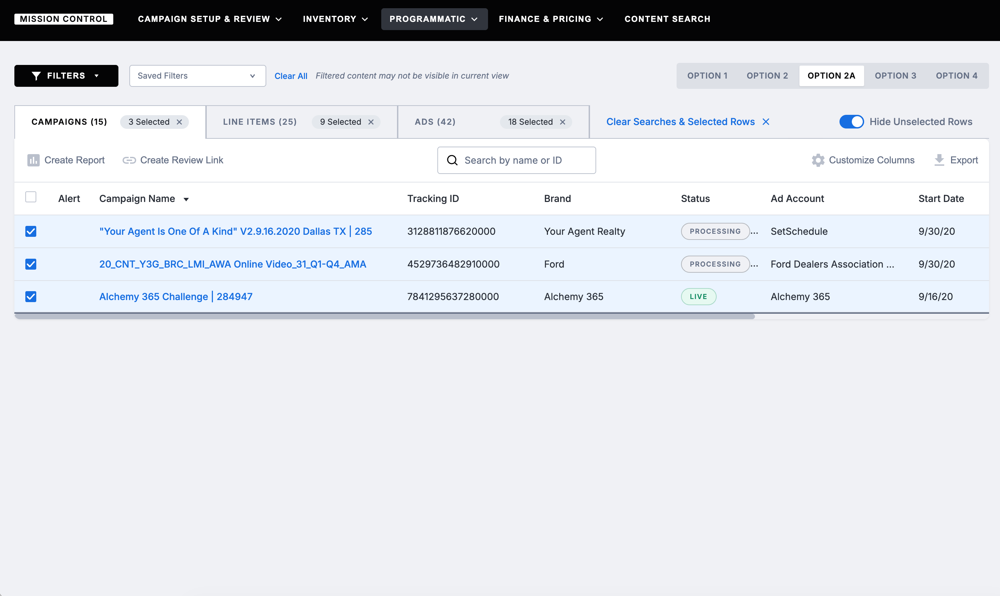
  

<!--
I suggested a warning or some type of message at the top saying something along the lines of "hey you have some filters are applied but the rows are turned off"

This is being developed right now and I'm sure more edge cases will pop up which I do the best of ability to address especially with the limitations I have which is almost always time. This should launch in the upcoming weeks and should reduce time spent for out internal users when looking up data.

So that was an example of my "small kitchen" update, let me get to my main case study which is going to be a "complete kitchen renovation"
-->

---
layout: default
transition: slide-left
hide: true
---

<CaseStudyPillTabs :key="s11_copy_agenda_dup5_feedback_repeat_dup" class="-mt-10 mb-10 mx-auto" :initial-index="1" />

  

    <h2 class="user-groups-slide-heading m-0">Current &quot;Big Kitchen&quot; work</h2>
    

      <i class="fa-solid fa-circle text-[#0D9488] text-[0.5rem] shrink-0"></i>
      New UI for legacy tool
    

    

      <i class="fa-solid fa-circle text-[#0D9488] text-[0.5rem] shrink-0"></i>
      Will need total overhaul
    

    

      Audit patterns and flows
      Interview users
      Revise PRD
    

  

  

    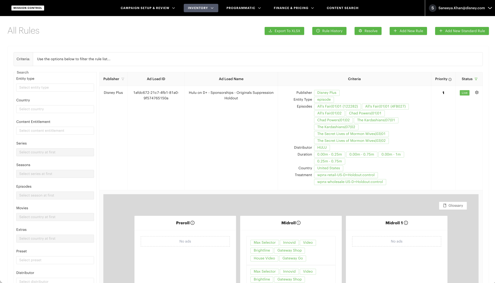
  

---
layout: two-cols
layoutClass: h-full
transition: slide-left
---

  

    

      
Designing Ads You Can Shop

      
Creating a new interactive ad format for streaming platforms

      

        CASE STUDY
      

    

  

::right::

  

    
Image placeholder

  

<!--
New case study introduction slide
-->

---
layout: default
transition: slide-left
---

  

    

      

        

          
Timeline

          
4 Months

        

        

          
Role

          
Product Designer

        

        

          
Team

          

            
UX Researchers

            
Product Managers

          

        

      

    

  

---
layout: default
transition: slide-left
---

<h2 class="user-groups-slide-heading m-0 mt-6 mb-5">Advertising on Hulu</h2>

  

    

      <i class="fa-solid fa-circle text-[#0D9488] text-[0.5rem] shrink-0"></i>
      30-45s video ads
    

    

      <i class="fa-solid fa-circle text-[#0D9488] text-[0.5rem] shrink-0"></i>
      Pause Ads
    

    

      <i class="fa-solid fa-circle text-[#0D9488] text-[0.5rem] shrink-0"></i>
      Interactive Ads
    

  

  

    <AdManagerStack :images="['./slides/assets/CurrentHuluad1.png', './slides/assets/CurrentHuluad2.png', './slides/assets/CurrentHuluad3.png']" :compact="true" :viewport-height="420" layer-max-width="72rem" layer-width-pct="95%" pull-down="-2rem" />
  

---
layout: default
transition: slide-left
---

<h2 class="user-groups-slide-heading m-0 mt-6 mb-5">Key constraints</h2>

  

    

      <svg xmlns="http://www.w3.org/2000/svg" viewBox="0 0 640 640" class="w-8 h-8 fill-[#0D9488]" aria-hidden="true"><path d="M96 192C96 130.1 146.1 80 208 80C269.9 80 320 130.1 320 192C320 253.9 269.9 304 208 304C146.1 304 96 253.9 96 192zM32 528C32 430.8 110.8 352 208 352C305.2 352 384 430.8 384 528L384 534C384 557.2 365.2 576 342 576L74 576C50.8 576 32 557.2 32 534L32 528z"/></svg>
    

    

    Interactive ads had CTAs such as QR codes/push/emails
  

  

    

      <svg xmlns="http://www.w3.org/2000/svg" viewBox="0 0 640 640" class="w-8 h-8 fill-[#0D9488]" aria-hidden="true"><path d="M296 88C296 74.7 306.7 64 320 64C333.3 64 344 74.7 344 88L344 128L400 128C417.7 128 432 142.3 432 160C432 177.7 417.7 192 400 192L285.1 192C260.2 192 240 212.2 240 237.1C240 259.6 256.5 278.6 278.7 281.8L370.3 294.9C424.1 302.6 464 348.6 464 402.9C464 463.2 415.1 512 354.9 512L344 512L344 552C344 565.3 333.3 576 320 576C306.7 576 296 565.3 296 552L296 512L224 512C206.3 512 192 497.7 192 480C192 462.3 206.3 448 224 448L354.9 448C379.8 448 400 427.8 400 402.9C400 380.4 383.5 361.4 361.3 358.2L269.7 345.1C215.9 337.5 176 291.4 176 237.1C176 176.9 224.9 128 285.1 128L296 128L296 88z"/></svg>
    

    

    We were not getting attributions for clicks/purchases
  

  

    

      <svg xmlns="http://www.w3.org/2000/svg" viewBox="0 0 640 640" class="self-center w-8 h-8 fill-[#0D9488] flex-shrink-0" aria-hidden="true"><path d="M96 160L96 400L544 400L544 160L96 160zM32 160C32 124.7 60.7 96 96 96L544 96C579.3 96 608 124.7 608 160L608 400C608 435.3 579.3 464 544 464L96 464C60.7 464 32 435.3 32 400L32 160zM192 512L448 512C465.7 512 480 526.3 480 544C480 561.7 465.7 576 448 576L192 576C174.3 576 160 561.7 160 544C160 526.3 174.3 512 192 512z"/></svg>
    

    

    Could not quantify the ad's impact on driving sales
  

---
layout: default
transition: slide-left
---

<CaseStudyPillTabs :key="s9_dup" class="-mt-10 mb-10 mx-auto" variant="campaign" :initial-index="1" />

  

    We did not have a truly frictionless shoppable TV ad experience where we could quantify the ad's impact
  

---
layout: default
transition: slide-left
---

<h2 class="user-groups-slide-heading m-0 mt-6 mb-5">The opportunity</h2>

  

    

      <i class="fa-solid fa-cart-shopping text-[1.6rem] text-[#0D9488]"></i>
    

    

    Create a new ad format that lets viewers shop directly from their screen
  

  

    

      <i class="fa-solid fa-lightbulb text-[1.6rem] text-[#0D9488]"></i>
    

    

    Create a custom landing page where viewers can browse &amp; purchase
  

  

    

      <i class="fa-solid fa-chart-line text-[1.6rem] text-[#0D9488]"></i>
    

    

    Track purchases/clicks in order to measure real revenue impact
  

---
layout: default
transition: slide-left
---

<h2 class="user-groups-slide-heading m-0 mt-6 mb-5">Business value</h2>

  

    <i class="fa-solid fa-circle text-[#0D9488] text-[0.5rem] shrink-0"></i>
    Products can be tied to the content being watched
  

  

    <i class="fa-solid fa-circle text-[#0D9488] text-[0.5rem] shrink-0"></i>
    Enables more personalized, interest-based ad targeting
  

  

    <i class="fa-solid fa-circle text-[#0D9488] text-[0.5rem] shrink-0"></i>
    Justifies higher cost of interactive ads by showing real value
  

---
layout: default
transition: slide-left
---

<h2 class="user-groups-slide-heading m-0 mt-6 mb-5">Goals & Strategy</h2>

  

    <i class="fa-solid fa-circle text-[#0D9488] text-[0.5rem] shrink-0"></i>
    Set up a working relationship with a brand new team of 4-5 PMs and no engineers
  

  

    <i class="fa-solid fa-circle text-[#0D9488] text-[0.35rem] shrink-0"></i>
    More experimental than my other teams
  

  

    <i class="fa-solid fa-circle text-[#0D9488] text-[0.5rem] shrink-0"></i>
    Research and learn about ad formats
  

  

    <i class="fa-solid fa-circle text-[#0D9488] text-[0.5rem] shrink-0"></i>
    Design template for living room (ad format) and second screen (mobile)
  

---
layout: default
transition: slide-left
---

<h2 class="user-groups-slide-heading m-0 mt-6 mb-5">Other ad formats</h2>

  

    

      <i class="fa-solid fa-circle text-[#0D9488] text-[0.5rem] shrink-0"></i>
      Existing ad formats on Hulu and competitors
    

  

  

    <AdManagerStack :images="['./slides/assets/adformatcompetitor1.png', './slides/assets/adformatcompetitor2.png', './slides/assets/adformatcompetitor3.png']" :compact="true" :viewport-height="420" layer-max-width="72rem" layer-width-pct="95%" pull-down="-2rem" />
  

---
layout: default
transition: slide-left
---

<h2 class="user-groups-slide-heading m-0 mt-6 mb-5">TV controls</h2>

  

    

      <i class="fa-solid fa-circle text-[#0D9488] text-[0.5rem] shrink-0"></i>
      About 2/3 of viewers
    

    

      <i class="fa-solid fa-circle text-[#0D9488] text-[0.5rem] shrink-0"></i>
      Mapped out every remote control flow
    

  

  

    <AdManagerStack :images="['./slides/assets/huluplayer1.png', './slides/assets/huluplayer2.png']" :compact="true" :viewport-height="420" layer-max-width="72rem" layer-width-pct="95%" pull-down="-2rem" />
  

---
layout: default
transition: slide-left
---

<h2 class="user-groups-slide-heading m-0 mt-6 mb-5">TV-first design</h2>

  

    

      <i class="fa-solid fa-circle text-[#0D9488] text-[0.5rem] shrink-0"></i>
      Worked with the player experience team
    

    

      <i class="fa-solid fa-circle text-[#0D9488] text-[0.5rem] shrink-0"></i>
      Safe zones for elements
    

    

      <i class="fa-solid fa-circle text-[#0D9488] text-[0.5rem] shrink-0"></i>
      Limitations of remote controls
    

  

  

    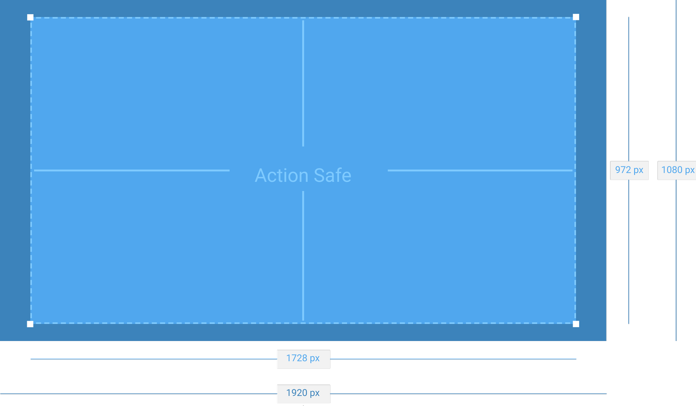
  

---
layout: default
transition: slide-left
---

<h2 class="user-groups-slide-heading m-0 mt-6 mb-5">Ad experience</h2>

  

    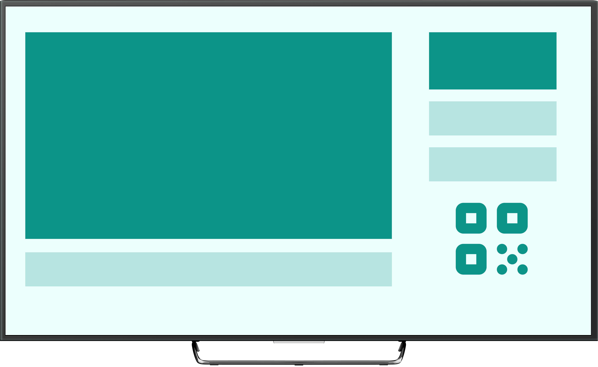
  

  

    <i class="fa-solid fa-arrow-right text-[#0D9488] text-[3rem]"></i>
  

  

    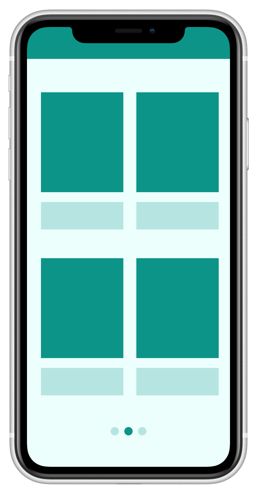
  

---
layout: default
transition: slide-left
---

<h2 class="user-groups-slide-heading m-0 mt-6 mb-5">Intended features</h2>

  

    <i class="fa-solid fa-circle text-[#0D9488] text-[0.5rem] shrink-0"></i>
    Keep the experience lightweight and non-intrusive
  

  

    <i class="fa-solid fa-circle text-[#0D9488] text-[0.5rem] shrink-0"></i>
    Include interactive CTAs such as buttons/QR code/product carousel
  

  

    <i class="fa-solid fa-circle text-[#0D9488] text-[0.5rem] shrink-0"></i>
    Ensure that ad can be &quot;templatized&quot; ie advertiser can easily customize each element
  

---
layout: default
transition: slide-left
---

  

    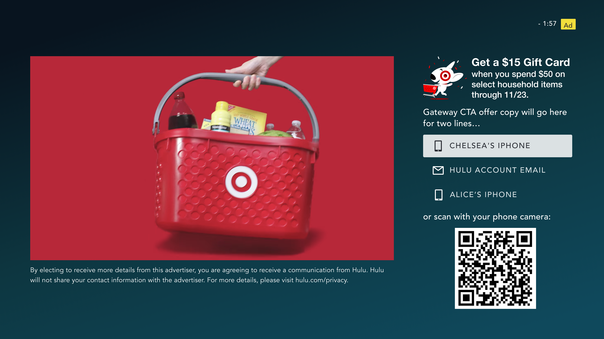
    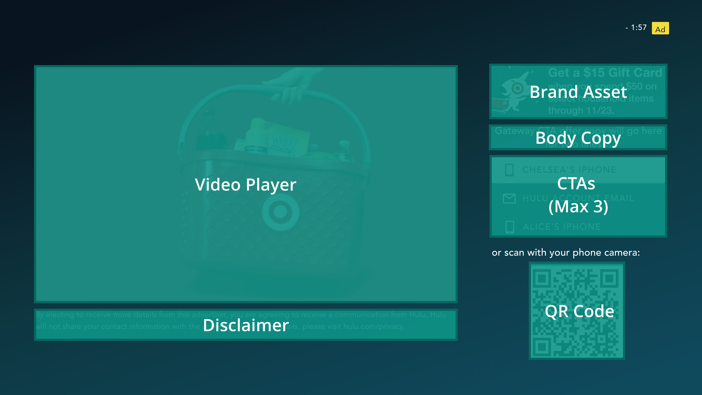
  

---
layout: default
transition: fade
---

<h2 class="user-groups-slide-heading m-0 mt-6 mb-5">Designs</h2>

  

    

      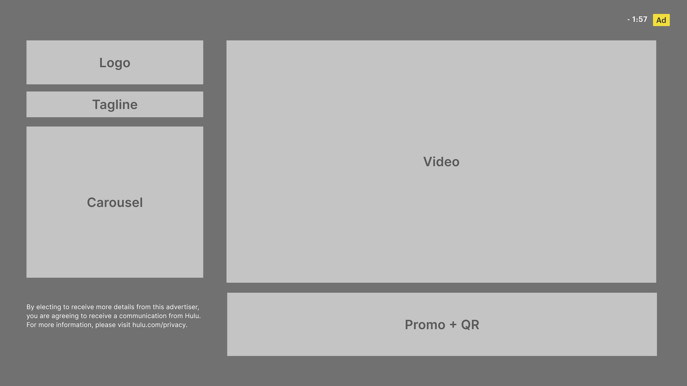
    

    

      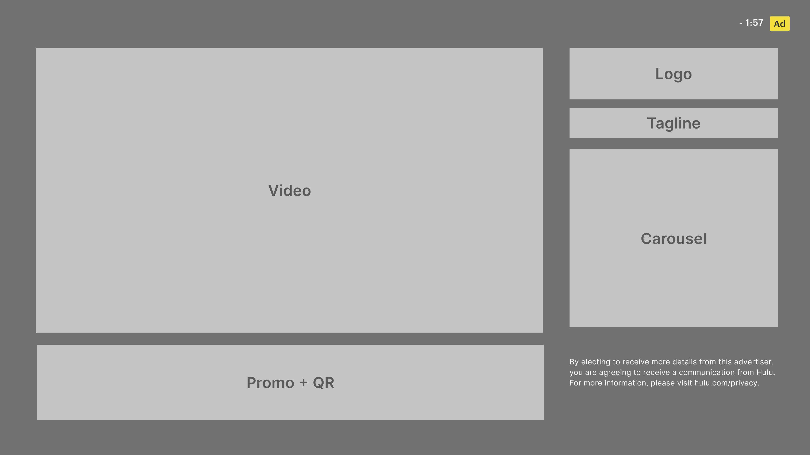
    

  

  

    

      <i class="fa-solid fa-arrow-down text-[#0D9488] text-[1.5rem]"></i>
    

    

      <i class="fa-solid fa-arrow-down text-[#0D9488] text-[1.5rem]"></i>
    

  

  

    

      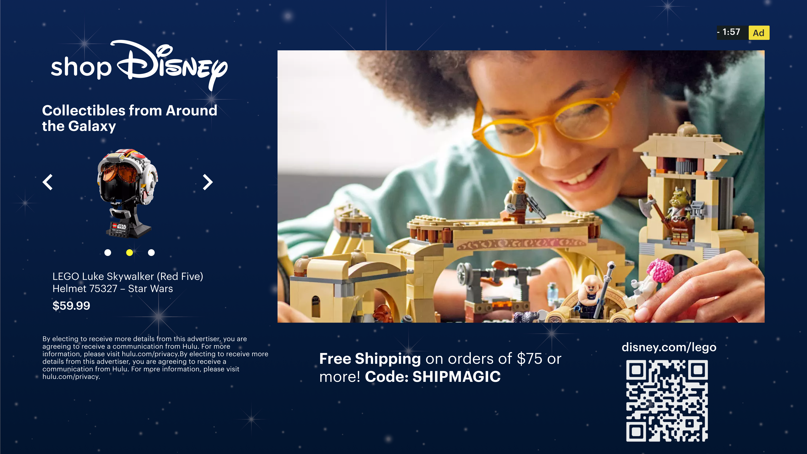
    

    

      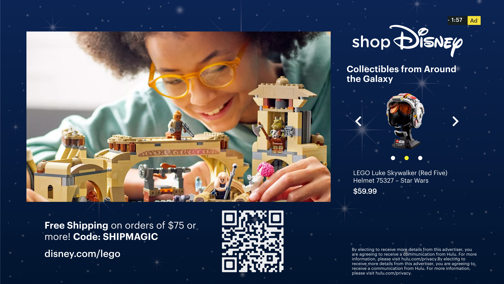
    

  

---
layout: default
transition: slide-left
---

<h2 class="user-groups-slide-heading m-0 mt-6 mb-5">Designs</h2>

  

    

      <i class="fa-solid fa-circle text-[#0D9488] text-[0.5rem] shrink-0"></i>
      Combination of CTAs + positionings
    

  

  

    <AdManagerStack :images="['./slides/assets/gatewayshopdesign1.png', './slides/assets/gatewayshopdesign2.png', './slides/assets/gatewayshopdesign3.png']" :compact="true" :viewport-height="420" layer-max-width="72rem" layer-width-pct="95%" pull-down="-2rem" />
  

---
layout: default
transition: slide-left
---

<h2 class="user-groups-slide-heading m-0 mt-6 mb-5">Bumpers</h2>

  

    

      <i class="fa-solid fa-circle text-[#0D9488] text-[0.5rem] shrink-0"></i>
      Combination of CTAs + positionings
    

  

  

    <AdManagerStack :images="['./slides/assets/gatewayshopbumper1.png', './slides/assets/gatewayshopbumper2.png', './slides/assets/gatewayshopbumper3.png']" :compact="true" :viewport-height="420" layer-max-width="72rem" layer-width-pct="95%" pull-down="-2rem" />
  

---
layout: default
transition: slide-left
---

<h2 class="user-groups-slide-heading m-0 mt-6 mb-5">Bumpers</h2>

  

    

      <i class="fa-solid fa-circle text-[#0D9488] text-[0.5rem] shrink-0"></i>
      Combination of CTAs + positionings
    

  

  

    <AdManagerStack :images="['./slides/assets/gatewayshopbumper1.png', './slides/assets/gatewayshopbumper2.png', './slides/assets/gatewayshopbumper3.png']" :compact="true" :viewport-height="420" layer-max-width="72rem" layer-width-pct="95%" pull-down="-2rem" />
  

---
layout: default
transition: slide-left
---

<h2 class="user-groups-slide-heading m-0 mt-6 mb-5">New shoppable ad format</h2>

  

    
Interactive ad with product browsing and purchase tracking

  

---
layout: default
transition: slide-left
---

<h2 class="user-groups-slide-heading m-0 mt-6 mb-5">Results & impact</h2>

  

    

      Conversion
    

    Track purchases and measure revenue impact
  

  

    

      Adoption
    

    New ad format available for advertisers
  

---
layout: default
transition: slide-left
---

<h2 class="user-groups-slide-heading m-0 mt-6 mb-5">Design outcomes</h2>

  

    

      <i class="fa-solid fa-check text-[#0D9488] text-[1.6rem]"></i>
    

    

    Templatized solution enables advertiser customization
  

  

    

      <i class="fa-solid fa-lightbulb text-[#0D9488] text-[1.6rem]"></i>
    

    

    Early UX team collaboration accelerated learning
  

---
layout: default
transition: slide-left
---

<h2 class="user-groups-slide-heading m-0 mt-6 mb-5">Key learnings</h2>

  

    <i class="fa-solid fa-circle text-[#0D9488] text-[0.5rem] shrink-0"></i>
    TV-first design requires different considerations than mobile/desktop
  

  

    <i class="fa-solid fa-circle text-[#0D9488] text-[0.5rem] shrink-0"></i>
    Templatization enables faster iteration and advertiser adoption
  

  

    <i class="fa-solid fa-circle text-[#0D9488] text-[0.5rem] shrink-0"></i>
    Cross-team collaboration accelerates learning and execution
  

---
layout: two-cols
layoutClass: h-full
transition: slide-left
---

  

    

      
Redesigning for Agency Scale

      
Updating the Campaign Creation flow

      

        CASE STUDY
      

    

  

::right::

<PinterestMasonry :show-images="false" span-src="./slides/assets/Campaigngrid4.png" span-position="center 28%" :span-flex="0.8" :merge-right-stack="true" right-src="./slides/assets/Campaigngrid1.png" right-position="left center" left-top-src="./slides/assets/Campaigngrid2.png" left-bottom-src="./slides/assets/Campaigngrid3.png" left-bottom-position="center 18%" />

<!--
Let me describe some "big kitchen remodel" I did which was the redesign of the campaign creation flow I worked on for Disney Campaign Manager
-->

---
layout: default
transition: slide-left
---

  

    

      

        

          
Timeline

          
2 Years

        

        

          
Role

          
Lead Designer

        

        

          
Team

          

            
1 Designer

            
5-7 PMs

            
30-40 Internal &amp; External Devs

            
QA

            
Ad Sales

            
Customer Support

            
Ad Ops

          

        

      

    

  

<!--
It was a huge project and before I get into the specifics, let me describe what is Disney Campaign Manager
-->

---
src: ./slides/more.md
---

---
layout: default
transition: slide-left
---

<CaseStudyPillTabs :key="s7" class="-mt-10 mb-10 mx-auto" variant="campaign" :initial-index="0" />

<h2 class="user-groups-slide-heading m-0 mt-6 mb-5">What is Disney Campaign Manager?</h2>

  

    

      <svg xmlns="http://www.w3.org/2000/svg" viewBox="0 0 640 640" class="self-center w-8 h-8 fill-[#0D9488] flex-shrink-0" aria-hidden="true"><path d="M96 160L96 400L544 400L544 160L96 160zM32 160C32 124.7 60.7 96 96 96L544 96C579.3 96 608 124.7 608 160L608 400C608 435.3 579.3 464 544 464L96 464C60.7 464 32 435.3 32 400L32 160zM192 512L448 512C465.7 512 480 526.3 480 544C480 561.7 465.7 576 448 576L192 576C174.3 576 160 561.7 160 544C160 526.3 174.3 512 192 512z"/></svg>
    

    

    Launched in March 2020 as Hulu Ad Manager
  

  

    

      <svg xmlns="http://www.w3.org/2000/svg" viewBox="0 0 640 640" class="self-center w-8 h-8 fill-[#0D9488] flex-shrink-0" aria-hidden="true"><path d="M96 192C96 130.1 146.1 80 208 80C269.9 80 320 130.1 320 192C320 253.9 269.9 304 208 304C146.1 304 96 253.9 96 192zM32 528C32 430.8 110.8 352 208 352C305.2 352 384 430.8 384 528L384 534C384 557.2 365.2 576 342 576L74 576C50.8 576 32 557.2 32 534L32 528zM464 128C517 128 560 171 560 224C560 277 517 320 464 320C411 320 368 277 368 224C368 171 411 128 464 128zM464 368C543.5 368 608 432.5 608 512L608 534.4C608 557.4 589.4 576 566.4 576L421.6 576C428.2 563.5 432 549.2 432 534L432 528C432 476.5 414.6 429.1 385.5 391.3C408.1 376.6 435.1 368 464 368z"/></svg>
    

    

    Intended for SMBs to be able to advertise on Hulu
  

  

    

      <svg xmlns="http://www.w3.org/2000/svg" viewBox="0 0 640 640" class="self-center w-8 h-8 fill-[#0D9488] flex-shrink-0" aria-hidden="true"><path d="M296 88C296 74.7 306.7 64 320 64C333.3 64 344 74.7 344 88L344 128L400 128C417.7 128 432 142.3 432 160C432 177.7 417.7 192 400 192L285.1 192C260.2 192 240 212.2 240 237.1C240 259.6 256.5 278.6 278.7 281.8L370.3 294.9C424.1 302.6 464 348.6 464 402.9C464 463.2 415.1 512 354.9 512L344 512L344 552C344 565.3 333.3 576 320 576C306.7 576 296 565.3 296 552L296 512L224 512C206.3 512 192 497.7 192 480C192 462.3 206.3 448 224 448L354.9 448C379.8 448 400 427.8 400 402.9C400 380.4 383.5 361.4 361.3 358.2L269.7 345.1C215.9 337.5 176 291.4 176 237.1C176 176.9 224.9 128 285.1 128L296 128L296 88z"/></svg>
    

    

    Managed by an external agency
  

<!--
Disney campaign manager used to be known as Hulu ad manager and was launched in early 2020.

The product was initially created to let SMBs advertise on Hulu because there was a much lower minimum spend than the traditional route, $500 in campaign manager vs $50,000 through the direct route

Hulu ad manager was a white label product launched and maintained by a 3rd party agency in Ukraine who we had to go through every time we needed to change something
-->

---
layout: default
transition: fade
---

<CaseStudyPillTabs :key="s6" class="-mt-10 mb-10 mx-auto" variant="campaign" :initial-index="0" />

<AdManagerStack :images="['./slides/assets/OLDham1.png', './slides/assets/OLDham2.png', './slides/assets/OLDham3.png', './slides/assets/OLDham4.png']" :compact="true" :viewport-height="500" layer-max-width="72rem" pull-down="-2rem" />

<!--
When I started in 2021 this was campaign creation flow looked like

It was was a page by page flow where you can set up Campaign name, dates, budget, and targeting options such as demographics and interests, and hobbies
-->

---
layout: default
transition: slide-left
hide: true
---

<CaseStudyPillTabs :key="s23_copy_dup" class="-mt-10 mb-10 mx-auto" variant="campaign" :initial-index="0" />

<h2 class="user-groups-slide-heading m-0 mt-6 mb-5">State of the product</h2>

  

    <i class="fa-solid fa-circle text-[#0D9488] text-[0.5rem] shrink-0"></i>
    $10m ARR within 1 year of launch
  

  

    <i class="fa-solid fa-circle text-[#0D9488] text-[0.5rem] shrink-0"></i>
    Had to use 3rd party agency for every update to the platform
  

  

    <i class="fa-solid fa-circle text-[#0D9488] text-[0.5rem] shrink-0"></i>
    Business had goals to transfer/rebuild the platform on Disney
  

<!--
Even though it was still a newish platform, it was profitable, making about $10mil a year

But we still have to spend money everytime we wanted to update the platform

Business wanted to transfer the platform over to our side because it was growing too quickly and because using the agency for every change was not sustainable
-->

---
layout: default
transition: slide-left
hide: true
---

<CaseStudyPillTabs :key="s8" class="-mt-10 mb-10 mx-auto" variant="campaign" :initial-index="1" />

<h2 class="user-groups-slide-heading m-0 mt-6 mb-5">Plans to scale</h2>

  

    <i class="fa-solid fa-circle text-[#0D9488] text-[0.5rem] shrink-0"></i>
    Business wanted to increase growth
  

  

    <i class="fa-solid fa-circle text-[#0D9488] text-[0.5rem] shrink-0"></i>
    Larger campaign budgets + more big-spend accounts
  

<!--
We really wanted faster growth so  

when I started, there was a big push to get larger campaign budgets and users who could do those larger spends
-->

---
layout: default
transition: slide-left
---

<CaseStudyPillTabs :key="s8_dup" class="-mt-10 mb-10 mx-auto" variant="campaign" :initial-index="1" />

<h2 class="user-groups-slide-heading m-0 mt-6 mb-5">Agency pivot</h2>

  

    

      <i class="fa-solid fa-chart-line self-center text-[1.6rem] text-[#0D9488] flex-shrink-0"></i>
    

    

    $10M ARR but business wanted to scale faster
  

  

    

      <svg xmlns="http://www.w3.org/2000/svg" viewBox="0 0 640 640" class="self-center w-8 h-8 fill-[#0D9488] flex-shrink-0" aria-hidden="true"><path d="M64 128C64 92.7 92.7 64 128 64L384 64C419.3 64 448 92.7 448 128L448 249.3C401.1 268.3 368 314.3 368 368C368 395.7 376.8 421.4 391.8 442.4C340.3 463.4 304 514 304 573.1C304 574.1 304 575 304 576L128 576C92.7 576 64 547.3 64 512L64 128zM208 464L208 528L261.4 528C268.6 498.6 282.7 471.9 301.8 449.7C295.7 430.2 277.5 416 256 416C229.5 416 208 437.5 208 464zM339 288.3C338 288.1 337 288 336 288L304 288C295.2 288 288 295.2 288 304L288 336C288 344.8 295.2 352 304 352L320.7 352C322.8 329.2 329.1 307.7 339 288.3zM176 160C167.2 160 160 167.2 160 176L160 208C160 216.8 167.2 224 176 224L208 224C216.8 224 224 216.8 224 208L224 176C224 167.2 216.8 160 208 160L176 160zM288 176L288 208C288 216.8 295.2 224 304 224L336 224C344.8 224 352 216.8 352 208L352 176C352 167.2 344.8 160 336 160L304 160C295.2 160 288 167.2 288 176zM176 288C167.2 288 160 295.2 160 304L160 336C160 344.8 167.2 352 176 352L208 352C216.8 352 224 344.8 224 336L224 304C224 295.2 216.8 288 208 288L176 288zM416 368C416 323.8 451.8 288 496 288C540.2 288 576 323.8 576 368C576 412.2 540.2 448 496 448C451.8 448 416 412.2 416 368zM352 576C352 523 395 480 448 480L544 480C597 480 640 523 640 576C640 593.7 625.7 608 608 608L384 608C366.3 608 352 593.7 352 576z"/></svg>
    

    

    Target users changed from SMBs to agencies &amp; larger advertisers
  

  

    

      <i class="fa-solid fa-cart-shopping self-center text-[1.6rem] text-[#0D9488] flex-shrink-0"></i>
    

    

    70% of ad buys on streaming are done via agencies
  

<!--
Platform was profitable, but business wanted faster growth. Which currently wasn't easy because we had to pay the 3rd party agency for every update. 

And to get larger spends, we also needed to pivot away from SMBs as the core user group to agencies and enterprise advertisers because they had those larger ad spends and did the bulk of advertising on steaming 

these people did advertise on Disney but through our direct side where operational costs were higher so that was another a reason to push them to the self serve side
-->

---
layout: default
transition: slide-left
---

<CaseStudyPillTabs :key="s10" class="-mt-10 mb-10 mx-auto" variant="campaign" :initial-index="1" />

<h2 class="user-groups-slide-heading m-0 mt-6 mb-5">What Agencies wanted</h2>

  

    

      <i class="fa-solid fa-circle text-[#0D9488] text-[0.5rem] shrink-0"></i>
      Ability to run multiple line items
    

    

      <i class="fa-solid fa-circle text-[#0D9488] text-[0.5rem] shrink-0"></i>
      Extra targeting options
    

    

      Dayparting
      Pacing
      Frequency
    

  

  

    
  

<!--
These Advertisers wanted extra targeting options such as day parting, frequency, pacing but the main thing they wanted was line items.

As I explained line items are basically sub-campaigns within campaigns, each with their own sets of targeting
-->

---
layout: default
transition: slide-left
---

<CaseStudyPillTabs :key="s9" class="-mt-10 mb-10 mx-auto" variant="campaign" :initial-index="1" />

  

    Agencies (and larger advertisers) did not see value in the self-serve ad platform
  

<!--
The core problem was that we didn't have the features these target advertisers wanted.
-->

---
layout: default
transition: slide-left
---

<CaseStudyPillTabs :key="s8_dup2" class="-mt-10 mb-10 mx-auto" variant="campaign" :initial-index="1" />

<h2 class="user-groups-slide-heading m-0 mt-6 mb-5">Agency pivot</h2>

  

    

      

        <i class="fa-solid fa-people-carry-box self-center text-[1.6rem] text-[#0D9488] flex-shrink-0"></i>
      

      

      Initiative to move platform
    

    <i class="fa-solid fa-plus text-[#0D9488] text-[1.75rem] mx-1 anim-fade-up justify-self-center self-center" style="animation-delay:0.4s"></i>
    

      

        <i class="fa-solid fa-chart-line self-center text-[1.6rem] text-[#0D9488] flex-shrink-0"></i>
      

      

      Plans to scale
    

    <i class="fa-solid fa-equals text-[#0D9488] text-[1.75rem] mx-1 anim-fade-up justify-self-center self-center" style="animation-delay:0.4s"></i>
  

  

    Entire Platform Rehaul
  

<!--
Because these was this plan for rapid growth, we had this initiative to move the platform to be in house as in transferring the platform over (using another external agency in Ukraine)

And the had huge plans to scale, this was a rare opportunity for me to essentially redo the entire platform.
-->

---
layout: default
transition: slide-left
---

<CaseStudyPillTabs :key="s8_dup3" class="-mt-10 mb-10 mx-auto" variant="campaign" :initial-index="1" />

  

    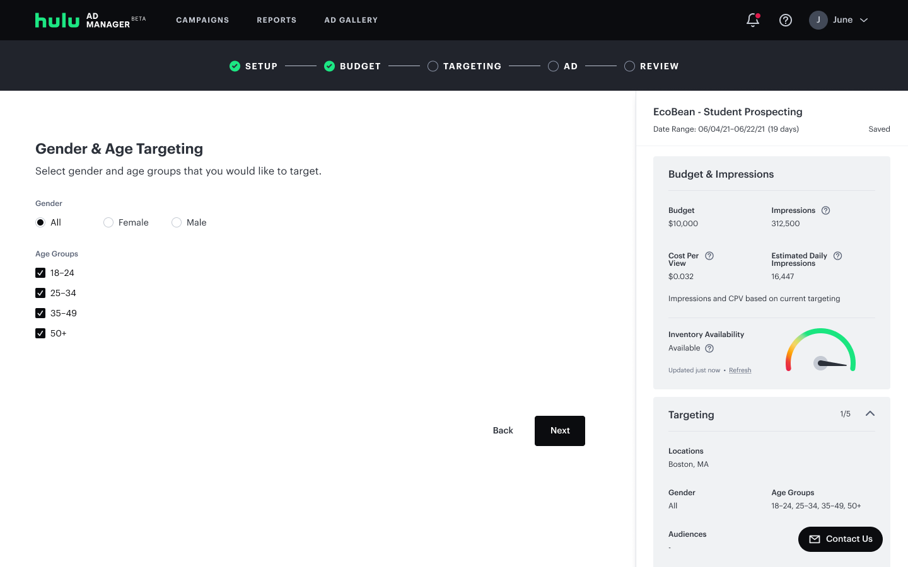
    <h3 class="thumb-subheader text-slate-600 text-[0.5rem] font-medium text-center">NEW Campaigns</h3>
  

  

    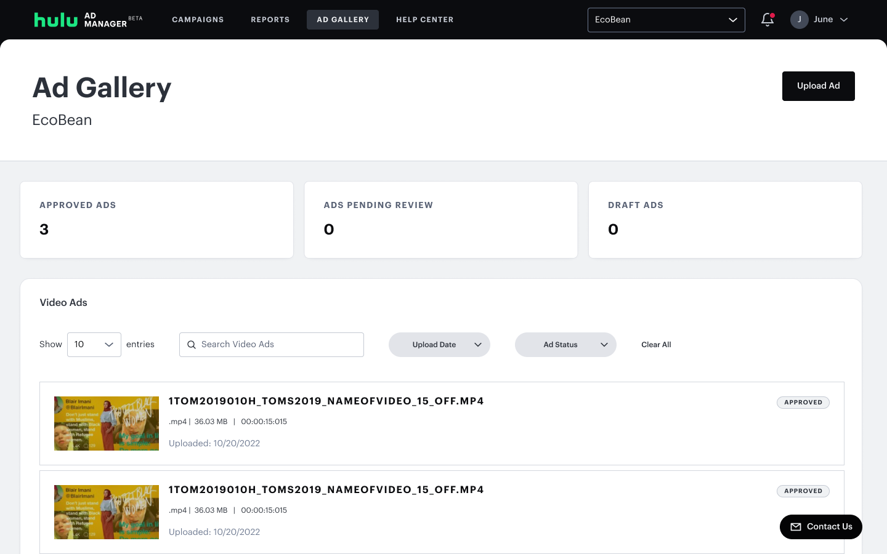
    <h3 class="thumb-subheader text-slate-600 text-[0.5rem] font-medium text-center">NEW Ad Gallery</h3>
  

  

    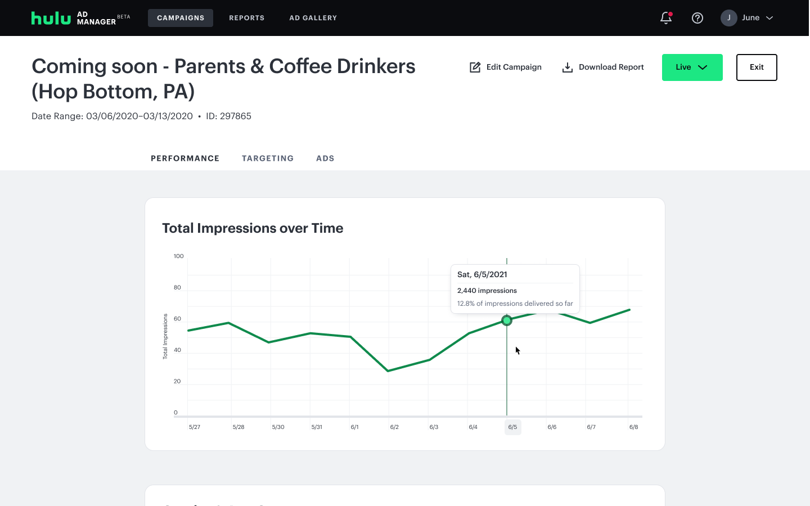
    <h3 class="thumb-subheader text-slate-600 text-[0.5rem] font-medium text-center">NEW Reporting</h3>
  

  

    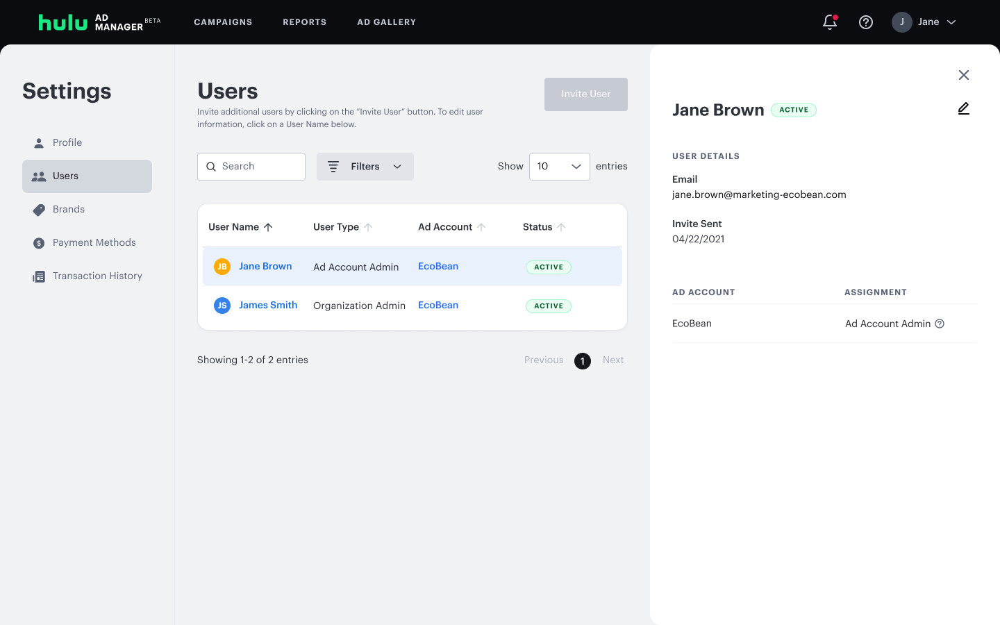
    <h3 class="thumb-subheader text-slate-600 text-[0.5rem] font-medium text-center">NEW Settings</h3>
  

  

    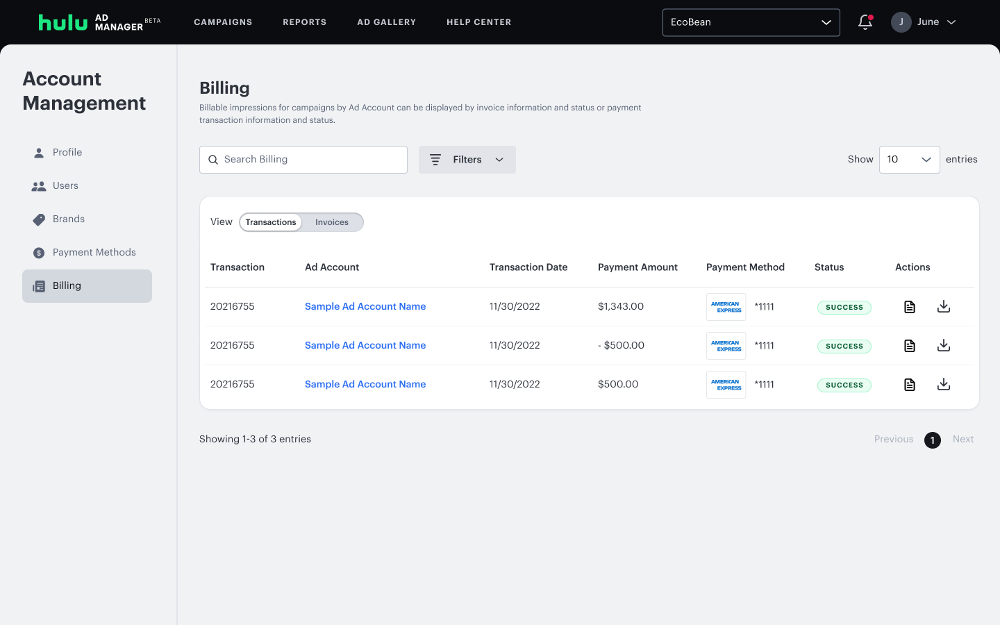
    <h3 class="thumb-subheader text-slate-600 text-[0.5rem] font-medium text-center">NEW Billing</h3>
  

  

    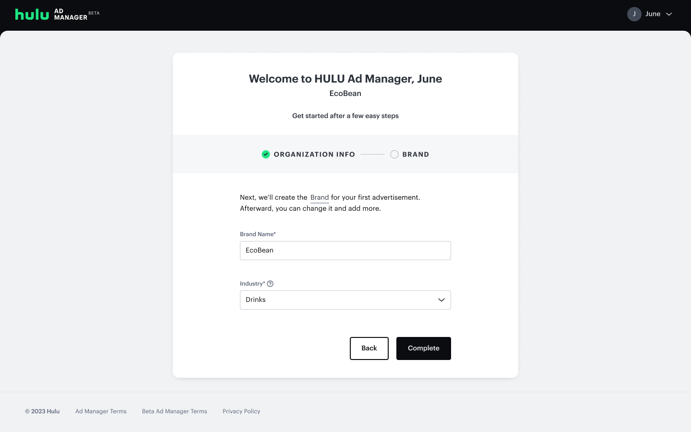
    <h3 class="thumb-subheader text-slate-600 text-[0.5rem] font-medium text-center">NEW Onboarding</h3>
  

  

    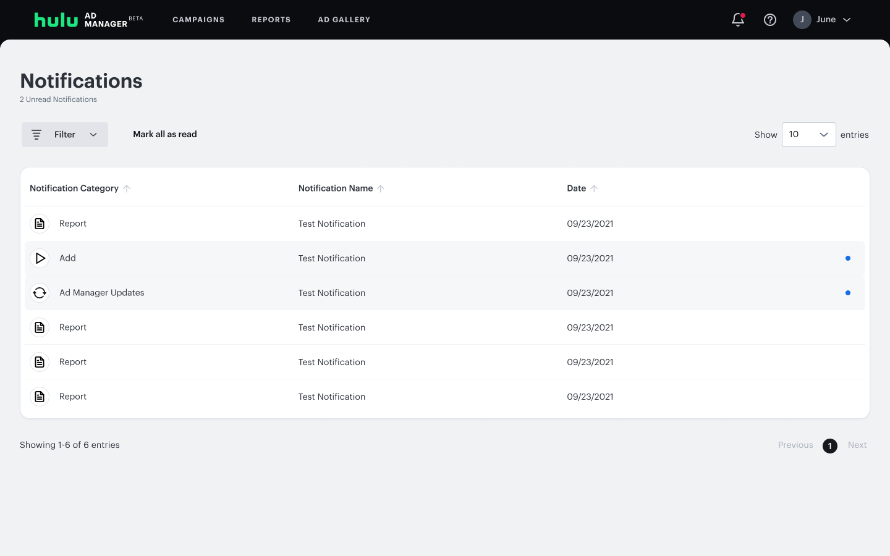
    <h3 class="thumb-subheader text-slate-600 text-[0.5rem] font-medium text-center">NEW Notifications</h3>
  

  

    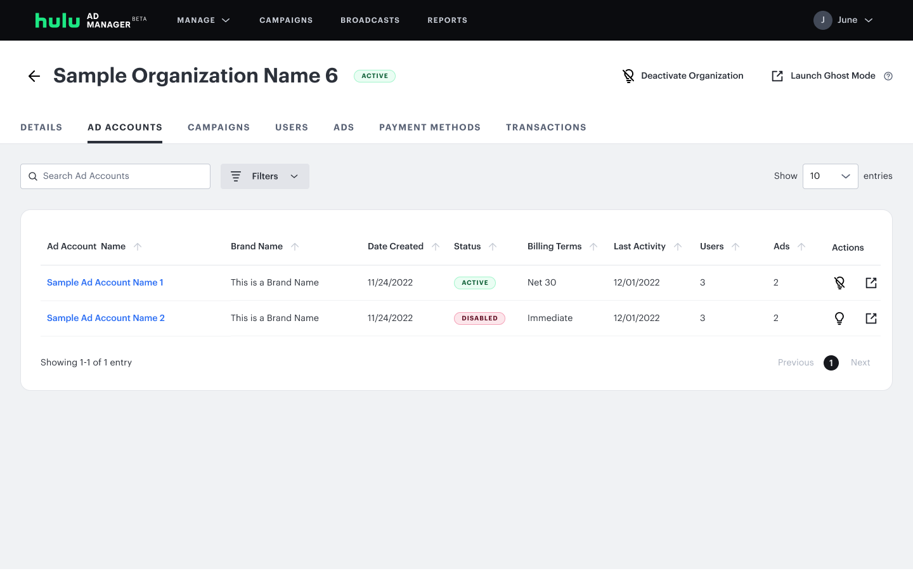
    <h3 class="thumb-subheader text-slate-600 text-[0.5rem] font-medium text-center">NEW Internal Ops Portal</h3>
  

<!--
Redoing the entire platform, meant everything. This was still a platform making money, so as the only designer, I had to update current parts of campaign manager including campaign creation and other areas such as reporting, onboarding and our internal portal. [CLICK]

and I had to simultaneously  work on the new iterations of everything. [CLICK] 

For the purpose of this presentation I will only focus on campaign creation because it went through the biggest change of everything here and because it is the core user experience in the platform
-->

---
layout: default
transition: slide-left
---

<CaseStudyPillTabs :key="s11" class="-mt-10 mb-10 mx-auto" variant="campaign" :initial-index="1" />

<h2 class="user-groups-slide-heading m-0 mt-6 mb-5">My strategy</h2>

  

    

      <i class="fa-solid fa-list-ol self-center text-[1.6rem] text-[#0D9488] flex-shrink-0"></i>
    

    

    Prioritize campaign redesign (hard deadline & only designer)
  

  

    

      <i class="fa-solid fa-magnifying-glass self-center text-[1.6rem] text-[#0D9488] flex-shrink-0"></i>
    

    

    Look at what patterns exist in other ad managers
  

  

    

      <i class="fa-solid fa-user-plus self-center text-[1.6rem] text-[#0D9488] flex-shrink-0"></i>
    

    

    Get additional resourcing
  

<!--
There was a hard deadline of Oct 1, 2024. Since it just me, I prioritized campaign redesign because it would be the biggest overhaul. For the same of time, I looked at other self serve ad platforms to learn what else was out there because agency users were used to working with these products so I wanted to stick with patterns they were familiar with

My other big goal was to get at least another designer to help me
-->

---
layout: default
transition: slide-left
---

<CaseStudyPillTabs :key="s_prev_design" class="-mt-10 mb-10 mx-auto" variant="campaign" :initial-index="2" />

  

    <h2 class="user-groups-slide-heading m-0">Previous design</h2>
    

      <i class="fa-solid fa-circle text-[#0D9488] text-[0.5rem] shrink-0"></i>
      Tested well in UXR
    

    

      <i class="fa-solid fa-circle text-[#0D9488] text-[0.5rem] shrink-0"></i>
      Easy to scale
    

  

  

    
  

<!--
So I started off by seeing what designs we had I could upcycle. 

There was this single page flow that was done by a previous designer and was tested with SMBs. It tested well, most users really liked the layout.

I hypothesized that it would be easier to add more sections (such day parting) in a single page flow than adding several more pages in a page-by-page flow
-->

---
layout: default
transition: slide-left
---

<CaseStudyPillTabs :key="s13" class="-mt-10 mb-4 mx-auto" variant="campaign" :initial-index="2" />

<h2 class="user-groups-slide-heading m-0 mt-6 mb-5 max-w-[9rem]">Competitive analysis</h2>

  

    

      <i class="fa-solid fa-circle text-[#0D9488] text-[0.5rem] shrink-0"></i>
      Ad Groups/Sets
    

    

      <i class="fa-solid fa-circle text-[#0D9488] text-[0.5rem] shrink-0"></i>
      Left or Right rail
    

  

  

    <AdManagerStack :images="['./slides/assets/CA1.png', './slides/assets/CA2.png', './slides/assets/CA3.png']" :compact="true" :viewport-height="820" layer-max-width="110rem" layer-width-pct="100%" pull-down="-16rem" />
  

<!--
When I looked at competitor platforms, I wanted to see how they handled line items. 

Facebook has this folder structure on the left rail and called them "ad sets" [CLICK]

Snapchat also calls them "ad sets" and has them here in the right rail [CLICK]

TikTok has "ad groups" and displayed them in the left rail  in a folder structure similar to facebook
-->

---
layout: default
transition: slide-left
hide: true
---

<CaseStudyPillTabs :key="s_core_layout" class="-mt-10 mb-10 mx-auto" variant="campaign" :initial-index="2" />

<h2 class="user-groups-slide-heading m-0 mt-6 mb-5">Core layout</h2>

  <ImageFadeSwap
    :images="['./slides/assets/layoutidea1.png', './slides/assets/layoutidea1a.png']"
    alt="Layout Idea 1"
    img-class="block h-[380px] w-auto max-w-full rounded-xl object-contain shadow-[0_2px_16px_rgb(0_0_0_/_6%)]"
  />

<!--
After looking at all the examples, I decided the core layout would look something like this

On the left would either be the navigation or line item menu, then you have the core campaign creation content in the middle, and here on the right rail would be where the inventory availability meter goes

I still hadn't decided exactly where Line items would go but I figured if I started designing, I could come up with some ideas
-->

---
layout: default
transition: slide-left
---

<CaseStudyPillTabs :key="s15" class="-mt-10 mb-4 mx-auto" variant="campaign" :initial-index="2" />

<h2 class="user-groups-slide-heading m-0 mt-6 mb-5">Top rail</h2>

  

    

      <i class="fa-solid fa-circle text-[#0D9488] text-[0.5rem] shrink-0"></i>
      Line items as top tabs
    

    <CarouselSyncBullet :show-at-click="3">Not scalable</CarouselSyncBullet>
  

  

    <AdManagerStack
      :images="['./slides/assets/Concept2.png', './slides/assets/Concept3.png', './slides/assets/Concept4.png']"
      :compact="true"
      :viewport-height="780"
      layer-max-width="110rem"
      layer-width-pct="98%"
      pull-down="-14.5rem"
      pile-shift="1.5rem"
    />
  

<!--
Using the research I had done as a starting off point, I did a ton of mocks, and of my initial ideas was to have line items live in the top as tabs because it would be easier to switch back and forth
[CLICK]

but since line item names could be customized, these tabs could get pretty long [CLICK]

and you end up with this weird horizontal scroll which did not look good or scale well

I ditched this idea and went on to try other options
-->

---
layout: default
transition: slide-left
---

<CaseStudyPillTabs :key="s16" class="-mt-10 mb-4 mx-auto" variant="campaign" :initial-index="2" />

<h2 class="user-groups-slide-heading m-0 mt-6 mb-5">More concepts</h2>

  

    

      <i class="fa-solid fa-circle text-[#0D9488] text-[0.5rem] shrink-0"></i>
      Early concepts for bulk editing line items
    

    <CarouselSyncBullet :show-at-click="1">Cut for scope</CarouselSyncBullet>
  

  

    <AdManagerStack :images="['./slides/assets/Concept2a.png', './slides/assets/Concept2b.png']" :compact="true" :viewport-height="820" layer-max-width="130rem" layer-width-pct="98%" pull-down="-16rem" />
  

<!--
One requirement early on was the ability to do bulk editing, as in be able to edit multiple line items at the same time

because of that concept I came up with this option of having line items in a dropdown at the top here and be able to select multiple line items had one time, but this dropdown could get long so I changed layouts 

[CLICK]

In this option, line items lived in the left rail. We ended up removing bulk editing for scope but this specific layout stuck with me and I decided to keep experimenting with it
-->

---
layout: default
transition: slide-left
---

<CaseStudyPillTabs :key="s17" class="-mt-10 mb-4 mx-auto" variant="campaign" :initial-index="2" />

<h2 class="user-groups-slide-heading m-0 mt-6 mb-5">Left rail</h2>

  

    

      <i class="fa-solid fa-circle text-[#0D9488] text-[0.5rem] shrink-0"></i>
      Can scale
    

    <CarouselSyncBullet :show-at-click="2">Easier to switch between line items</CarouselSyncBullet>
    <CarouselSyncBullet :show-at-click="2">Tested well internally</CarouselSyncBullet>
  

  

    <AdManagerStack :images="['./slides/assets/Concept3a.png', './slides/assets/Concept3b.png', './slides/assets/Concept3c.png']" :compact="true" :viewport-height="760" layer-max-width="100rem" layer-width-pct="95%" pull-down="-12rem" />
  

<!--
I had this idea of tabs that could toggle back and forth with the campaign navigation and line item menu

it was still sort of awkward,[CLICK] so another idea was having this line item accordion that would open up the navigation when selected

this was fine but navigation doesn't change, its the same regardless of whatever line item is selected. what does change is the line item [CLICK]

so I reversed it and came up with this design where the line item menu was an accordion  

I shared this layout with various internal teams specifically the client facing people such as customer support and sales people and they really liked this approach
-->

---
layout: default
transition: slide-left
---

<CaseStudyPillTabs :key="s18" class="-mt-10 mb-4 mx-auto" variant="campaign" :initial-index="2" process-label="Final" />

<h2 class="user-groups-slide-heading m-0 mt-2 mb-2">Line Item menu</h2>

  <AdManagerStack
    :images="['./slides/assets/Line Item Open.png']"
    :compact="true"
    :viewport-height="500"
    layer-max-width="88rem"
    layer-width-pct="89%"
    pull-down="-3rem"
    pile-shift="2rem"
  />

<!--
This is what the new layout ended up looking like, this is before the Disney Campaign Manger rebrand that we have now
-->

---
layout: default
transition: slide-left
---

<CaseStudyPillTabs :key="s11_dup_internal" class="-mt-10 mb-10 mx-auto" variant="campaign" :initial-index="3" />

<h2 class="user-groups-slide-heading m-0 mt-6 mb-5">With internal teams</h2>

  

    <i class="fa-solid fa-circle text-[#0D9488] text-[0.5rem] shrink-0"></i>
    Daily slacks/emails to PMs & eng
  

  

    <i class="fa-solid fa-circle text-[#0D9488] text-[0.5rem] shrink-0"></i>
    Weekly 'UX office hour'
  

  

    <i class="fa-solid fa-circle text-[#0D9488] text-[0.5rem] shrink-0"></i>
    Set up feedback sessions with sales & ops teams
  

  

    <i class="fa-solid fa-circle text-[#0D9488] text-[0.5rem] shrink-0"></i>
    Attend on-sites with product/eng
  

<!--
While the designs were being finalized, I was  doing a lot of check in and hand offs with product and eng. Especially since I was the only designer.

To keep up with everyone, I would message the PMs and lead engineers pretty frequently

I held weekly UX office hours where anyone could sign up in the agenda and go over anything design related

I myself shared designs and did discovery in ad hoc sessions with our sales and operations people

And I would even try to go out to the Hulu office, this was before RTO and it wasn't even my assigned office. But I tried to go a few times a month because the PMs were there and it usually was the easiest way for me to get updates and ask questions
-->

---
layout: default
transition: slide-left
---

<CaseStudyPillTabs :key="s11_dup_external" class="-mt-10 mb-10 mx-auto" variant="campaign" :initial-index="3" />

<h2 class="user-groups-slide-heading m-0 mt-6 mb-5">With external teams</h2>

  

    <i class="fa-solid fa-circle text-[#0D9488] text-[0.5rem] shrink-0"></i>
    Daily 8am calls
  

  

    <i class="fa-solid fa-circle text-[#0D9488] text-[0.5rem] shrink-0"></i>
    Asynchronous Q&A via spreadsheets
  

  

    <i class="fa-solid fa-circle text-[#0D9488] text-[0.5rem] shrink-0"></i>
    Very literal on designs
  

<!--
Working with the external teams was a whole other story, it was difficult to communicate with them, because there was a 10 hour time difference as well as a culture and language barrier

I would go to the 8am calls because it the was the only time everyone was online at once, we used this spreadsheet to ask questions and answers. Right before those 8am calls, I would scan the spreadsheet to see if there was anything design related that I could answer

But the biggest challenge, especially for me, was how literal those teams took designs. I was used to sharing designs with devs that had general direction, and they could fill in the blanks themselves but for these teams, they wanted every single flow spelled out
-->

---
layout: default
transition: slide-left
---

<CaseStudyPillTabs :key="s13_copy2" class="-mt-10 mb-4 mx-auto" variant="campaign" :initial-index="3" />

<h2 class="user-groups-slide-heading m-0 mt-6 mb-5 max-w-[18rem]">Handoffs</h2>

  

    

      <i class="fa-solid fa-circle text-[#0D9488] text-[0.5rem] shrink-0"></i>
      Mapped out every flow
    

    <CarouselSyncBullet :show-at-click="1">And every state</CarouselSyncBullet>
  

  

    <AdManagerStack :images="['./slides/assets/literal1.png', './slides/assets/literal2.png']" :compact="true" :viewport-height="780" layer-max-width="120rem" layer-width-pct="98%" pull-down="-12rem" />
  

<!--
the teams was very literal so I had to spell every flow including every error, modal, state, etc [CLICK]

This led to some massive figma files and I really wish I had the AI tooling we have now because it could have sped up a lot of this 

Ultimately this did help the external devs and more importantly didn't hold them up when we had this tight deadline we had to hit
-->

---
layout: default
transition: slide-left
---

<CaseStudyPillTabs :key="s18b_ui_patterns" class="-mt-10 mb-4 mx-auto" variant="campaign" :initial-index="2" process-label="Final" />

<h2 class="user-groups-slide-heading m-0 mt-6 mb-5">Pattern consolidation</h2>

  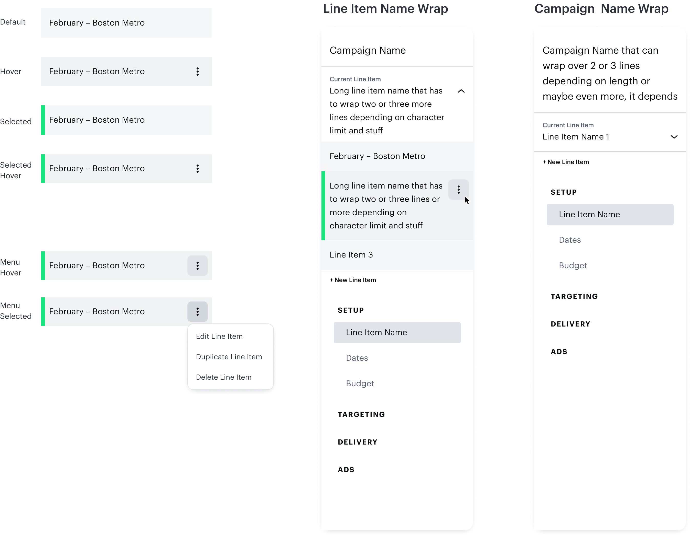

<!--
While I was going handoffs, I had to finalize the specs. One thing to note is that I inherited a design system which was a frankenstein of legacy hulu internal tools and hulu consumer apps

Consistency is big for me when it comes to UI and since I was redoing the whole platform, I wanted to make sure everything looked consistent, even any new elements I would add

This is the specs I did for the new line item menu
-->

---
layout: default
transition: slide-left
---

<CaseStudyPillTabs :key="s18b_ui_patterns_dup" class="-mt-10 mb-4 mx-auto" variant="campaign" :initial-index="2" process-label="Final" />

<h2 class="user-groups-slide-heading m-0 mt-6 mb-5">Pattern consolidation</h2>

  

    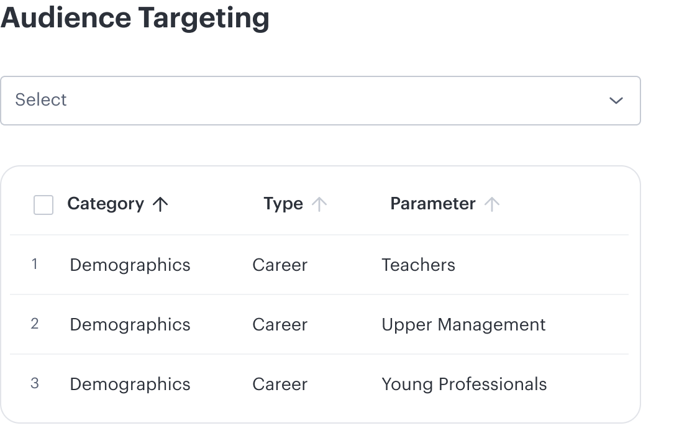
  

  

    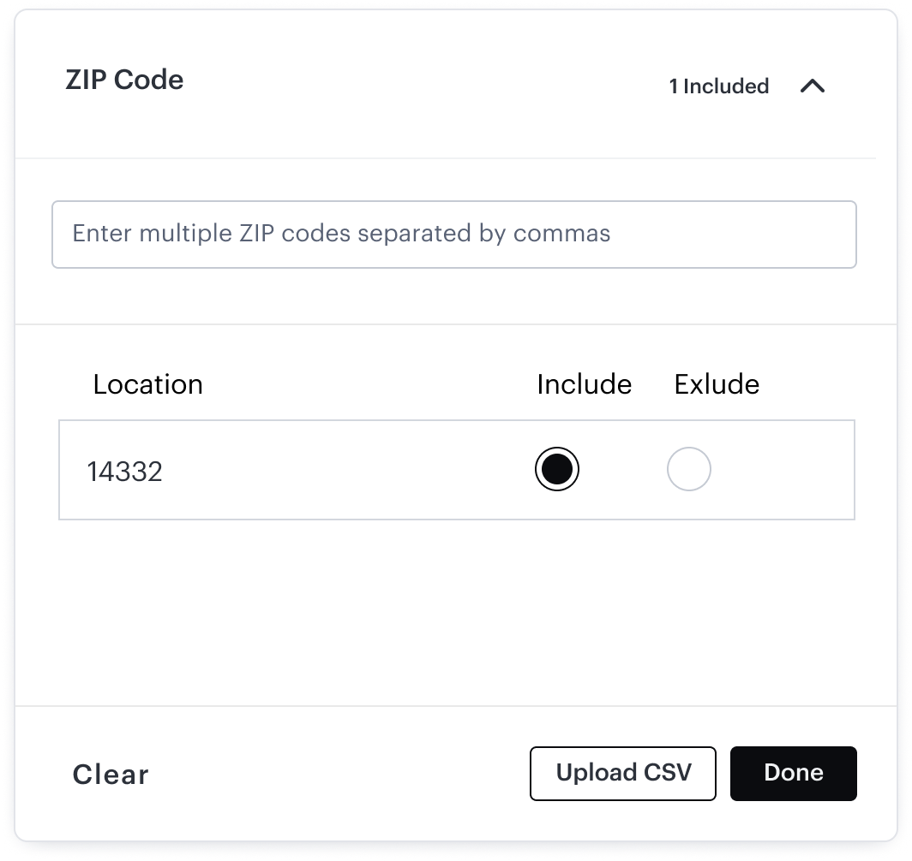
  

  

    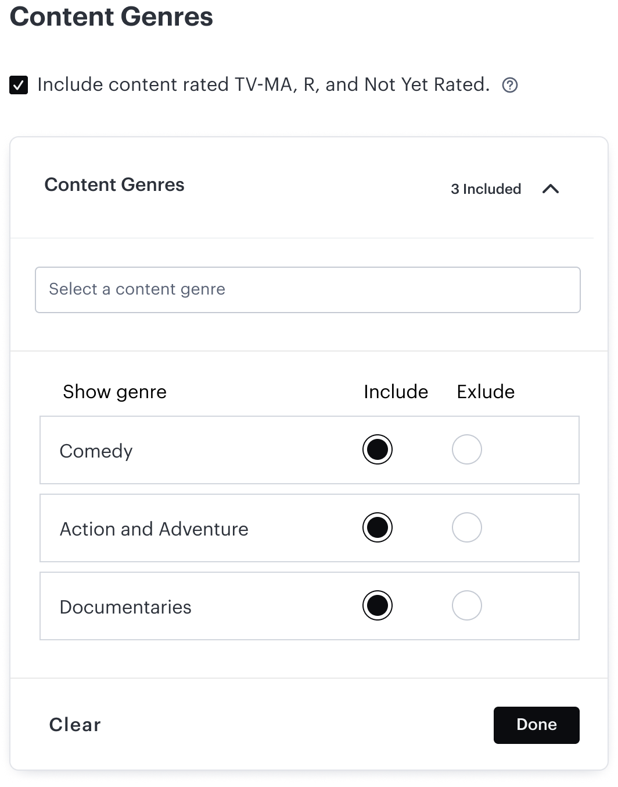
  

<!--
In the old designs, the UI was different depending on which targeting section you were on in the campaign creation flow

this is what audiences looked like and I liked it as multiselect pattern, you could make selections from the drop down and it would populate this table below [CLICK]

Location and content targeting behaved the same but looked different
-->

---
layout: default
transition: slide-left
---

<CaseStudyPillTabs :key="s18b_ui_patterns_dup2" class="-mt-10 mb-4 mx-auto" variant="campaign" :initial-index="2" process-label="Final" />

<h2 class="user-groups-slide-heading m-0 mt-6 mb-5">Pattern consolidation</h2>

  

    
  

  

    <i class="fa-solid fa-arrow-right text-[#0D9488] text-[1.75rem]"></i>
  

  

    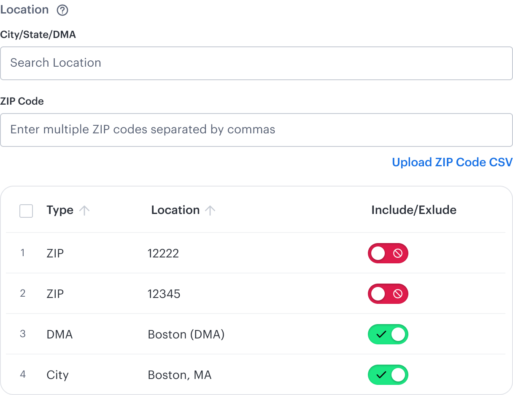
  

<!--
Do I redid patterns to match audiences, here is what geo targeting looked like [CLICK]
-->

---
layout: default
transition: slide-left
---

<CaseStudyPillTabs :key="s18b_ui_patterns_dup3" class="-mt-10 mb-4 mx-auto" variant="campaign" :initial-index="2" process-label="Final" />

<h2 class="user-groups-slide-heading m-0 mt-6 mb-5">Pattern consolidation</h2>

  

    
  

  

    <i class="fa-solid fa-arrow-right text-[#0D9488] text-[1.75rem]"></i>
  

  

    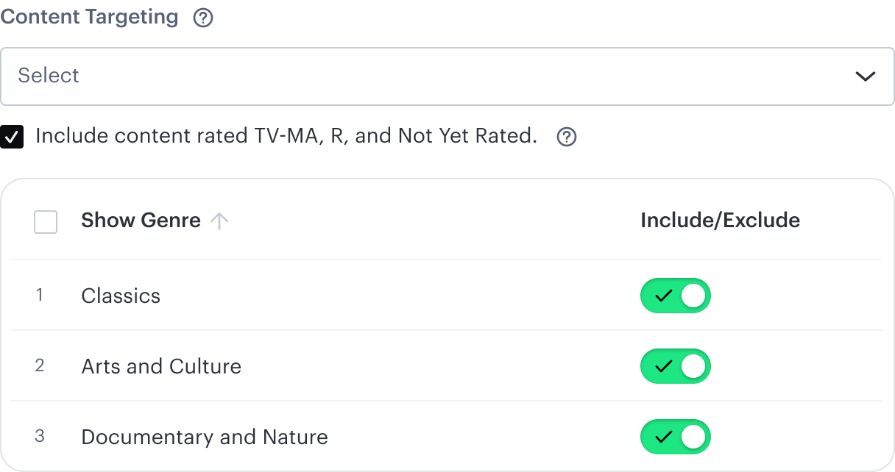
  

<!--
And this what Content genres ended up looking like [CLICK]
-->

---
layout: default
transition: slide-left
---

<CaseStudyPillTabs :key="s18b_ui_patterns_dup4" class="-mt-10 mb-4 mx-auto" variant="campaign" :initial-index="2" process-label="Final" />

<h2 class="user-groups-slide-heading m-0 mt-6 mb-5">Pattern consolidation</h2>

  

    

      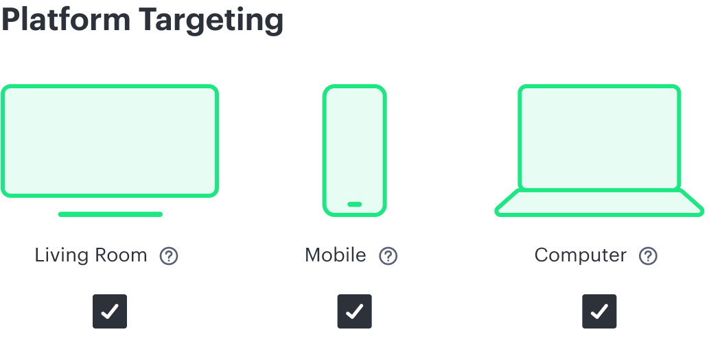
    

    

      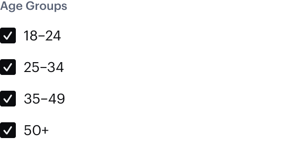
    

  

  

    

      <i class="fa-solid fa-arrow-down text-[#0D9488] text-[1.75rem]"></i>
    

    

      <i class="fa-solid fa-arrow-down text-[#0D9488] text-[1.75rem]"></i>
    

  

  

    

      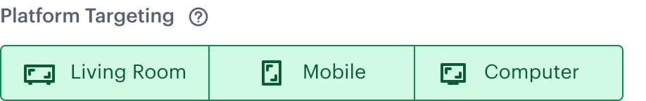
    

    

      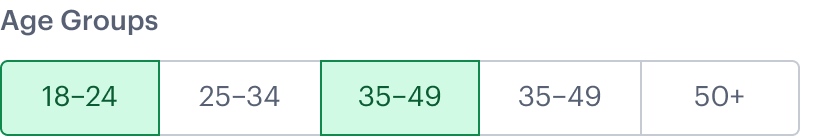
    

  

<!--
we also had different multi-select selections which were fine in page-by-page flow but they took up a lot of real estate in a single page scroll

So I redid them to also look more consistent
-->

---
layout: default
transition: slide-left
hide: true
---

<CaseStudyPillTabs :key="s18b_new_patterns" class="-mt-10 mb-4 mx-auto" variant="campaign" :initial-index="2" process-label="Final" />

<h2 class="user-groups-slide-heading m-0 mt-6 mb-5">New patterns</h2>

  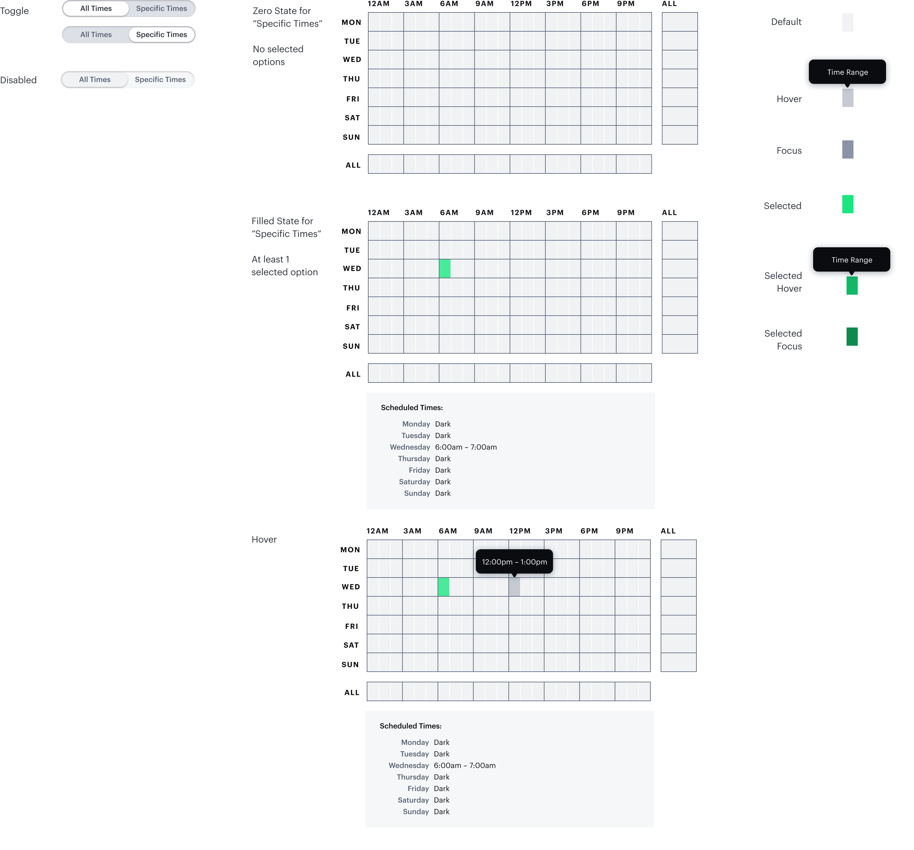

<!--
I did some brand new targeting patterns too. Day parting was a new feature, and again for the sake of time, I looked at what was out there

I found this draggable day parting pattern in our internal ad trafficking tool (the one I showed you all earlier) and modified it to fit the then Hulu UI
-->

---
layout: default
transition: slide-left
---

<CaseStudyPillTabs :key="s18b_new_patterns_dup" class="-mt-10 mb-4 mx-auto" variant="campaign" :initial-index="2" process-label="Final" />

<h2 class="user-groups-slide-heading m-0 mt-6 mb-5">New patterns</h2>

  <video
    class="mx-auto block h-auto max-h-[min(420px,52vh)] w-auto max-w-full rounded-xl object-contain shadow-[0_4px_24px_rgb(0_0_0_/_12%)] md:max-w-5xl"
    autoplay
    loop
    muted
    playsinline
    preload="metadata"
    src="./slides/assets/daypart video.mov"
  ></video>

<!--
I still needed to add dayparting, because of time I recyled this dayparting tool we had in mission control, that ad traffciking tool I showed you earlier. Here is it in action
-->

---
layout: default
transition: slide-left
---

<CaseStudyPillTabs :key="s18b_new_patterns_dup2" class="-mt-10 mb-4 mx-auto" variant="campaign" :initial-index="2" process-label="Final" />

<h2 class="user-groups-slide-heading m-0 mt-6 mb-5">New patterns</h2>

  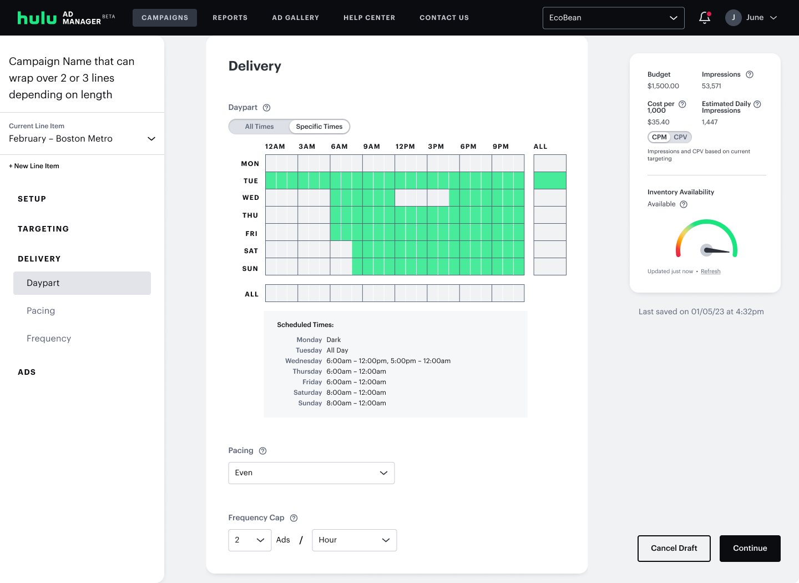

<!--
and here is the whole new "delivery" section in the campaign flow with day parting, pacing and frequency cap
-->

---
layout: default
transition: slide-left
hide: true
---

<CaseStudyPillTabs :key="s_ut1" class="-mt-10 mb-10 mx-auto" variant="campaign" :initial-index="3" />

<h2 class="user-groups-slide-heading m-0 mt-6 mb-5">User Testing</h2>

  

    <i class="fa-solid fa-circle text-[#0D9488] text-[0.5rem] shrink-0"></i>
    "Gut check" to make sure campaign flow made sense
  

  

    <i class="fa-solid fa-circle text-[#0D9488] text-[0.5rem] shrink-0"></i>
    Test with existing customers
  

<!--
I wanted to do user testing really as a "gut check" because I hadn't done any user research with advertisers and since we were changing campaign flow, I really wanted to talk to existing customers
-->

---
layout: default
transition: slide-left
---

<CaseStudyPillTabs :key="s11_after_methodology" class="-mt-10 mb-10 mx-auto" variant="campaign" :initial-index="3" />

<h2 class="user-groups-slide-heading m-0 mt-6 mb-5">User testing issues</h2>

  

    

      <i class="fa-solid fa-user-slash self-center text-[1.6rem] text-[#0D9488] flex-shrink-0"></i>
    

    

    No additional resources/UXR team
  

  

    

      <i class="fa-solid fa-briefcase self-center text-[1.6rem] text-[#0D9488] flex-shrink-0"></i>
    

    

    Sales team would not give access to their clients
  

  

    

      <i class="fa-solid fa-rocket text-[1.6rem] text-[#0D9488]"></i>
    

    

    Results would not be implemented until after launch
  

<!--
I was getting to the crunch time, a couple of months away from launch. There was still a lot to do, I still had to run QA of the testing environment and I really wanted to do user testing, I had tested a lot of the campaign redesigns with internal people but not with customers. And the hardest challenge of all was that it was still just me, no additional resource, not even a dedicated UXR team.

I ran into hudrles, the sales team was hesitant on giving me their users to test with even though I really wanted to test with existing customers and I really tried to give me access to their clients, I was able to secure incentives from the marketing team, I offered to let them sit in on the sessions, but in the end they didn't want to participate and I was running out of time

And the because user testing was happening later than I wanted to, any recommendations that came about from testing wouldn't affect launch. However, I was able to work out a deal with product that I could add the fixes as a fast follow after launch
-->

---
layout: default
transition: slide-left
---

<CaseStudyPillTabs :key="s_need_help_dup" class="-mt-10 mb-10 mx-auto" variant="campaign" :initial-index="3" />

<h2 class="user-groups-slide-heading m-0 mt-6 mb-5">Getting a contractor</h2>

  

    

      <i class="fa-solid fa-sack-dollar text-[1.6rem] text-[#0D9488]"></i>
    

    

    Secured budget for a contractor and hire someone in summer 2024
  

  

    

      <i class="fa-solid fa-list-check text-[1.6rem] text-[#0D9488]"></i>
    

    

    Was able to delegate user testing & QA work
  

  

    

      <i class="fa-solid fa-chalkboard-user text-[1.6rem] text-[#0D9488]"></i>
    

    

    I was able to learn mentorship and constructive feedback skills
  

<!--
I started off trying to address the most prominent issue, resourcing. I really needed help, we were months from launching. The rest of the design team was stretched thin, so I had to get someone new

Hiring a full-time person at Disney is quite difficult and takes a long time which I was not gonna wait around for so 

I played slack tag where I would ask one person who I can talk to about budget and they would refer me to someone else. Ultimately I ended up finding the with the project manager who controlled funding for this initiative and was able to secure budget for a contractor who I was able to train and delegate as well as mentor
-->

---
layout: default
transition: slide-left
---

<CaseStudyPillTabs :key="s25" class="-mt-10 mb-10 mx-auto" variant="campaign" :initial-index="3" />

<h2 class="user-groups-slide-heading m-0 mt-6 mb-5">Methodology</h2>

  

    

      <svg xmlns="http://www.w3.org/2000/svg" viewBox="0 0 640 640" class="h-7 w-7 fill-[#0D9488]" aria-hidden="true"><path d="M128 128C128 92.7 156.7 64 192 64L341.5 64C358.5 64 374.8 70.7 386.8 82.7L493.3 189.3C505.3 201.3 512 217.6 512 234.6L512 512C512 547.3 483.3 576 448 576L192 576C156.7 576 128 547.3 128 512L128 128zM336 122.5L336 216C336 229.3 346.7 240 360 240L453.5 240L336 122.5zM248 320C234.7 320 224 330.7 224 344C224 357.3 234.7 368 248 368L392 368C405.3 368 416 357.3 416 344C416 330.7 405.3 320 392 320L248 320zM248 416C234.7 416 224 426.7 224 440C224 453.3 234.7 464 248 464L392 464C405.3 464 416 453.3 416 440C416 426.7 405.3 416 392 416L248 416z"/></svg>
    

    

    Built test plan and screener; recruited via Dscout
  

  

    

      <svg xmlns="http://www.w3.org/2000/svg" viewBox="0 0 640 640" class="h-7 w-7 fill-[#0D9488]" aria-hidden="true"><path d="M173.3 66.5C181.4 62.4 191.2 63.3 198.4 68.8L518.4 308.7C526.7 314.9 530 325.7 526.8 335.5C523.6 345.3 514.4 351.9 504 351.9L351.7 351.9L440.6 529.6C448.5 545.4 442.1 564.6 426.3 572.5C410.5 580.4 391.3 574 383.4 558.2L294.5 380.5L203.2 502.3C197 510.6 186.2 513.9 176.4 510.7C166.6 507.5 160 498.3 160 488L160 88C160 78.9 165.1 70.6 173.3 66.5z"/></svg>
    

    

    Partnered with UX engineering to build a high-fidelity interactive prototype
  

  

    

      <svg xmlns="http://www.w3.org/2000/svg" viewBox="0 0 640 640" class="h-7 w-7 fill-[#0D9488]" aria-hidden="true"><path d="M320 64C355.3 64 384 92.7 384 128C384 163.3 355.3 192 320 192C284.7 192 256 163.3 256 128C256 92.7 284.7 64 320 64zM416 376C416 401 403.3 423 384 435.9L384 528C384 554.5 362.5 576 336 576L304 576C277.5 576 256 554.5 256 528L256 435.9C236.7 423 224 401 224 376L224 336C224 283 267 240 320 240C373 240 416 283 416 336L416 376zM160 96C190.9 96 216 121.1 216 152C216 182.9 190.9 208 160 208C129.1 208 104 182.9 104 152C104 121.1 129.1 96 160 96zM176 336L176 368C176 400.5 188.1 430.1 208 452.7L208 528C208 529.2 208 530.5 208.1 531.7C199.6 539.3 188.4 544 176 544L144 544C117.5 544 96 522.5 96 496L96 439.4C76.9 428.4 64 407.7 64 384L64 352C64 299 107 256 160 256C172.7 256 184.8 258.5 195.9 262.9C183.3 284.3 176 309.3 176 336zM432 528L432 452.7C451.9 430.2 464 400.5 464 368L464 336C464 309.3 456.7 284.4 444.1 262.9C455.2 258.4 467.3 256 480 256C533 256 576 299 576 352L576 384C576 407.7 563.1 428.4 544 439.4L544 496C544 522.5 522.5 544 496 544L464 544C451.7 544 440.4 539.4 431.9 531.7C431.9 530.5 432 529.2 432 528zM480 96C510.9 96 536 121.1 536 152C536 182.9 510.9 208 480 208C449.1 208 424 182.9 424 152C424 121.1 449.1 96 480 96z"/></svg>
    

    

    10 participants (of various skill levels) each in a 1-hour moderated session
  

  

    

      <svg xmlns="http://www.w3.org/2000/svg" viewBox="0 0 640 640" class="h-7 w-7 fill-[#0D9488]" aria-hidden="true"><path d="M576 160C576 210.2 516.9 285.1 491.4 315C487.6 319.4 482 321.1 476.9 320L384 320C366.3 320 352 334.3 352 352C352 369.7 366.3 384 384 384L480 384C533 384 576 427 576 480C576 533 533 576 480 576L203.6 576C212.3 566.1 222.9 553.4 233.6 539.2C239.9 530.8 246.4 521.6 252.6 512L480 512C497.7 512 512 497.7 512 480C512 462.3 497.7 448 480 448L384 448C331 448 288 405 288 352C288 299 331 256 384 256L423.8 256C402.8 224.5 384 188.3 384 160C384 107 427 64 480 64C533 64 576 107 576 160zM181.1 553.1C177.3 557.4 173.9 561.2 171 564.4L169.2 566.4L169 566.2C163 570.8 154.4 570.2 149 564.4C123.8 537 64 466.5 64 416C64 363 107 320 160 320C213 320 256 363 256 416C256 446 234.9 483 212.5 513.9C201.8 528.6 190.8 541.9 181.7 552.4L181.1 553.1zM192 416C192 398.3 177.7 384 160 384C142.3 384 128 398.3 128 416C128 433.7 142.3 448 160 448C177.7 448 192 433.7 192 416zM480 192C497.7 192 512 177.7 512 160C512 142.3 497.7 128 480 128C462.3 128 448 142.3 448 160C448 177.7 462.3 192 480 192z"/></svg>
    

    

    Evaluated how and if users did tasks such as create line items and set up targeting
  

<!--
Now with an additional person, I planned the user sessions. I made a screener and recruited users on Dscout (its a usertesting.com type of product we had a license to). From there I found 10 people who said they had used self serve ad platforms before

We worked with our UXE team to make an interactive prototype (before AI)

We conducted 1 hr usability tests where I asked them to do certain tasks and see how they went about them,

Even though none of them had used our platform before, I got some pretty useful feedback
-->

---
layout: default
transition: slide-left
---

<CaseStudyPillTabs :key="s_line_item" class="-mt-10 mb-10 mx-auto" variant="campaign" :initial-index="3" />

<h2 class="user-groups-slide-heading m-0 mt-6 mb-3">"Line Item"</h2>

  

    

      <i class="fa-solid fa-circle text-[#0D9488] text-[0.5rem] shrink-0"></i>
      Term confused some users
    

    

      <i class="fa-solid fa-circle text-[#0D9488] text-[0.5rem] shrink-0"></i>
      Used to "ad groups/sets" or "flights"
    

  

  

    
  

<!--
Here are some of the high level ones

First off, the term "line items" was confusing, even to the users who did a lot of advertising were thrown off by the term but understood the concept

I think the term "line item" was one of the things I pushed back against the most with product, I wanted to call it ad set or ad groups. even before this user test, based on my meetings with internal teams, a lot of them didn't get the term either

However product insisted on calling it line items because thats what it was called in our internal ad trafficking tool And like with sales, I had to accept I wasn't going to change their minds and had to move on to other important things in this tight deadline
-->

---
layout: default
transition: slide-left
---

<CaseStudyPillTabs :key="s_discoverability" class="-mt-10 mb-10 mx-auto" variant="campaign" :initial-index="3" />

<h2 class="user-groups-slide-heading m-0 mt-6 mb-3">Discoverability</h2>

  

    

      <i class="fa-solid fa-circle text-[#0D9488] text-[0.5rem] shrink-0"></i>
      66% of users struggled to locate "New Line Item" button
    

  

  

    
  

<!--
Another big issue was that people could not find the "create new line item button", it was too small and not noticeable so that was something I prioritized as a post-launch fix
-->

---
layout: default
transition: slide-left
---

<CaseStudyPillTabs :key="s_layout_ut" class="-mt-10 mb-10 mx-auto" variant="campaign" :initial-index="3" />

<h2 class="user-groups-slide-heading m-0 mt-6 mb-3">Layout</h2>

  

    

      <i class="fa-solid fa-circle text-[#0D9488] text-[0.5rem] shrink-0"></i>
      Users appreciated single-page layout
    

    

      <i class="fa-solid fa-circle text-[#0D9488] text-[0.5rem] shrink-0"></i>
      Most of them could navigate to different targeting sections easily
    

  

  

    
  

<!--
On the positive note, the single page flow tested well, people new to the platform quickly figured out how to navigate

and that was a huge goal of mine, was to make sure this new singe page layout was usable
-->

---
layout: default
transition: slide-left
---

<CaseStudyPillTabs :key="s_design_uat" class="-mt-10 mb-10 mx-auto" variant="campaign" :initial-index="3" />

<h2 class="user-groups-slide-heading m-0 mt-6 mb-5">Design UAT</h2>

  

    

      <i class="fa-solid fa-circle text-[#0D9488] text-[0.5rem] shrink-0"></i>
      Created Epic with all requested changes
    

    

      <i class="fa-solid fa-circle text-[#0D9488] text-[0.5rem] shrink-0"></i>
      Prioritized based on LOE + urgency
    

    

      <i class="fa-solid fa-circle text-[#0D9488] text-[0.5rem] shrink-0"></i>
      Quick and important changes such as a more prominent "Add New Line Item"
    

  

  

    
  

<!--
After all the user feedback as well as my own QA of the testing environment, I made this huge Epic on JIRA with almost 100 tickets from everything to minor UI issues to major issues like the new line item button

I prioritized these tickets based on severity and level of effort and was able to get the engineering teams to work on them in the weeks following launch
-->

---
layout: default
transition: fade
---

<CaseStudyPillTabs :key="s6_copy_before_final" class="-mt-10 mb-10 mx-auto" variant="campaign" :initial-index="0" />

<h2 class="user-groups-slide-heading m-0 mt-6 mb-5">Before</h2>

<AdManagerStack :images="['./slides/assets/OLDham1.png', './slides/assets/OLDham2.png', './slides/assets/OLDham3.png', './slides/assets/OLDham4.png']" :compact="true" :viewport-height="500" layer-max-width="72rem" pull-down="-2rem" />

<!--
We were ready to release, here is the page by page design we had in the old platform
-->

---
layout: default
transition: slide-left
---

<CaseStudyPillTabs :key="s18b_copy" class="-mt-10 mb-4 mx-auto" variant="campaign" :initial-index="2" process-label="Final" />

<h2 class="user-groups-slide-heading m-0 mt-6 mb-3">After</h2>

  <FastVideo
    src="./slides/assets/New Campaign Flow Walkthrough.mp4"
    :playback-rate="2"
    video-class="mx-auto block h-auto max-h-[min(520px,58vh)] w-auto max-w-full rounded-xl object-contain shadow-[0_2px_16px_rgb(0_0_0_/_8%)] md:max-w-3xl"
  />

<!--
Here is the final flow at launch, this is sped up 

you can see the line item menu and the ability to navigate back and forth between them
-->

---
layout: default
transition: slide-left
hide: true
---

<CaseStudyPillTabs :key="s_need_help" class="-mt-10 mb-10 mx-auto" variant="campaign" :initial-index="3" />

<h2 class="user-groups-slide-heading m-0 mt-6 mb-5">Still left to do</h2>

  

    

      <i class="fa-solid fa-chalkboard-user text-[1.6rem] text-[#0D9488]"></i>
    

    

    Test designs externally
  

  

    

      <i class="fa-solid fa-earth-americas text-[1.6rem] text-[#0D9488]"></i>
    

    

    Work on engineering handoff
  

  

    

      <i class="fa-solid fa-clipboard-check text-[1.6rem] text-[#0D9488]"></i>
    

    

    Do Design QA
  

<!--
Even though all the iterations and specs of the campaign creation flow were more or less done, I still had a lot to do before launch

I had shared designs several times with internal people but I really wanted to test with advertisers

This platform overhaul, especially the front-end was done by this this team in Ukraine, and it was difficult because I couldn't do the usual designer/eng co-work sessions I've done in other jobs

And there was a lot of my own QA I had to do in the testing environments
-->

---
layout: default
transition: slide-left
---

<CaseStudyPillTabs :key="s_new" class="-mt-10 mb-10 mx-auto" variant="campaign" :initial-index="3" />

<h2 class="user-groups-slide-heading m-0 mt-6 mb-5">After the launch</h2>

  

    

      <i class="fa-solid fa-arrow-up text-[2.5rem]"></i>
      <CountUp :to="39" suffix="%" :duration="1200" />
    

    Increase in agency users the following year
  

  

    

      <CountUp :to="76" prefix="$" suffix="M" :duration="1400" />
    

    ARR the following year (from $26M previous year)
  

<!--
once we released the new campaign flow as well as the rest of the new platform, there was pretty quick growth the following year, both revenue and number of agency users significantly increased

we accomplished the businesses goal of scaling the product and getting more agencies onboard
-->

---
layout: default
transition: slide-left
---

<CaseStudyPillTabs :key="s_wiwdd" class="-mt-10 mb-10 mx-auto" variant="campaign" :initial-index="3" />

<h2 class="user-groups-slide-heading m-0 mt-6 mb-5">What I would do differently</h2>

  

    

      <i class="fa-solid fa-clock text-[#0D9488] text-[1.6rem]"></i>
    

    

    Bring in a contractor sooner. Scope of work was more than I estimated
  

  

    

      <i class="fa-solid fa-route text-[#0D9488] text-[1.6rem]"></i>
    

    

    Establish a clear timeline for deliverables and revisit as the project evolves
  

<!--
This was a huge project and probably one of the hardest ones I've ever worked on. I learned a lot from this especially things I would do differently such as 
getting support earlier 

and setting up realistic timelines for my work sooner, I think I relied too much on product and sales when setting delivery timelines which didn't account for me being the only designer

but one thing i would definitely do differently now is use AI especially for quick concepts. 

I think it would have been easier to create mocks and share out with stakeholders, here is an example I made [SHOW PROTO]
-->

---
layout: two-cols

layoutClass: h-full
transition: fade-out
hideGlobalNav: true
---

  

<HeroTitle compact>
  Thank you

  <template #subtitle>
    
Any questions?

  </template>
</HeroTitle>
  

::right::

<!--
so that was the whole kitchen rehaul, thank you for listening and are their any questions?
-->
