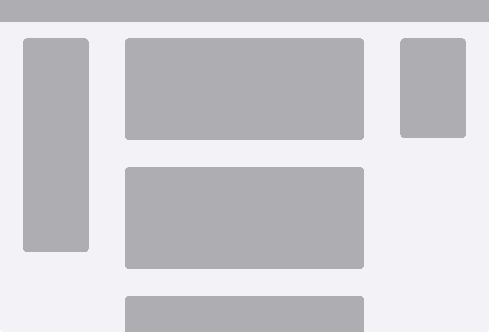

  

<HeroTitle compact>
  Filtering Through the Noise

  <template #subtitle>
    
Saneeya Khan

    
Senior Product Designer

  </template>
  <template #pill>
    PORTFOLIO
  </template>
</HeroTitle>
  

::right::

<PinterestMasonry placement="title" />

<!--
hello

let me show you "real life UX" process

a few years ago threw a housewarming/halloween party
-->

---
transition: fade-out
layout: default
hide: true
---

## My process

<InvitePushRow />

<!--
Invite -> wayfinding sign -> bathroom sign -> wifi -> QR Code -> google from

- went all out but out of scope: games, recipes
-no one took candy
- user feedback was great
-->

---
transition: slide-up
layout: two-cols
layoutClass: h-full layout-wide-right
---

## Background

::right::

<PinterestMasonry placement="title" :hide-left-mid="true" left-extra-top-src="/pictures/20191229_134146.jpg" :left-extra-top-grow="0.8" :title-top-grow="1.4" :title-bottom-grow="1.0" right-tall-src="/pictures/PXL_20251222_030347531.jpg" right-bottom-src="/pictures/PXL_20240608_204901982.jpg" />

<!--
- Account Manager -> Campaign Creation -> Admin Portal -> MC Traffciking
- DCM for 4 years, grew from about $10m to $100m
- Now work on internal tooling
-->

---
transition: slide-up
layout: two-cols
layoutClass: h-full layout-wide-right
---

## Experience

::right::

<PinterestMasonry placement="title" :hide-left-mid="true" />

---
layout: two-cols
layoutClass: h-full
transition: slide-left
---

  

    

      
MakingFilters Functional

      
Campaign flow redesign

      

        CASE STUDY
      

    

  

::right::

<PinterestMasonry :show-images="false" span-src="/FI.png" span-position="center 28%" :span-flex="0.8" :merge-right-stack="true" right-src="/MCFilters.gif" right-position="left center" left-top-src="/filter88.png" left-bottom-src="/datepicker.png" left-bottom-position="center 18%" tile-border="1px solid #cbd5e1" />

<!--
- recent project which is in dev
-->

---
src: ./slides/more.md
---

---
layout: default
transition: fade
---

<CaseStudyPillTabs :key="s6" class="-mt-10 mb-10 mx-auto" :initial-index="1" />

<AdManagerStack :images="['./slides/assets/MCfilter1.png', './slides/assets/MCfilter2.png', './slides/assets/MCfilter3.png']" :compact="true" />

<!--
- filters are one long scrolls
-->

---
layout: default
transition: slide-left
---

<CaseStudyPillTabs :key="s7" class="-mt-10 mb-10 mx-auto" :initial-index="1" />

<h2 class="user-groups-slide-heading m-0 mt-6 mb-5">The Platform in 2021</h2>

  

    <i class="fa-brands fa-google text-[#e60024] text-[2rem]"></i>
    Launched in March 2020 as Hulu Ad Manager
  

  

    <i class="fa-solid fa-tags text-[#e60024] text-[2rem]"></i>
    Company's only self-serve ad platform
  

  

    <i class="fa-regular fa-square-caret-down text-[#e60024] text-[2rem]"></i>
    Intended for SMBs since min campaign spend was less than traditional route
  

  

    <i class="fa-solid fa-filter text-[#e60024] text-[2rem]"></i>
    Had $10M ARR as of Fall 2021
  

<!--
- they really wanted boolean and more filter options
- wanted to share filters
-->

---
layout: default
transition: slide-left
---

<CaseStudyPillTabs :key="s8" class="-mt-10 mb-10 mx-auto" :initial-index="1" />

<h2 class="user-groups-slide-heading m-0 mt-6 mb-5">Growing Pains</h2>

  

    <i class="fa-solid fa-filter-circle-xmark text-[#e60024] text-[2rem] self-center"></i>
    Platform was managed by overseas 3rd party team; expensive to maintain
  

  

    <i class="fa-solid fa-layer-group text-[#e60024] text-[2rem] self-center"></i>
    Business goals pivoted to appeal to agencies &amp; larger advertisers (over SMBs)
  

  

    <i class="fa-solid fa-expand text-[#e60024] text-[2rem] self-center"></i>
    Platform lacked features the target users wanted
  

<!--
- new filters took a while to implement
-->

---
layout: default
transition: slide-left
---

<CaseStudyPillTabs :key="s9" class="-mt-10 mb-10 mx-auto" :initial-index="1" />

  

    Agencies (and larger advertisers) did not see value in the self-serve ad platform
  

---
layout: default
transition: slide-left
---

<CaseStudyPillTabs :key="s10" class="-mt-10 mb-10 mx-auto" :initial-index="1" />

<h2 class="user-groups-slide-heading m-0 mt-6 mb-5">Business goals</h2>

  

    <i class="fa-regular fa-square text-slate-300 text-[1.5rem] shrink-0"></i>
    Rebuild entire platform to be in-house
  

  

    <i class="fa-regular fa-square text-slate-300 text-[1.5rem] shrink-0"></i>
    Ability to run multiple line items within larger campaigns.
  

  

    <i class="fa-regular fa-square text-slate-300 text-[1.5rem] shrink-0"></i>
    Add extra targeting options (dayparting, pacing, etc)
  

  

    <i class="fa-regular fa-square text-slate-300 text-[1.5rem] shrink-0"></i>
    Platform rebuild (and brand rename) to launch Oct 2024
  

---
layout: default
transition: slide-left
---

<CaseStudyPillTabs :key="s11" class="-mt-10 mb-10 mx-auto" :initial-index="1" />

<h2 class="user-groups-slide-heading m-0 mt-6 mb-5">Team of One</h2>

  

    
Box 1

    
Box 2

    
Box 3

    
Box 4

  

  

    <i class="fa-solid fa-chevron-down text-[#e60024] text-[1.3rem]"></i>
    <i class="fa-solid fa-chevron-down text-[#e60024] text-[1.3rem]"></i>
    <i class="fa-solid fa-chevron-down text-[#e60024] text-[1.3rem]"></i>
    <i class="fa-solid fa-chevron-down text-[#e60024] text-[1.3rem]"></i>
  

  
Box 5

---
layout: default
transition: slide-left
---

<h2 class="user-groups-slide-heading m-0 mt-6 mb-5">Layout</h2>

  

    
Tested well in UXR

    
Easier to scale

    
Bullet 3

  

  

    
  

<!--
- wanted side panel design

- too many booleans
-->

---
layout: default
transition: slide-left
---

<CaseStudyPillTabs :key="s13" class="-mt-10 mb-10 mx-auto" :initial-index="1" />

<h2 class="user-groups-slide-heading m-0 mt-6 mb-5">"Line Items"</h2>

<AdManagerStack :images="['./slides/assets/CA1.png', './slides/assets/CA2.png', './slides/assets/CA3.png']" :compact="true" :viewport-height="560" layer-max-width="70rem" pull-down="-0.5rem" />

<!--
SHOW DEMO
-->

---
layout: default
transition: slide-left
---

<h2 class="user-groups-slide-heading m-0 mt-6 mb-5">Layout</h2>

  

---
layout: default
transition: slide-left
---

<h2 class="user-groups-slide-heading m-0 mt-6 mb-5">My goals</h2>

  

    
      <i class="fa-regular fa-square text-slate-300 text-[1.5rem] absolute inset-0 goals-uncheck" style="animation-delay:0.4s"></i>
      <i class="fa-solid fa-square-check text-[#e60024] text-[1.5rem] absolute inset-0 goals-check" style="animation-delay:0.4s"></i>
    
    Introduce a filter panel or some other new selection area
  

  

    
      <i class="fa-regular fa-square text-slate-300 text-[1.5rem] absolute inset-0 goals-uncheck" style="animation-delay:0.9s"></i>
      <i class="fa-solid fa-square-check text-[#e60024] text-[1.5rem] absolute inset-0 goals-check" style="animation-delay:0.9s"></i>
    
    Have consistent style for each type of filter (radio, multi-select, etc)
  

  

    
      <i class="fa-regular fa-square text-slate-300 text-[1.5rem] absolute inset-0 goals-uncheck" style="animation-delay:1.4s"></i>
      <i class="fa-solid fa-square-check text-[#e60024] text-[1.5rem] absolute inset-0 goals-check" style="animation-delay:1.4s"></i>
    
    Introduce boolean options (AND/OR)
  

  

    <i class="fa-regular fa-square text-slate-300 text-[1.5rem] shrink-0"></i>
    Enable users to save their filters and share them
    
      <i class="fa-solid fa-triangle-exclamation text-amber-400"></i>
      Partially implemented
    
  

---
layout: default
transition: slide-left
---

<h2 class="user-groups-slide-heading m-0 mt-6 mb-5">Takeaways</h2>

  

    <i class="fa-solid fa-arrow-pointer text-[2rem] text-[#e60024] self-center"></i>
    Prototyping advanced logic harder than intended; did not need pixel-perfect output
  

  

    <i class="fa-solid fa-hands-clapping text-[2rem] text-[#e60024] self-center"></i>
    Biggest win was learning how to prototype such intricate designs
  

<!--
- this is in development; working with eng if there are any addittinal edge cases

- will do design/own QA when testing environment is ready
-->

---
layout: two-cols
layoutClass: h-full
transition: fade-out
---

  

<HeroTitle compact>
  Thank you
</HeroTitle>
  

::right::

<PinterestMasonry placement="title" left-top-small-src="/IMG_4215.jpg" left-mid-src="/20221117_091012.jpg" left-top-src="/PXL_20241205_015703401.jpg" right-tall-src="/IMG_20200523_120959.jpg" right-bottom-src="/PXL_20240210_213758992.jpg" />

